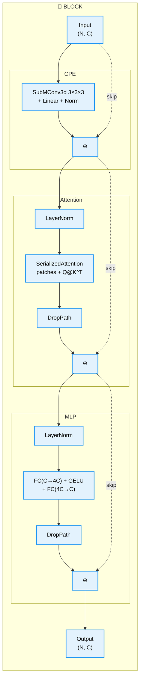
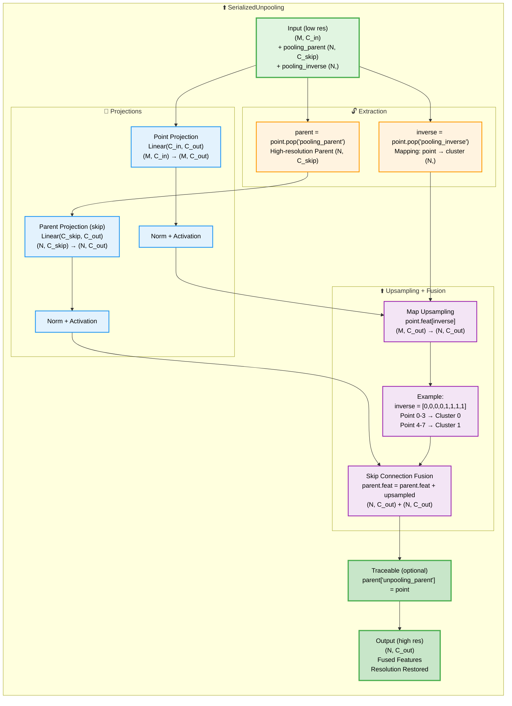
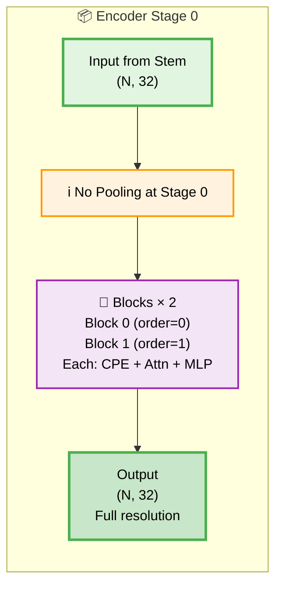
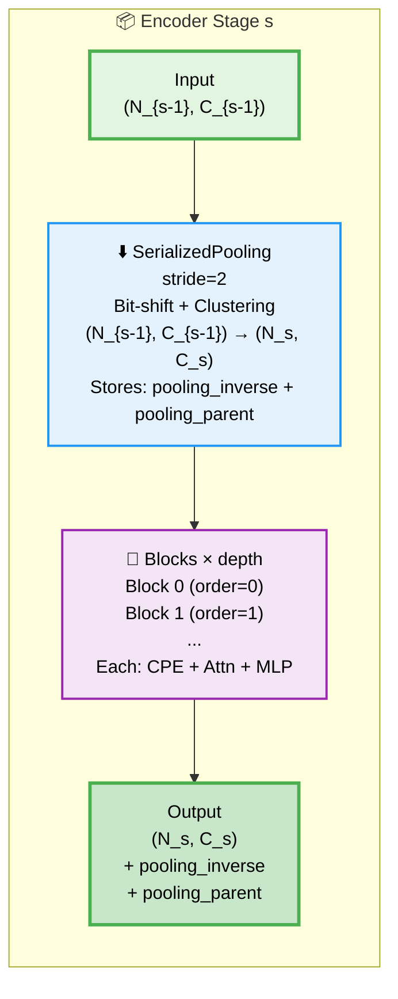
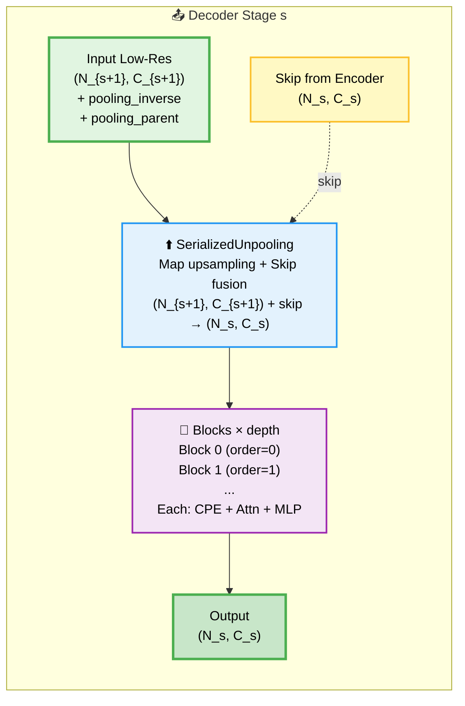

# Point Transformer v3: From Voxelization to Serialization

## Introduction

After the success of Point Transformer v2's voxel-based approach, **Point Transformer v3 (PTv3)** introduces a fundamentally different philosophy: instead of organizing points through voxelization and grid pooling, PTv3 uses **spatial serialization** based on space-filling curves. This paradigm shift brings several key advantages:

* **Full attention mechanism** with QKᵀ instead of grouped vector attention
* **Serialization-based pooling** that preserves spatial locality without explicit voxels
* **Flash Attention support** for massive speedups (up to 10× faster attention computation)
* **Multiple ordering strategies** (Z-order, Hilbert curves) for better spatial coverage

---
## Overall Architecture

```mermaid
graph LR
    subgraph INPUT["🎯 INPUT"]
        I0["Point Cloud<br/>(N, 6)<br/>xyz + rgb"]
    end

    subgraph PREP["🔧 PREPROCESSING"]
        S1["Serialization<br/>Z-order/Hilbert<br/>→ serialized_order"]
        S2["Sparsify<br/>→ SparseConvTensor"]
    end

    subgraph STEM["🌱 EMBEDDING STEM"]
        E1["SubMConv3d 5×5×5<br/>(N, 6) → (N, 32)<br/>+ BatchNorm + GELU"]
    end

    subgraph ENC0["📦 ENCODER STAGE 0<br/>stride=1, 2 blocks"]
        E0_B1["Block 0<br/>CPE + Attn + MLP<br/>(N, 32)<br/>patch_size=1024, heads=2"]
        E0_B2["Block 1<br/>CPE + Attn + MLP<br/>(N, 32)<br/>order_index=1"]
    end

    subgraph ENC1["📦 ENCODER STAGE 1<br/>stride=2, 2 blocks"]
        E1_P["SerializedPooling<br/>stride=2, bit_shift=3<br/>(N, 32) → (N/2, 64)"]
        E1_B1["Block 0<br/>CPE + Attn + MLP<br/>(N/2, 64)<br/>patch_size=1024, heads=4"]
        E1_B2["Block 1<br/>CPE + Attn + MLP<br/>(N/2, 64)<br/>order_index=1"]
    end

    subgraph ENC2["📦 ENCODER STAGE 2<br/>stride=2, 2 blocks"]
        E2_P["SerializedPooling<br/>stride=2, bit_shift=3<br/>(N/2, 64) → (N/4, 128)"]
        E2_B1["Block 0<br/>CPE + Attn + MLP<br/>(N/4, 128)<br/>patch_size=1024, heads=8"]
        E2_B2["Block 1<br/>CPE + Attn + MLP<br/>(N/4, 128)<br/>order_index=1"]
    end

    subgraph ENC3["📦 ENCODER STAGE 3<br/>stride=2, 6 blocks"]
        E3_P["SerializedPooling<br/>stride=2, bit_shift=3<br/>(N/4, 128) → (N/8, 256)"]
        E3_B1["Block 0<br/>CPE + Attn + MLP<br/>(N/8, 256)<br/>patch_size=1024, heads=16"]
        E3_BX["... 4 more blocks ...<br/>order cycling"]
        E3_B6["Block 5<br/>CPE + Attn + MLP<br/>(N/8, 256)<br/>order_index=1"]
    end

    subgraph ENC4["📦 ENCODER STAGE 4 (BOTTLENECK)<br/>stride=2, 2 blocks"]
        E4_P["SerializedPooling<br/>stride=2, bit_shift=3<br/>(N/8, 256) → (N/16, 512)"]
        E4_B1["Block 0<br/>CPE + Attn + MLP<br/>(N/16, 512)<br/>patch_size=1024, heads=32"]
        E4_B2["Block 1<br/>CPE + Attn + MLP<br/>(N/16, 512)<br/>order_index=1"]
    end

    subgraph DEC3["📤 DECODER STAGE 3<br/>2 blocks"]
        D3_U["SerializedUnpooling<br/>Map + Skip Fusion<br/>(N/16, 512) + skip → (N/8, 256)"]
        D3_B1["Block 0<br/>CPE + Attn + MLP<br/>(N/8, 256)<br/>patch_size=1024, heads=16"]
        D3_B2["Block 1<br/>CPE + Attn + MLP<br/>(N/8, 256)<br/>order_index=1"]
    end

    subgraph DEC2["📤 DECODER STAGE 2<br/>2 blocks"]
        D2_U["SerializedUnpooling<br/>Map + Skip Fusion<br/>(N/8, 256) + skip → (N/4, 128)"]
        D2_B1["Block 0<br/>CPE + Attn + MLP<br/>(N/4, 128)<br/>patch_size=1024, heads=8"]
        D2_B2["Block 1<br/>CPE + Attn + MLP<br/>(N/4, 128)<br/>order_index=1"]
    end

    subgraph DEC1["📤 DECODER STAGE 1<br/>2 blocks"]
        D1_U["SerializedUnpooling<br/>Map + Skip Fusion<br/>(N/4, 128) + skip → (N/2, 64)"]
        D1_B1["Block 0<br/>CPE + Attn + MLP<br/>(N/2, 64)<br/>patch_size=1024, heads=4"]
        D1_B2["Block 1<br/>CPE + Attn + MLP<br/>(N/2, 64)<br/>order_index=1"]
    end

    subgraph DEC0["📤 DECODER STAGE 0<br/>2 blocks"]
        D0_U["SerializedUnpooling<br/>Map + Skip Fusion<br/>(N/2, 64) + skip → (N, 64)"]
        D0_B1["Block 0<br/>CPE + Attn + MLP<br/>(N, 64)<br/>patch_size=1024, heads=4"]
        D0_B2["Block 1<br/>CPE + Attn + MLP<br/>(N, 64)<br/>order_index=1"]
    end

    subgraph OUTPUT["🎯 OUTPUT"]
        O1["Features<br/>(N, 64)<br/>Full Resolution"]
    end

    %% Flow principal
    I0 --> S1
    S1 --> S2
    S2 --> E1
    E1 --> E0_B1
    E0_B1 --> E0_B2
    
    E0_B2 --> E1_P
    E1_P --> E1_B1
    E1_B1 --> E1_B2
    
    E1_B2 --> E2_P
    E2_P --> E2_B1
    E2_B1 --> E2_B2
    
    E2_B2 --> E3_P
    E3_P --> E3_B1
    E3_B1 --> E3_BX
    E3_BX --> E3_B6
    
    E3_B6 --> E4_P
    E4_P --> E4_B1
    E4_B1 --> E4_B2
    
    %% Decoder
    E4_B2 --> D3_U
    D3_U --> D3_B1
    D3_B1 --> D3_B2
    
    D3_B2 --> D2_U
    D2_U --> D2_B1
    D2_B1 --> D2_B2
    
    D2_B2 --> D1_U
    D1_U --> D1_B1
    D1_B1 --> D1_B2
    
    D1_B2 --> D0_U
    D0_U --> D0_B1
    D0_B1 --> D0_B2
    
    D0_B2 --> O1

    %% Skip connections (en pointillés)
    E0_B2 -.->|"pooling_parent<br/>+ pooling_inverse"| D0_U
    E1_B2 -.->|"pooling_parent<br/>+ pooling_inverse"| D1_U
    E2_B2 -.->|"pooling_parent<br/>+ pooling_inverse"| D2_U
    E3_B6 -.->|"pooling_parent<br/>+ pooling_inverse"| D3_U

    %% Style
    classDef inputStyle fill:#e1f5e1,stroke:#4caf50,stroke-width:3px,color:#000
    classDef prepStyle fill:#fff3e0,stroke:#ff9800,stroke-width:2px,color:#000
    classDef stemStyle fill:#f3e5f5,stroke:#9c27b0,stroke-width:3px,color:#000
    classDef encStyle fill:#e3f2fd,stroke:#2196f3,stroke-width:2px,color:#000
    classDef bottleneckStyle fill:#fce4ec,stroke:#e91e63,stroke-width:3px,color:#000
    classDef decStyle fill:#fff9c4,stroke:#fbc02d,stroke-width:2px,color:#000
    classDef outputStyle fill:#c8e6c9,stroke:#4caf50,stroke-width:3px,color:#000
    
    class I0 inputStyle
    class S1,S2 prepStyle
    class E1 stemStyle
    class E0_B1,E0_B2,E1_P,E1_B1,E1_B2,E2_P,E2_B1,E2_B2,E3_P,E3_B1,E3_BX,E3_B6 encStyle
    class E4_P,E4_B1,E4_B2 bottleneckStyle
    class D3_U,D3_B1,D3_B2,D2_U,D2_B1,D2_B2,D1_U,D1_B1,D1_B2,D0_U,D0_B1,D0_B2 decStyle
    class O1 outputStyle
```



The PTv3 architecture follows a U-Net structure similar to PTv2, but **pooling is based on serialization codes** rather than voxel aggregation.

---

## The Serialization Revolution: From 3D to 1D

### The Problem with Voxelization

PTv2's voxel-based approach has inherent limitations:

1. **Information loss**: Multiple points in the same voxel are aggregated
2. **Fixed grid resolution**: Grid size must be chosen a priori
3. **Boundary artifacts**: Points near voxel boundaries may be separated

### The Serialization Solution

PTv3 uses **Morton, Hilbert codes** to serialize 3D points into a 1D sequence while preserving spatial locality. For a detailed explanation of theses codes, see [my article on Point Cloud serialization]({{ '/blog/2025/pointSerialisation/' | relative_url }}).

Here's how it works conceptually:

```python
# Original 3D coordinates
points_3d = [[0.15, 0.23, 0.17], [0.16, 0.24, 0.18], [0.85, 0.92, 0.74]]

# Step 1: Discretize to grid (like PTv2, but just for ordering)
grid_coord = discretize(points_3d, grid_size=0.01)
# Result: [[15, 23, 17], [16, 24, 18], [85, 92, 74]]

# Step 2: Compute Morton codes (interleaving bits)
codes = [morton_encode(x, y, z) for x, y, z in grid_coord]
# Result: [3847, 4102, 892743] (example values)

# Step 3: Sort by code
sorted_indices = argsort(codes)
# Points are now in spatial order!
```

**Nearby points in 3D space have similar codes**, so sorting by code creates spatially coherent sequences.

---

### Data Structures 

The `Point` class in **Pointcept** provides a unified structure for managing serialized point cloud data, ensuring consistency in metadata and transformed versions (such as voxelized, serialized, or sparsified forms). By inheriting from Python's `dict`, each instance acts as a flexible container, allowing seamless tracking of point coordinates, features, and batch information.

This structure enables direct integration with neural network layers, where serialized data can be accessed and processed without manual conversion. For example, the `PointLayer` class, which inherits from `PointModule`, operates directly on the `Point` object, manipulating its attributes such as `feat` or `grid_coord`. Similarly, the `serialization` method transforms continuous coordinates into spatially ordered, Morton (Z-order) encoded values, while the `sparsify` method prepares the point data for sparse convolutions.

Example 1: A `PointLinear` module could modify the `feat` attribute of a `Point` object in the forward pass:

```python
class PointLinear(PointModule):
    def __init__(self, in_dim, out_dim):
        super().__init__()
        self.linear = nn.Linear(in_dim, out_dim)

    def forward(self, point):
        point["feat"] = self.linear(point["feat"])
        return point
```

Example 2: In `PointSequential`, different modules operate on a `Point` object, managing both its dense and sparse features:

```python
seq = PointSequential(
    PointLinear(4, 8),
    nn.BatchNorm1d(8),
    spconv.SubMConv3d(8, 16, 3)
)
```

This approach ensures that each point cloud’s transformation and feature processing is coherent across multiple stages of the pipeline.

---

## SerializedAttention: Back to Standard Attention

### PTv2's GroupedVectorAttention Limitations

Recall that PTv2 used a specialized **GroupedVectorAttention** that:
- Computed only vector similarities, not full QKᵀ attention
- Was limited to local neighborhoods

### PTv3's Return to Standard Attention

PTv3 returns to the **standard transformer attention** mechanism:

```python
Attention(Q, K, V) = softmax(QKᵀ/√d) V
```

But how can we apply this to point clouds? The answer is **patch-based serialization**.

```mermaid
graph TB
    subgraph SATTN_DETAIL["🔍 SerializedAttention"]
        direction TB
        
        ATTN_IN["Input: point.feat<br/>(N, C)"]
        
        subgraph PREP["Data prepration"]
            P1["get_padding_and_inverse<br/>pad, unpad, cu_seqlens"]
            P2["order = serialized_order[pad]<br/>inverse = unpad[serialized_inverse]"]
        end
        
        subgraph QKV["QKV Generation"]
            Q1["QKV Linear<br/>(N, C) → (N, 3C)"]
            Q2["Arrange by order<br/>qkv = qkv[order]"]
            Q3["Reshape into patchs<br/>(N, 3C) → (N', K, 3C)"]
            Q4["Split + reshape multi-head<br/>(N', K, 3, H, C/H)"]
            Q5["Permute + unbind<br/>→ Q, K, V: (N', H, K, C/H)"]
        end
        
        subgraph ATTN_COMP["Attention Computation"]
            direction TB
            
            A1["Q @ K^T<br/>(N', H, K, K)"]
            A4["Softmax<br/>(N', H, K, K)"]
            A5["Attention Dropout"]
            A6["Attn @ V<br/>(N', H, K, C/H)"]
        end
        
        subgraph POST["Post-Processing"]
            PP1["Transpose + reshape<br/>(N', K, C)"]
            PP2["Original order<br/>feat = feat[inverse]"]
            PP3["Projection + Dropout<br/>(N, C)"]
        end
        
        ATTN_OUT["Output: point.feat<br/>(N, C)"]
        
        ATTN_IN --> P1
        P1 --> P2
        P2 --> Q1
        Q1 --> Q2
        Q2 --> Q3
        Q3 --> Q4
        Q4 --> Q5
        
        Q5 --> A1
        A1 --> A4
        A4 --> A5
        A5 --> A6
        
        A6 --> PP1
        PP1 --> PP2
        PP2 --> PP3
        PP3 --> ATTN_OUT
    end
    
    classDef prepStyle fill:#fff3e0,stroke:#ff9800,stroke-width:2px,color:#000
    classDef qkvStyle fill:#e1f5fe,stroke:#03a9f4,stroke-width:2px,color:#000
    classDef attnStyle fill:#f3e5f5,stroke:#9c27b0,stroke-width:2px,color:#000
    classDef postStyle fill:#e8f5e9,stroke:#4caf50,stroke-width:2px,color:#000
    
    class ATTN_IN,ATTN_OUT prepStyle
    class P1,P2 prepStyle
    class Q1,Q2,Q3,Q4,Q5 qkvStyle
    class A1,A2,A3,A4,A5,A6 attnStyle
    class PP1,PP2,PP3 postStyle
```


### Step-by-Step SerializedAttention

**After reorganization:**

```python
qkv = qkv[order]

# Structure of reorganized qkv:
qkv = [
    # All points from cloud 0 (in Z-order)
    qkv[523], qkv[12], ..., qkv[234],
    # All points from cloud 1 (in Z-order)
    qkv[1023], qkv[1456], ..., qkv[2300],
    # All points from cloud 2 (in Z-order)
    qkv[2501], qkv[2789], ..., qkv[3299]
]
```

---

### Patch Splitting: No Mixing!

```python
# After reorganization
qkv: (3300, 3C)
# [0:1000] points from cloud 0
# [1000:2500] points from cloud 1  
# [2500:3300] points from cloud 2

# Split into patches of K=1024
qkv.reshape(-1, K, 3, H, C')

# Created patches:
Patch 0: qkv[0:1024]      # Points from cloud 0 ONLY ✓
Patch 1: qkv[1024:2048]   # Points from cloud 1 ONLY ✓
Patch 2: qkv[2048:3072]   # Points from cloud 1 ONLY ✓
Patch 3: qkv[3072:3300]   # Points from cloud 2 (incomplete patch, 228 points)
```

**Each patch contains points from ONE cloud only!**

---

### Attention Q @ K^T: Safe!

```python
# For each patch
attn = (q @ k.transpose(-2, -1))
# attn[patch_i]: (H, K, K)

# Patch 0 contains ONLY points from cloud 0
# → Attention happens ONLY among points from cloud 0 ✓

# Patch 1 contains ONLY points from cloud 1
# → Attention happens ONLY among points from cloud 1 ✓
```

**Why does this work?**

The attention `Q @ K^T` never mixes patches:

```python
# Shape before attention
q: (N', H, K, C')
k: (N', H, K, C')

# Attention by patch
for patch_i in range(N'):
    attn[patch_i] = q[patch_i] @ k[patch_i].T
    # ↑ Patch i only sees patch i, never other patches!
```

---
## Special Case: Patches Spanning Two Clouds?

### The Potential Problem

```python
# If a cloud size is not a multiple of patch_size
Cloud 0: 1000 points
Cloud 1: 1500 points
patch_size = 1024

# After naive splitting
Patch 0: points [0:1024]     # 1000 from cloud 0 + 24 from cloud 1 ❌
Patch 1: points [1024:2048]  # Points from cloud 1
Patch 2: points [2048:3072]  # Points from cloud 1 + start of cloud 2 ❌
```

**Problem:** A patch could contain points from two different clouds!

### Solution: Smart Padding

That is exactly what `get_padding_and_inverse` does!

```python
def get_padding_and_inverse(self, point):
    offset = point.offset
    bincount = offset2bincount(offset)  # [1000, 1500, 800]
    
    # Compute the required padding for each cloud
    bincount_pad = (
        torch.div(
            bincount + self.patch_size - 1,
            self.patch_size,
            rounding_mode="trunc",
        )
        * self.patch_size
    )
```

**Padding computation:**

```python
bincount = [1000, 1500, 800]
patch_size = 1024

# For each cloud, round up to the next multiple of patch_size
bincount_pad = [
    ceil(1000 / 1024) * 1024 = 1 * 1024 = 1024,
    ceil(1500 / 1024) * 1024 = 2 * 1024 = 2048,
    ceil(800 / 1024) * 1024 = 1 * 1024 = 1024
]

# Sizes after padding
Cloud 0: 1000 → 1024 (+24 padded points)
Cloud 1: 1500 → 2048 (+548 padded points)
Cloud 2: 800 → 1024 (+224 padded points)
```

**Structure after padding:**

```python
# Total padded: 1024 + 2048 + 1024 = 4096 points

qkv_padded: (4096, 3C)

# [0:1024] Cloud 0 (1000 real + 24 padded)
# [1024:3072] Cloud 1 (1500 real + 548 padded)
# [3072:4096] Cloud 2 (800 real + 224 padded)
```

**Patch splitting:**

```python
Patch 0: [0:1024]       # Cloud 0 only ✓
Patch 1: [1024:2048]    # Cloud 1 only ✓
Patch 2: [2048:3072]    # Cloud 1 only ✓
Patch 3: [3072:4096]    # Cloud 2 only ✓
```

**Now each patch belongs to ONE cloud only!**
### How Are the Padded Points Created?

```python
# Padded points are REPETITIONS of the last points from the last incomplete patch

# Cloud 0: 1000 points, needs 24 padding points
# Last incomplete patch of cloud 0: points [0:1000]
# This patch should have 1024 points but only has 1000

# The last 24 points of this patch (points [976:1000]) are repeated
pad_indices = [976, 977, ..., 999, 976, 977, ..., 999]
#              └─ Repeated to reach 1024 ─┘
```

**Result:**

```python
# Patch 0 after padding
real_points = qkv[0:1000]       # 1000 points
padded_points = qkv[976:1000]   # Repeated to make 24 more

patch_0 = [real_points, padded_points]  # 1024 total points
```

**Impact on attention:**

The padded points are **duplicates**, so the attention computed on them is redundant but **harmless** because:

1. They belong to the same cloud (no inter-cloud mixing)
2. They are removed after attention via `unpad`
## Final Comparison: PTv2 vs PTv3

### PTv2: Explicit Separation via K-NN

```python
# K-NN with offset
reference_index = knn_query(K, coord, offset)
#                                      ↑
#                                   Explicit boundaries

# For each point, searches K neighbors WITHIN ITS OWN CLOUD
# → Separation guaranteed by construction
```

### PTv3: Implicit Separation via Serialization + Padding

```python
# 1. Serialization encodes the batch into a code
code = encode(grid_coord, batch, depth, order)
# → Points from different clouds get very different codes

# 2. Sort by code
order = argsort(code)
# → Points from the same cloud become contiguous

# 3. Padding
bincount_pad = ceil(bincount / patch_size) * patch_size
# → Each cloud has a number of points that is a multiple of patch_size

# 4. Patch splitting
patches = reshape(-1, patch_size, ...)
# → Each patch contains ONE cloud only

# 5. Attention Q @ K^T
attn = q @ k.T  # PER PATCH
# → Attention is intra-patch = intra-cloud ✓
```

## Flash Attention Integration

PTv3 can leverage **Flash Attention** for massive speedups. Here's what changes:

### Standard Attention (memory-bound)
```python
# Computes full attention matrix
attn = (Q @ K.T) / sqrt(d)  # O(N²) memory!
attn = softmax(attn)
out = attn @ V
```

### Flash Attention (compute-optimal)
```python
# Never materializes full attention matrix
out = flash_attn_varlen_qkvpacked_func(
    qkv,  # Packed QKV
    cu_seqlens,  # Cumulative sequence lengths
    max_seqlen=patch_size,
    dropout_p=attn_drop,
    softmax_scale=scale
)
# Uses tiling and recomputation to avoid O(N²) memory
```

The speedup is dramatic - up to **10× faster** for large patches, while using **10× less memory**.

---


## Block Architecture: Residual Learning with CPE

Each `Block` in PTv3 combines attention with **Conditional Position Encoding (CPE)** via sparse convolutions:



### The CPE Innovation

Unlike PTv2 which encoded positions explicitly in attention, PTv3 uses **sparse 3D convolutions** as implicit position encoding:

```python
self.cpe = PointSequential(
    spconv.SubMConv3d(
        channels, channels,
        kernel_size=3,
        bias=True,
        indice_key=cpe_indice_key
    ),
    nn.Linear(channels, channels),
    norm_layer(channels)
)
```

This serves multiple purposes:
1. **Captures local geometry** through 3×3×3 neighborhoods
2. **Maintains sparsity** (SubMConv doesn't change point locations)
3. **Provides position-aware features** without explicit encoding

---

## SerializedPooling: Hierarchical Decimation

Unlike PTv2's voxel aggregation, PTv3's pooling works directly on serialization codes:

```mermaid
graph TB
    subgraph POOL["⬇️ SerializedPooling (stride=2)"]
        direction TB
        
        INPUT_P["Input<br/>(N, C_in)<br/>+ serialized_code<br/>+ serialized_order/inverse<br/>+ serialized_depth"]
        
        subgraph PREP_P["🔧 Preparation"]
            P1["pooling_depth =<br/>(stride-1).bit_length()<br/>stride=2 → depth=1"]
            P2["Bit Shift Codes<br/>code = serialized_code >> (depth×3)<br/>Group nearby pointss"]
        end
        
        subgraph CLUSTER["🎯 Clustering"]
            C1["torch.unique(code[0])<br/>→ code_, cluster, counts"]
            C2["Sort by cluster<br/>indices = argsort(cluster)"]
            C3["Index pointers<br/>idx_ptr = cumsum(counts)"]
            C4["Head indices<br/>head_indices = indices[idx_ptr[:-1]]<br/>1 representative per cluster"]
        end
        
        subgraph AGGREGATE["📊 Aggregation"]
            A1["Projection<br/>Linear(C_in, C_out)"]
            A2["Aggregate Features<br/>segment_csr(feat[indices], reduce='max')<br/>(N, C_out) → (M, C_out)"]
            A3["Aggregate Coords<br/>segment_csr(coord[indices], reduce='mean')<br/>(N, 3) → (M, 3)"]
            A4["Update grid_coord<br/>grid_coord[head_indices] >> depth"]
        end
        
        subgraph RECODE["🔄 Re-serialization"]
            R1["New codes<br/>code = code[:, head_indices]"]
            R2["New order<br/>order = argsort(code)"]
            R3["New inverse<br/>inverse mapping"]
            R4["Shuffle orders<br/>(optionnel)"]
        end
        
        subgraph COLLECT["📦 Data"]
            CO1["Create Point dict:<br/>feat (M, C_out)<br/>coord (M, 3)<br/>grid_coord (M, 3)"]
            CO2["serialized_code/order/inverse<br/>serialized_depth - pooling_depth<br/>batch[head_indices]"]
            CO3["Traceable:<br/>pooling_inverse = cluster<br/>pooling_parent = point"]
        end
        
        POST_P["Norm + Activation<br/>(optionnel)"]
        SPARS["Sparsify<br/>→ sparse_conv_feat"]
        OUTPUT_P["Output<br/>(M, C_out)<br/>M = N/stride<br/>+ pooling_inverse<br/>+ pooling_parent"]
        
        INPUT_P --> P1
        P1 --> P2
        P2 --> C1
        C1 --> C2
        C2 --> C3
        C3 --> C4
        
        C4 --> A1
        A1 --> A2
        C4 --> A3
        C4 --> A4
        
        A2 --> R1
        A3 --> R1
        A4 --> R1
        R1 --> R2
        R2 --> R3
        R3 --> R4
        
        R4 --> CO1
        CO1 --> CO2
        CO2 --> CO3
        CO3 --> POST_P
        POST_P --> SPARS
        SPARS --> OUTPUT_P
    end
    
    classDef inputStyle fill:#e1f5e1,stroke:#4caf50,stroke-width:3px,color:#000
    classDef prepStyle fill:#fff3e0,stroke:#ff9800,stroke-width:2px,color:#000
    classDef clusterStyle fill:#e3f2fd,stroke:#2196f3,stroke-width:2px,color:#000
    classDef aggStyle fill:#f3e5f5,stroke:#9c27b0,stroke-width:2px,color:#000
    classDef recodeStyle fill:#fff9c4,stroke:#fbc02d,stroke-width:2px,color:#000
    classDef outputStyle fill:#c8e6c9,stroke:#4caf50,stroke-width:3px,color:#000
    
    class INPUT_P inputStyle
    class P1,P2 prepStyle
    class C1,C2,C3,C4 clusterStyle
    class A1,A2,A3,A4 aggStyle
    class R1,R2,R3,R4,CO1,CO2,CO3 recodeStyle
    class POST_P,SPARS,OUTPUT_P outputStyle
```


# SerializedPooling: Downsampling by Code Grouping

## General Principle

**SerializedPooling** performs downsampling by **grouping nearby points along the serialization curve** (Z-order, Hilbert).

### Key Idea: Bit Shifting on Codes

Instead of voxelizing space (as in GridPool from PTv2), PTv3 leverages **serialization codes**:

```
If stride = 2 → group pairs of consecutive points  
If stride = 4 → group sets of 4 points  
If stride = 8 → group sets of 8 points
```

**How?** By **removing the least significant bits** from the serialization codes!

## Reminder: Serialization Codes

### Code Structure

Serialization codes (Z-order, Hilbert) encode a point’s 3D position into a **64-bit integer**:

```python
# Z-order code for a point at position (x, y, z)
# Bits are interleaved: ...zyx zyx zyx zyx

# Simplified example with depth=3 (3 bits per dimension)
Point at (5, 3, 2) with depth=3
x = 5 = 101 (binary)
y = 3 = 011
z = 2 = 010

# Interleaved Z-order code:
code = z₂y₂x₂ z₁y₁x₁ z₀y₀x₀
     = 0 1 1  1 1 0  0 1 1
     = 01110011 (binary)
     = 115 (decimal)
```

### Key Property

**Nearby points in 3D space have similar codes** (they differ by only a few bits).

```
Neighboring points in a 2×2×2 cube:
Point A: (0,0,0) → code = 000 000 000
Point B: (1,0,0) → code = 000 000 001
Point C: (0,1,0) → code = 000 010 000
Point D: (1,1,0) → code = 000 010 001
...

All share the same high-order bits!
```
--- 
## Step by Step

### Example Setup

```python
N = 16 points
stride = 2  # We want to downsample by 2
depth = 4   # Serialization depth
```

### STEP 1: Compute pooling_depth

```python
pooling_depth = (math.ceil(self.stride) - 1).bit_length()
```

**Idea:** Determine how many bits to remove to reach the desired stride.

**Explanation:**

```
stride = 2  → pooling_depth = 1  (remove 1 level)
stride = 4  → pooling_depth = 2  (remove 2 levels)
stride = 8  → pooling_depth = 3  (remove 3 levels)

Formula: stride = 2^pooling_depth
```

---

### STEP 2: Bit Shifting the Codes

```python
code = point.serialized_code >> pooling_depth * 3
```

**Idea:** Drop the least significant bits to group nearby points.

**Why `* 3`?** Because each level encodes **3 dimensions** (x, y, z).

#### Detailed Example

```python
# Setup
depth = 4
pooling_depth = 1
stride = 2

# serialized_code for 16 points (simplified, binary)
# Each code has 12 bits (4 levels × 3 bits)

point.serialized_code[0] = [
    0b000000000000,  # Point 0: (0,0,0)
    0b000000000001,  # Point 1: (1,0,0)
    0b000000000010,  # Point 2: (0,1,0)
    0b000000000011,  # Point 3: (1,1,0)
    0b000000000100,  # Point 4: (0,0,1)
    0b000000000101,  # Point 5: (1,0,1)
    0b000000000110,  # Point 6: (0,1,1)
    0b000000000111,  # Point 7: (1,1,1)
    0b000000001000,  # Point 8: (2,0,0)
    0b000000001001,  # Point 9: (3,0,0)
    0b000000001010,  # Point 10: (2,1,0)
    0b000000001011,  # Point 11: (3,1,0)
    0b000000001100,  # Point 12: (2,0,1)
    0b000000001101,  # Point 13: (3,0,1)
    0b000000001110,  # Point 14: (2,1,1)
    0b000000001111,  # Point 15: (3,1,1)
]  # (16,)

# Bit shift >> (pooling_depth * 3) = >> 3
code_shifted = serialized_code >> 3

code_shifted[0] = [
    0b000000000000 >> 3 = 0b000000000,  # Points 0–7 → 0
    0b000000000001 >> 3 = 0b000000000,
    0b000000000010 >> 3 = 0b000000000,
    0b000000000011 >> 3 = 0b000000000,
    0b000000000100 >> 3 = 0b000000000,
    0b000000000101 >> 3 = 0b000000000,
    0b000000000110 >> 3 = 0b000000000,
    0b000000000111 >> 3 = 0b000000000,
    0b000000001000 >> 3 = 0b000000001,  # Points 8–15 → 1
    0b000000001001 >> 3 = 0b000000001,
    0b000000001010 >> 3 = 0b000000001,
    0b000000001011 >> 3 = 0b000000001,
    0b000000001100 >> 3 = 0b000000001,
    0b000000001101 >> 3 = 0b000000001,
    0b000000001110 >> 3 = 0b000000001,
    0b000000001111 >> 3 = 0b000000001,
]

# Decimal form
code_shifted = [0, 0, 0, 0, 0, 0, 0, 0, 1, 1, 1, 1, 1, 1, 1, 1]
```

**Result:**

```
The 16 points are grouped into 2 clusters:
- Cluster 0: points [0–7]   (code_shifted = 0)
- Cluster 1: points [8–15]  (code_shifted = 1)

stride=2 achieved! (16 points → 2 clusters)
```

---
### STEP 3: Cluster Identification

```python
code_, cluster, counts = torch.unique(
    code[0],
    sorted=True,
    return_inverse=True,
    return_counts=True,
)
```

**Idea:** Find unique codes and assign each point to a cluster.

```python
code[0] = [0, 0, 0, 0, 0, 0, 0, 0, 1, 1, 1, 1, 1, 1, 1, 1]

# torch.unique
code_ = [0, 1]  # Unique codes
cluster = [0, 0, 0, 0, 0, 0, 0, 0, 1, 1, 1, 1, 1, 1, 1, 1]  # Cluster ID per point
counts = [8, 8]  # Number of points per cluster
```

---
### STEP 4: Sort by Cluster

```python
_, indices = torch.sort(cluster)
```

**Idea:** Reorganize points so that points in the same cluster are contiguous.

---

### STEP 5: Index Pointers

```python
idx_ptr = torch.cat([counts.new_zeros(1), torch.cumsum(counts, dim=0)])
```

**Idea:** Create pointers delimiting each cluster.

```python
counts = [8, 8]
cumsum = [8, 16]

idx_ptr = [0, 8, 16]
#          ↑  ↑  ↑
#          │  │  └─ End (16 points)
#          │  └──── Cluster 1: indices [8:16]
#          └────── Cluster 0: indices [0:8]
```

---

### STEP 6: Selecting Representatives (head_indices)

```python
head_indices = indices[idx_ptr[:-1]]
```

**Idea:** Choose **one representative point** per cluster (the first after sorting).

```python
idx_ptr = [0, 8, 16]
idx_ptr[:-1] = [0, 8]

indices = [0, 1, 2, 3, 4, 5, 6, 7, 8, 9, 10, 11, 12, 13, 14, 15]

head_indices = indices[[0, 8]]
             = [0, 8]
```

**Meaning:**

```
Cluster 0 → represented by point 0
Cluster 1 → represented by point 8
```

These representative points inherit the **metadata** (batch, grid_coord, etc.).

---
### STEP 7: Feature Aggregation

```python
feat_pooled = torch_scatter.segment_csr(
    self.proj(point.feat)[indices], 
    idx_ptr, 
    reduce=self.reduce
)
```

**Idea:** Aggregate features of all points within each cluster.

#### a) Projection

```python
point.feat: (16, in_channels)
self.proj: Linear(in_channels, out_channels)

feat_projected: (16, out_channels)
```

#### b) Reordering

```python
feat_projected[indices]: (16, out_channels)
# Points sorted by cluster
```

#### c) Aggregation

```python
# segment_csr aggregates according to idx_ptr
feat_pooled = segment_csr(feat_projected[indices], idx_ptr, reduce="max")

# For reduce="max" (default)
feat_pooled[0] = max(feat_projected[0:8], dim=0)   # Cluster 0
feat_pooled[1] = max(feat_projected[8:16], dim=0)  # Cluster 1

feat_pooled: (2, out_channels)  # 2 clusters
```


---

### STEP 8 : Coordinate Aggregation

```python
coord_pooled = torch_scatter.segment_csr(
    point.coord[indices], 
    idx_ptr, 
    reduce="mean"
)
```
**Idea:** Mean position of points in each cluster.

```python
# Cluster 0 contains points [0–7]
coord[0:8] = [
    [0, 0, 0],
    [1, 0, 0],
    [0, 1, 0],
    [1, 1, 0],
    [0, 0, 1],
    [1, 0, 1],
    [0, 1, 1],
    [1, 1, 1],
]

coord_pooled[0] = mean(coord[0:8]) = [0.5, 0.5, 0.5]

# Cluster 1 contains points [8–15]
coord_pooled[1] = mean(coord[8:16]) = [2.5, 0.5, 0.5]

coord_pooled: (2, 3)
```

---

### STEP 9: Update grid_coord

```python
grid_coord_pooled = point.grid_coord[head_indices] >> pooling_depth
```

**Idea:** Discrete coordinates of representative points, bit-shifted.

```python
head_indices = [0, 8]

# grid_coord of representatives
point.grid_coord[head_indices] = [
    [0, 0, 0],  # Point 0
    [2, 0, 0],  # Point 8
]

# Bit shift (divide by 2^pooling_depth)
grid_coord_pooled = [
    [0, 0, 0] >> 1 = [0, 0, 0],
    [2, 0, 0] >> 1 = [1, 0, 0],
]

grid_coord_pooled: (2, 3)
```

---
### STEP 10: Generate New Serialization Codes

```python
code = code[:, head_indices]
order = torch.argsort(code)
inverse = torch.zeros_like(order).scatter_(
    dim=1,
    index=order,
    src=torch.arange(0, code.shape[1], device=order.device).repeat(
        code.shape[0], 1
    ),
)
```

**Idea:** Create new serialized codes for the clusters.

#### a) Selecting codes

```python
# code after bit shift
code: (num_orders, 16)  # All points

# Select representatives
code = code[:, head_indices]
# code: (num_orders, 2)

# Example with 1 order
code[0] = [0, 1]  # Codes of the 2 clusters
```

#### b) Generate order

```python
order = torch.argsort(code)
# order[0] = [0, 1]  # Already sorted

# If code were [5, 2, 8, 1]
# order would be [3, 1, 0, 2]  # Sorted indices
```

#### c) Generate inverse

```python
# inverse[order] = arange(len(order))
inverse = [0, 1]  # Position of each cluster in the sorted order
```


---
### STEP 11: Shuffle Orders (Optional)

```python
if self.shuffle_orders:
    perm = torch.randperm(code.shape[0])
    code = code[perm]
    order = order[perm]
    inverse = inverse[perm]
```

**Idea:** Shuffle serialization orders for data augmentation.

```python
# If there are 4 orders [Z, Z-trans, Hilbert, Hilbert-trans]
perm = [2, 0, 3, 1]  # Random permutation

# Orders are shuffled
code = code[[2, 0, 3, 1]]
order = order[[2, 0, 3, 1]]
inverse = inverse[[2, 0, 3, 1]]
```

---

### STEP 12: Collect Results

```python
point_dict = Dict(
    feat=feat_pooled,                           # (Ncluster, out_channels)
    coord=coord_pooled,                         # (Ncluster, 3)
    grid_coord=grid_coord_pooled,               # (Ncluster, 3)
    serialized_code=code,                       # (num_orders, Ncluster)
    serialized_order=order,                     # (num_orders, Ncluster)
    serialized_inverse=inverse,                 # (num_orders, Ncluster)
    serialized_depth=point.serialized_depth - pooling_depth,  # depth - 1
    batch=point.batch[head_indices],            # (Ncluster,)
)
```

**Result:**

```python
# Before pooling
N = 16 points
depth = 4

# After pooling with stride=2
Ncluster = 8
depth = 3

# Features
feat: (16, C) → (8, C)

# 2× downsampling achieved!
```
---
### STEP 13: Traceable

```python
point_dict["pooling_inverse"] = cluster
point_dict["pooling_parent"] = point
```

**Idea:** Store the mapping for later unpooling.

```python
pooling_inverse = cluster
# cluster: (16,) = [0, 0, 0, 0, 0, 0, 0, 0, 1, 1, 1, 1, 1, 1, 1, 1]
# Points 0–7 → Cluster 0
# Points 8–15 → Cluster 1

pooling_parent = point  # Reference to the pre-pooled point
```

These entries will be used in **SerializedUnpooling**.

---
## Complete Visualization

### Before Pooling

```
16 points in 3D space:
    ●●●●
    ●●●●
    ●●●●
    ●●●●

serialized_code (after Z-order):
[0, 0, 0, 0, 0, 0, 0, 0, 1, 1, 1, 1, 1, 1, 1, 1]
```

### Bit Shifting (stride=2)

```
code >> 3 bits:
[0, 0, 0, 0, 0, 0, 0, 0, 1, 1, 1, 1, 1, 1, 1, 1]
 └────── Cluster 0 ─────┘ └────── Cluster 1 ─────┘
```

### After Pooling

```
2 clusters:
    ◉◉
    
coord_pooled:
Cluster 0: [0.5, 0.5, 0.5]  ← Mean of first 8 points
Cluster 1: [2.5, 0.5, 0.5]  ← Mean of next 8 points

feat_pooled:
Cluster 0: max(feat[0:8])
Cluster 1: max(feat[8:16])
```

**SerializedPooling** workflow:

1. **Bit-shift** serialization codes to group nearby points
2. **Identify** clusters via `torch.unique`
3. **Aggregate** features (max/mean/sum) and coordinates (mean) per cluster
4. **Store** mapping (`pooling_inverse`) for unpooling
5. **Maintain** separation between batch clouds

**Advantages vs GridPool:**

* Directly exploits the structure of the serialization curve
* No need to define voxel size
* Flexible stride (powers of 2)
* Fully compatible with serialization


# SerializedUnpooling : Upsampling with Skip Connections


---
## General Philosophy

**SerializedUnpooling** performs the **inverse** of SerializedPooling:

```
SerializedPooling:
    High resolution (N points) → Low resolution (M clusters)
    + stores pooling_inverse

SerializedUnpooling:
    Low resolution (M clusters) → High resolution (N points)
    + merges with skip connection
    + uses pooling_inverse for mapping
```

**Analogy with PTv2:**

* PTv2: Unpooling uses `cluster_inverse`
* PTv3: Unpooling uses `pooling_inverse`

**Key idea:** Reuse the downsampling mapping to achieve upsampling efficiently.

## Summary

**SerializedUnpooling**:

1. **Retrieve** the parent (skip) and the mapping (`pooling_inverse`)
2. **Project** low-resolution features to `out_channels`
3. **Project** skip features to `out_channels`
4. **Free upsampling**: `point.feat[pooling_inverse]`
5. **Fuse**: `skip + upsampled`
6. **Return** the parent with fused features

**Advantages:**

* O(N) upsampling (free via indexing)
* Preserves batch structure
* Natural skip fusion
* No costly interpolation

**Equivalent to Map Unpooling in PTv2, but adapted to PTv3’s serialized structure.**








## Configuration Summary

| Stage | Operation | Input | Output | Blocks | Heads |
|-------|-----------|-------|--------|--------|-------|
| **Encoder 0** | - | (N, 32) | (N, 32) | 2 | 2 |
| **Encoder 1** | Pool ×2 | (N, 32) | (N/2, 64) | 2 | 4 |
| **Encoder 2** | Pool ×2 | (N/2, 64) | (N/4, 128) | 2 | 8 |
| **Encoder 3** | Pool ×2 | (N/4, 128) | (N/8, 256) | 6 | 16 |
| **Encoder 4** | Pool ×2 | (N/8, 256) | (N/16, 512) | 2 | 32 |
| **Decoder 3** | Unpool ×2 | (N/16, 512) | (N/8, 256) | 2 | 16 |
| **Decoder 2** | Unpool ×2 | (N/8, 256) | (N/4, 128) | 2 | 8 |
| **Decoder 1** | Unpool ×2 | (N/4, 128) | (N/2, 64) | 2 | 4 |
| **Decoder 0** | Unpool ×2 | (N/2, 64) | (N, 64) | 2 | 4 |

**Note:** All stages use `patch_size=1024` and cycle through 4 orders: `["z", "z-trans", "hilbert", "hilbert-trans"]`.

```python
# 4 orders: ["z", "z-trans", "hilbert", "hilbert-trans"]
order_index = block_id % 4

Block 0: order_index=0 → z-order
Block 1: order_index=1 → z-trans
Block 2: order_index=2 → hilbert
Block 3: order_index=3 → hilbert-trans
Block 4: order_index=0 → z-order (cycle repeats)
```

Different space-filling curves have different properties:

1. **Z-order (Morton)**: Fast to compute, good for axis-aligned features
2. **Hilbert curve**: Better locality preservation but more complex
3. **Transposed versions**: Capture different dominant directions

By combining them, PTv3 captures spatial relationships from multiple perspectives:

---

## Conclusion


## Performance Comparison with PTv2

Let's compare the key architectural differences:

| Component | PTv2 | PTv3 |
|-----------|------|------|
| **Spatial organization** | Voxelization (GridPool) | Serialization (Morton/Hilbert) |
| **Attention type** | GroupedVectorAttention | Standard QKᵀ Attention |
| **Attention scope** | K nearest neighbors | Fixed-size patches |
| **Position encoding** | Explicit relative positions | Implicit via sparse conv (CPE) |
| **Pooling** | Voxel aggregation | Serialization-based clustering |
| **Multi-scale** | Fixed voxel hierarchy | Multiple orderings |
| **Flash Attention** | Not supported | Native support |
| **Parameters** | ~10M | ~46M (deeper model) |

### Benchmark Results (S3DIS Dataset)



### Memory Results 




---

## Implementation Insights

### Key Design Choices

1. **Patch size = 1024**: Large enough for meaningful attention patterns, small enough for memory efficiency

2. **DropPath instead of Dropout**: Regularization at the block level rather than feature level

3. **Pre-norm architecture**: LayerNorm before attention/MLP for training stability

4. **Sparse convolutions for CPE**: Leverages existing sparse structure for position encoding

--- 

Point Transformer v3 represents a philosophical shift in point cloud processing. By embracing serialization over voxelization, it achieves:

1. **Simplicity**: Standard transformer blocks work directly on serialized points
2. **Efficiency**: Flash Attention and serialization-based pooling reduce complexity
3. **Flexibility**: Multiple orderings capture different spatial relationships
4. **Scalability**: Can handle larger point clouds with less memory

The key insight - that space-filling curves can bridge the gap between unstructured 3D points and structured 1D sequences - opens new possibilities for applying standard NLP architectures to 3D data. As transformers continue to dominate across modalities, PTv3 shows that point clouds need not be an exception.

For those implementing PTv3, remember:
- Start with serialization (Morton codes are simplest)
- Use Flash Attention if available (massive speedup)
- Experiment with different orderings for your data
- Consider PDNorm for multi-dataset training

The journey from PTv1's point-based attention to PTv2's voxel-based processing to PTv3's serialization-based approach shows the rapid evolution of point cloud architectures. Each iteration brings us closer to a unified transformer architecture that works across all data modalities - text, images, and now 3D points.
