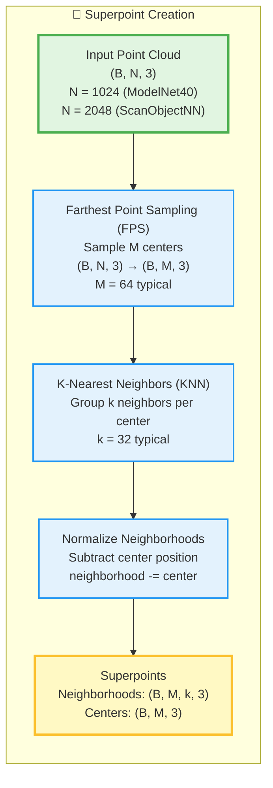
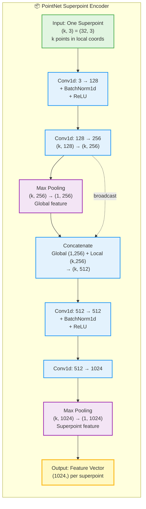
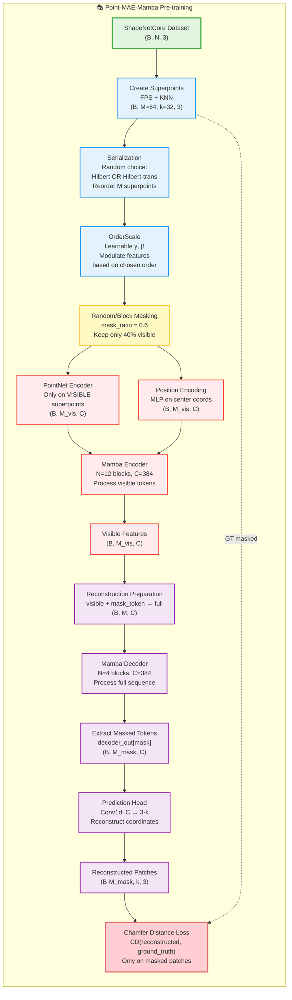
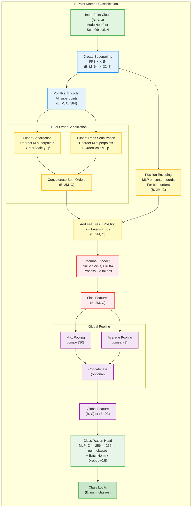
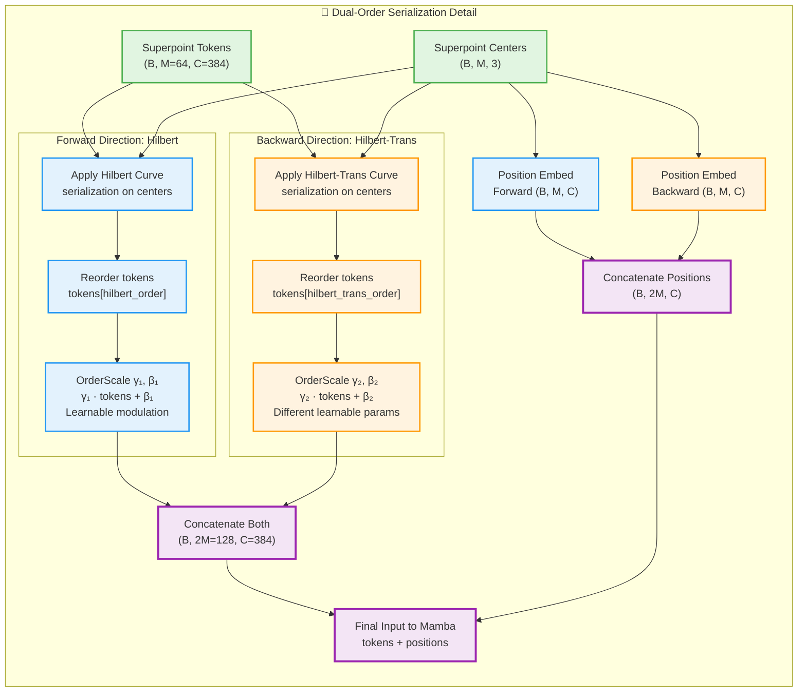
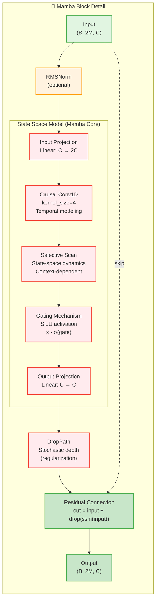

# Point-Mamba: Understanding the Architecture




## Introduction

**Point-Mamba** introduces a novel approach to 3D point cloud understanding by combining **space-filling curve serialization** with **Mamba (State Space Models)** instead of traditional Transformers. The architecture operates on **superpoint-level** representations rather than individual points, making it fundamentally designed for **classification tasks**, not segmentation.

> **Important Note:** Point-Mamba processes point clouds at the **patch/superpoint level** (M tokens), not at the point level (N tokens). This design makes it inherently unsuitable for dense prediction tasks like segmentation without significant architectural modifications.

---

## Two-Phase Training Strategy

Point-Mamba follows a standard two-phase approach:

1. **Pre-training Phase**: Self-supervised learning via Masked Autoencoding (MAE) on ShapeNetCore
2. **Fine-tuning Phase**: Supervised classification on downstream tasks (ModelNet40, ScanObjectNN)

---

## Core Pipeline: From Point Cloud to Superpoints

### Step 1: Superpoint Sampling (FPS + KNN)

The first critical step transforms the unstructured point cloud into a structured set of **superpoints** (also called patches or groups).



**Key Point:** After this step, we work with **M superpoints** (e.g., M=64), not N points (e.g., N=1024). Each superpoint represents a local region of ~32 points.

**Why this matters:** The entire Mamba encoder processes only M tokens, not N tokens. This dramatically reduces computational cost but **prevents dense per-point predictions** needed for segmentation.

---

### Step 2: Superpoint Feature Encoding (PointNet)

Each superpoint is encoded independently using a lightweight PointNet encoder.



**Result:** Each of the M superpoints is now represented by a feature vector of dimension C .

**Shape transformation:**
```
Input:  (B, M, k, 3) = (B, 64, 32, 3)
         ↓ PointNet applied per superpoint
Output: (B, M, C) = (B, 64, 1024)
```

---

## Phase 1: Pre-training with Masked Autoencoding (MAE)

### Architecture Overview



### Key Pre-training Mechanism

**Masking Strategy:**
- **Random masking**: Randomly select 60% of superpoints to mask
- **Block masking**: Mask a contiguous spatial block (selected by distance from a random center)

**What gets masked:** Entire superpoints (patches), not individual points within patches.

```
Example with M=64 superpoints, mask_ratio=0.6:

Visible: 26 superpoints → Encoded by Mamba
Masked:  38 superpoints → Replaced by learnable mask_token

Decoder reconstructs the 38 masked patches (38 × 32 = 1216 points)
```

**Training objective:**
```python
loss = ChamferDistance(
    reconstructed_patches,  # (B·M_mask, k, 3)
    ground_truth_patches    # (B·M_mask, k, 3)
)
```

---

## Phase 2: Fine-tuning for Classification

### Architecture Overview



### Dual-Order Serialization Strategy

Point-Mamba's key innovation for classification is processing superpoints in **two different spatial orders simultaneously**.



**Why dual-order?**
- Different space-filling curves capture different spatial patterns
- Processing the same data in two orders enriches representations
- OrderScale (γ, β) allows the model to learn order-specific feature modulations

**OrderScale mechanism:**
```python
# Learnable parameters per order
gamma_1, beta_1 = nn.Parameter(torch.ones(C)), nn.Parameter(torch.zeros(C))
gamma_2, beta_2 = nn.Parameter(torch.ones(C)), nn.Parameter(torch.zeros(C))

# Apply to forward/backward serialized tokens
tokens_forward_scaled = gamma_1 * tokens_forward + beta_1
tokens_backward_scaled = gamma_2 * tokens_backward + beta_2
```

---

### From Superpoints to Classification: The Aggregation

The critical step for classification is aggregating the 2M superpoint features into a **single global feature vector**.

```
Mamba Output: (B, 2M=128, C=384)
    ↓
Global Pooling: (B, C) or (B, 2C) if both max and avg
    ↓
Classification Head: (B, num_classes)
```

**Pooling strategies (ablation study findings):**

| Strategy | Shape | Performance |
|----------|-------|-------------|
| Max pooling only | (B, C) | Good |
| Avg pooling only | (B, C) | **Best** |
| Max + Avg concat | (B, 2C) | Good |
| CLS token | (B, C) | Worse |

> **Important finding from paper:** "Without [CLS] token and utilizing only average pooling of the final block's output yields the best results for Point-Mamba."

---

## Mamba Block: The Core Processing Unit



**Key difference from Transformer:**
- Transformer uses **attention** (Q @ K^T): O(sequence_length²) complexity
- Mamba uses **selective state-space**: O(sequence_length) complexity
- Mamba maintains a **hidden state** that evolves along the sequence (similar to RNNs but more efficient)

## Complete Shape Transformation Flow

### Pre-training (MAE)

```
(B, N, 3)                    Input point cloud
    ↓ FPS
(B, M, 3)                    Superpoint centers
    ↓ KNN
(B, M, k, 3)                 Neighborhoods
    ↓ PointNet per superpoint
(B, M, C)                    Superpoint features
    ↓ Serialization (1 order)
(B, M, C)                    Reordered features
    ↓ OrderScale
(B, M, C)                    Modulated features
    ↓ Masking (60%)
(B, M_vis, C)                Visible features only
    ↓ + Position
(B, M_vis, C)                Input to encoder
    ↓ Mamba Encoder (12 blocks)
(B, M_vis, C)                Encoded visible
    ↓ Add mask tokens
(B, M, C)                    Full sequence
    ↓ Mamba Decoder (4 blocks)
(B, M, C)                    Decoded features
    ↓ Extract masked
(B, M_mask, C)               Masked features
    ↓ Conv1d prediction head
(B·M_mask, k, 3)             Reconstructed patches
```

### Fine-tuning (Classification)

```
(B, N, 3)                    Input point cloud
    ↓ FPS
(B, M, 3)                    Superpoint centers
    ↓ KNN
(B, M, k, 3)                 Neighborhoods
    ↓ PointNet per superpoint
(B, M, C)                    Superpoint features
    ↓ Dual serialization
(B, M, C) × 2                Forward + Backward
    ↓ OrderScale × 2
(B, M, C) × 2                Modulated × 2
    ↓ Concatenate
(B, 2M, C)                   Combined features
    ↓ + Position
(B, 2M, C)                   Input to encoder
    ↓ Mamba Encoder (12 blocks)
(B, 2M, C)                   Encoded features
    ↓ Global pooling (avg)
(B, C)                       Global feature
    ↓ Classification head
(B, num_classes)             Class logits
```

---

## Summary: Why Superpoint-Level Processing?

**Advantages:**
1. **Local structure preservation**: Each superpoint captures a meaningful local region
2. **Hierarchical representation**: Superpoints act as abstracted representations

**Limitations:**
1. **Cannot do dense prediction**: No mechanism to return to N points
2. **Information loss**: k=32 points compressed into single vector

**Point-Mamba is fundamentally a** ***classification*** **architecture, not a segmentation architecture.** Adapting it for segmentation would require significant modifications including upsampling modules, multi-scale skip connections, and point-level feature extraction—none of which are present in the provided codebase.