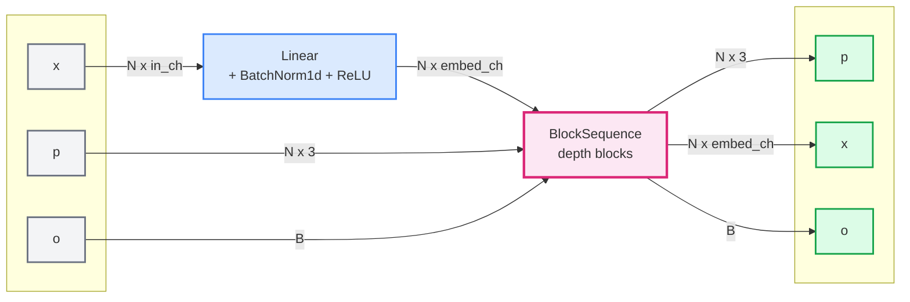

```mermaid

graph LR
    subgraph InputPXO[" "]
        p["p"]
        x["x"]
        o["o"]
    end
    
    x -->|N x in_ch| Proj["Linear<br>+ BatchNorm1d + ReLU"]
    Proj -->|N x embed_ch| BlockSeq["BlockSequence<br>depth blocks"]
    
    p -->|N x 3| BlockSeq
    o -->|B| BlockSeq
    
    subgraph OutputPXO[" "]
        pout["p"]
        xout["x"]
        oout["o"]
    end
    
    BlockSeq -->|N x 3| pout
    BlockSeq -->|N x embed_ch| xout
    BlockSeq -->|B| oout
    
    style p fill:#f3f4f6,stroke:#6b7280,stroke-width:2px
    style x fill:#f3f4f6,stroke:#6b7280,stroke-width:2px
    style o fill:#f3f4f6,stroke:#6b7280,stroke-width:2px
    
    style Proj fill:#dbeafe,stroke:#3b82f6,stroke-width:2px
    style BlockSeq fill:#fce7f3,stroke:#db2777,stroke-width:3px
    
    style pout fill:#dcfce7,stroke:#16a34a,stroke-width:2px
    style xout fill:#dcfce7,stroke:#16a34a,stroke-width:2px
    style oout fill:#dcfce7,stroke:#16a34a,stroke-width:2px
```
