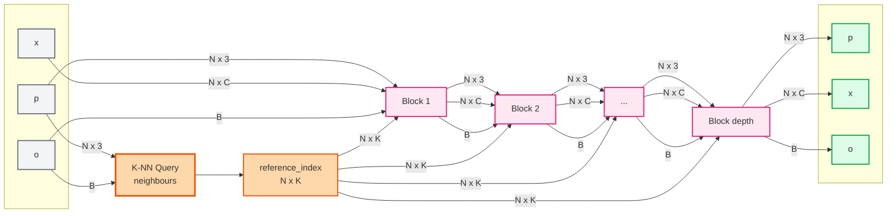

```mermaid
graph LR
    subgraph InputPXO[" "]
        p["p"]
        x["x"]
        o["o"]
    end
    
    p -->|N x 3| KNN["K-NN Query<br>neighbours"]
    o -->|B| KNN
    
    KNN --> RefIdx["reference_index<br>N x K"]
    
    p -->|N x 3| Block1["Block 1"]
    x -->|N x C| Block1
    o -->|B| Block1
    RefIdx -->|N x K| Block1
    
    Block1 -->|N x 3| Block2["Block 2"]
    Block1 -->|N x C| Block2
    Block1 -->|B| Block2
    RefIdx -->|N x K| Block2
    
    Block2 -->|N x 3| BlockDots["..."]
    Block2 -->|N x C| BlockDots
    Block2 -->|B| BlockDots
    RefIdx -->|N x K| BlockDots
    
    BlockDots -->|N x 3| BlockN["Block depth"]
    BlockDots -->|N x C| BlockN
    BlockDots -->|B| BlockN
    RefIdx -->|N x K| BlockN
    
    subgraph OutputPXO[" "]
        pout["p"]
        xout["x"]
        oout["o"]
    end
    
    BlockN -->|N x 3| pout
    BlockN -->|N x C| xout
    BlockN -->|B| oout
    
    style p fill:#f3f4f6,stroke:#6b7280,stroke-width:2px
    style x fill:#f3f4f6,stroke:#6b7280,stroke-width:2px
    style o fill:#f3f4f6,stroke:#6b7280,stroke-width:2px
    
    style KNN fill:#fed7aa,stroke:#ea580c,stroke-width:3px
    style RefIdx fill:#fed7aa,stroke:#ea580c,stroke-width:2px
    
    style Block1 fill:#fce7f3,stroke:#db2777,stroke-width:2px
    style Block2 fill:#fce7f3,stroke:#db2777,stroke-width:2px
    style BlockDots fill:#fce7f3,stroke:#db2777,stroke-width:2px
    style BlockN fill:#fce7f3,stroke:#db2777,stroke-width:2px
    
    style pout fill:#dcfce7,stroke:#16a34a,stroke-width:2px
    style xout fill:#dcfce7,stroke:#16a34a,stroke-width:2px
    style oout fill:#dcfce7,stroke:#16a34a,stroke-width:2px
```
