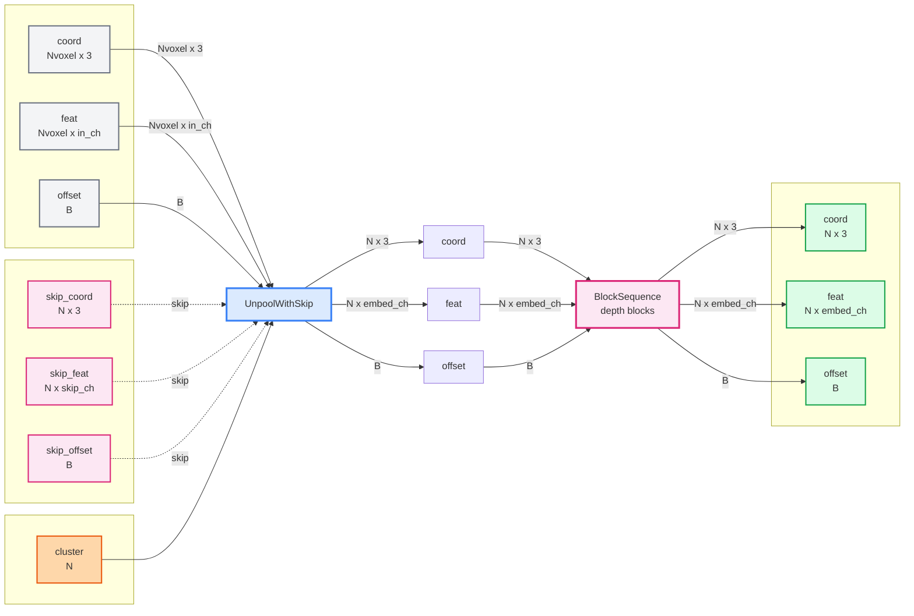

```mermaid

graph LR
    subgraph InputCurrent[" "]
        p["coord<br>Nvoxel x 3"]
        x["feat<br>Nvoxel x in_ch"]
        o["offset<br>B"]
    end
    
    subgraph InputSkip[" "]
        pskip["skip_coord<br>N x 3"]
        xskip["skip_feat<br>N x skip_ch"]
        oskip["skip_offset<br>B"]
    end
    
    subgraph InputCluster[" "]
        cluster["cluster<br>N"]
    end
    
    p -->|Nvoxel x 3| Unpool["UnpoolWithSkip"]
    x -->|Nvoxel x in_ch| Unpool
    o -->|B| Unpool
    pskip -.skip.-> Unpool
    xskip -.skip.-> Unpool
    oskip -.skip.-> Unpool
    cluster --> Unpool
    
    Unpool -->|N x 3| pout["coord"]
    Unpool -->|N x embed_ch| xout["feat"]
    Unpool -->|B| oout["offset"]
    
    pout -->|N x 3| BlockSeq["BlockSequence<br>depth blocks"]
    xout -->|N x embed_ch| BlockSeq
    oout -->|B| BlockSeq
    
    subgraph Output[" "]
        pfinal["coord<br>N x 3"]
        xfinal["feat<br>N x embed_ch"]
        ofinal["offset<br>B"]
    end
    
    BlockSeq -->|N x 3| pfinal
    BlockSeq -->|N x embed_ch| xfinal
    BlockSeq -->|B| ofinal
    
    style p fill:#f3f4f6,stroke:#6b7280,stroke-width:2px
    style x fill:#f3f4f6,stroke:#6b7280,stroke-width:2px
    style o fill:#f3f4f6,stroke:#6b7280,stroke-width:2px
    
    style pskip fill:#fce7f3,stroke:#db2777,stroke-width:2px
    style xskip fill:#fce7f3,stroke:#db2777,stroke-width:2px
    style oskip fill:#fce7f3,stroke:#db2777,stroke-width:2px
    
    style cluster fill:#fed7aa,stroke:#ea580c,stroke-width:2px
    
    style Unpool fill:#dbeafe,stroke:#3b82f6,stroke-width:3px
    style BlockSeq fill:#fce7f3,stroke:#db2777,stroke-width:3px
    
    style pfinal fill:#dcfce7,stroke:#16a34a,stroke-width:2px
    style xfinal fill:#dcfce7,stroke:#16a34a,stroke-width:2px
    style ofinal fill:#dcfce7,stroke:#16a34a,stroke-width:2px
```
