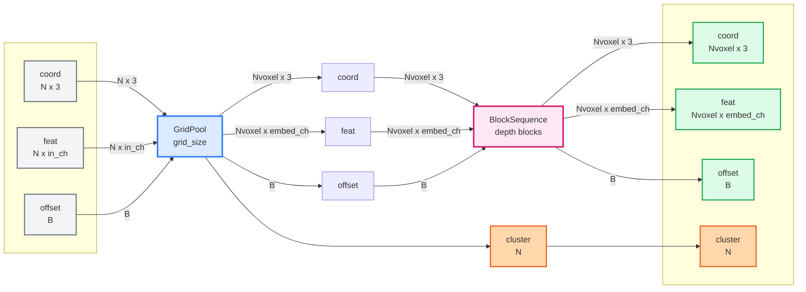

```mermaid

graph LR
    subgraph Input[" "]
        p["coord<br>N x 3"]
        x["feat<br>N x in_ch"]
        o["offset<br>B"]
    end
    
    p -->|N x 3| GridPool["GridPool<br>grid_size"]
    x -->|N x in_ch| GridPool
    o -->|B| GridPool
    
    GridPool -->|Nvoxel x 3| pout["coord"]
    GridPool -->|Nvoxel x embed_ch| xout["feat"]
    GridPool -->|B| oout["offset"]
    GridPool --> Cluster["cluster<br>N"]
    
    pout -->|Nvoxel x 3| BlockSeq["BlockSequence<br>depth blocks"]
    xout -->|Nvoxel x embed_ch| BlockSeq
    oout -->|B| BlockSeq
    
    subgraph Output[" "]
        pfinal["coord<br>Nvoxel x 3"]
        xfinal["feat<br>Nvoxel x embed_ch"]
        ofinal["offset<br>B"]
        clusterfinal["cluster<br>N"]
    end
    
    BlockSeq -->|Nvoxel x 3| pfinal
    BlockSeq -->|Nvoxel x embed_ch| xfinal
    BlockSeq -->|B| ofinal
    Cluster --> clusterfinal
    
    style p fill:#f3f4f6,stroke:#6b7280,stroke-width:2px
    style x fill:#f3f4f6,stroke:#6b7280,stroke-width:2px
    style o fill:#f3f4f6,stroke:#6b7280,stroke-width:2px
    
    style GridPool fill:#dbeafe,stroke:#3b82f6,stroke-width:3px
    style BlockSeq fill:#fce7f3,stroke:#db2777,stroke-width:3px
    
    style Cluster fill:#fed7aa,stroke:#ea580c,stroke-width:2px
    
    style pfinal fill:#dcfce7,stroke:#16a34a,stroke-width:2px
    style xfinal fill:#dcfce7,stroke:#16a34a,stroke-width:2px
    style ofinal fill:#dcfce7,stroke:#16a34a,stroke-width:2px
    style clusterfinal fill:#fed7aa,stroke:#ea580c,stroke-width:2px
```
