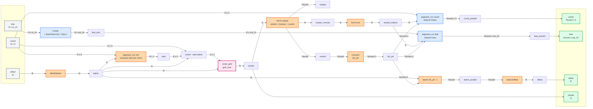

```mermaid

graph LR
    subgraph Input[" "]
        p["coord<br>N x 3"]
        x["feat<br>N x in_ch"]
        o["offset<br>B"]
    end
    
    x -->|N x in_ch| FC["Linear<br>+ BatchNorm1d + ReLU"]
    FC -->|N x out_ch| FeatProj["feat_proj"]
    
    o -->|B| O2B["offset2batch"]
    O2B -->|N| Batch["batch"]
    
    p -->|N x 3| SegStart["segment_csr min<br>compute start per cloud"]
    Batch -->|N| SegStart
    SegStart -->|B x 3| Start["start"]
    
    p -->|N x 3| Sub["coord - start batch"]
    Start -->|B x 3| Sub
    Batch -->|N| Sub
    Sub -->|N x 3| VoxelGrid["voxel_grid<br>grid_size"]
    Batch -->|N| VoxelGrid
    VoxelGrid -->|N| Cluster["cluster"]
    
    Cluster -->|N| Unique["torch.unique<br>sorted + inverse + counts"]
    Unique -->|Nvoxel| UniqueClusters["unique"]
    Unique -->|N| ClusterInv["cluster_inverse"]
    Unique -->|Nvoxel| Counts["counts"]
    
    ClusterInv -->|N| Sort["torch.sort"]
    Sort -->|N| SortedIdx["sorted_indices"]
    
    Counts -->|Nvoxel| CumSum["cumsum<br>idx_ptr"]
    CumSum -->|Nvoxel+1| IdxPtr["idx_ptr"]
    
    p -->|N x 3| SegCoord["segment_csr coord<br>reduce=mean"]
    SortedIdx -->|N| SegCoord
    IdxPtr -->|Nvoxel+1| SegCoord
    SegCoord -->|Nvoxel x 3| CoordOut["coord_pooled"]
    
    FeatProj -->|N x out_ch| SegFeat["segment_csr feat<br>reduce=max"]
    SortedIdx -->|N| SegFeat
    IdxPtr -->|Nvoxel+1| SegFeat
    SegFeat -->|Nvoxel x out_ch| FeatOut["feat_pooled"]
    
    Batch -->|N| BatchSample["batch idx_ptr -1"]
    IdxPtr -->|Nvoxel+1| BatchSample
    BatchSample -->|Nvoxel| BatchOut["batch_pooled"]
    
    BatchOut -->|Nvoxel| B2O["batch2offset"]
    B2O -->|B| OffsetOut["offset"]
    
    subgraph Output[" "]
        pout["coord<br>Nvoxel x 3"]
        xout["feat<br>Nvoxel x out_ch"]
        oout["offset<br>B"]
        clusterout["cluster<br>N"]
    end
    
    CoordOut --> pout
    FeatOut --> xout
    OffsetOut --> oout
    Cluster --> clusterout
    
    style p fill:#f3f4f6,stroke:#6b7280,stroke-width:2px
    style x fill:#f3f4f6,stroke:#6b7280,stroke-width:2px
    style o fill:#f3f4f6,stroke:#6b7280,stroke-width:2px
    
    style FC fill:#dbeafe,stroke:#3b82f6,stroke-width:2px
    style O2B fill:#fed7aa,stroke:#ea580c,stroke-width:2px
    style SegStart fill:#fed7aa,stroke:#ea580c,stroke-width:2px
    style VoxelGrid fill:#fce7f3,stroke:#db2777,stroke-width:3px
    style Unique fill:#fed7aa,stroke:#ea580c,stroke-width:2px
    style Sort fill:#fed7aa,stroke:#ea580c,stroke-width:2px
    style CumSum fill:#fed7aa,stroke:#ea580c,stroke-width:2px
    style SegCoord fill:#dbeafe,stroke:#3b82f6,stroke-width:2px
    style SegFeat fill:#dbeafe,stroke:#3b82f6,stroke-width:2px
    style BatchSample fill:#fed7aa,stroke:#ea580c,stroke-width:2px
    style B2O fill:#fed7aa,stroke:#ea580c,stroke-width:2px
    
    style pout fill:#dcfce7,stroke:#16a34a,stroke-width:2px
    style xout fill:#dcfce7,stroke:#16a34a,stroke-width:2px
    style oout fill:#dcfce7,stroke:#16a34a,stroke-width:2px
    style clusterout fill:#dcfce7,stroke:#16a34a,stroke-width:2px
```
