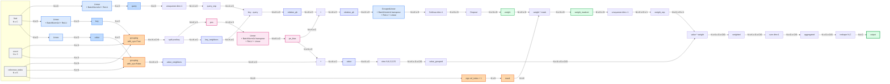

```mermaid

graph LR
    subgraph Input[" "]
        feat["feat<br>N x C"]
        coord["coord<br>N x 3"]
        ref["reference_index<br>N x K"]
    end
    
    feat -->|N x C| LinearQ["Linear<br>+ BatchNorm1d + ReLU"]
    feat -->|N x C| LinearK["Linear<br>+ BatchNorm1d + ReLU"]
    feat -->|N x C| LinearV["Linear"]
    
    LinearQ -->|N x C| Query["query"]
    LinearK -->|N x C| Key["key"]
    LinearV -->|N x C| Value["value"]
    
    Key -->|N x C| GroupK["grouping<br>with_xyz=True"]
    coord -->|N x 3| GroupK
    ref -->|N x K| GroupK
    
    Value -->|N x C| GroupV["grouping<br>with_xyz=False"]
    coord -->|N x 3| GroupV
    ref -->|N x K| GroupV
    
    GroupK -->|N x K x C+3| Split["split pos/key"]
    Split -->|N x K x 3| Pos["pos"]
    Split -->|N x K x C| KeyNeigh["key_neighbors"]
    
    GroupV -->|N x K x C| ValueNeigh["value_neighbors"]
    
    Query -->|N x C| Unsqueeze["unsqueeze dim=1"]
    Unsqueeze -->|N x 1 x C| QueryExp["query_exp"]
    
    KeyNeigh -->|N x K x C| Diff["key - query"]
    QueryExp -->|N x 1 x C| Diff
    Diff -->|N x K x C| RelQK["relation_qk"]
    
    Pos -->|N x K x 3| PEBias["Linear<br>+ BatchNorm1d transpose<br>+ ReLU + Linear"]
    PEBias -->|N x K x C| PEB["pe_bias"]
    
    RelQK -->|N x K x C| AddPE["+"]
    PEB -->|N x K x C| AddPE
    AddPE -->|N x K x C| RelQKFinal["relation_qk"]
    
    ValueNeigh -->|N x K x C| AddPEV["+"]
    PEB -->|N x K x C| AddPEV
    AddPEV -->|N x K x C| ValueFinal["value"]
    
    RelQKFinal -->|N x K x C| WeightEnc["GroupedLinear<br>+ BatchNorm1d transpose<br>+ ReLU + Linear"]
    WeightEnc -->|N x K x G| Softmax["Softmax dim=1"]
    Softmax -->|N x K x G| AttnDrop["Dropout"]
    AttnDrop -->|N x K x G| Weight["weight"]
    
    ref -->|N x K| Mask["sign ref_index + 1"]
    Mask -->|N x K| MaskVec["mask"]
    
    Weight -->|N x K x G| Mul["weight * mask"]
    MaskVec -->|N x K| Mul
    Mul -->|N x K x G| WeightMasked["weight_masked"]
    
    ValueFinal -->|N x K x C| Reshape["view N,K,G,C/G"]
    Reshape -->|N x K x G x C/G| ValueGrouped["value_grouped"]
    
    WeightMasked -->|N x K x G| UnsqueezeLast["unsqueeze dim=-1"]
    UnsqueezeLast -->|N x K x G x 1| WeightExp["weight_exp"]
    
    ValueGrouped -->|N x K x G x C/G| MulFinal["value * weight"]
    WeightExp -->|N x K x G x 1| MulFinal
    MulFinal -->|N x K x G x C/G| Weighted["weighted"]
    
    Weighted -->|N x K x G x C/G| SumNeigh["sum dim=1"]
    SumNeigh -->|N x G x C/G| Aggregated["aggregated"]
    
    Aggregated -->|N x G x C/G| Flatten["reshape N,C"]
    Flatten -->|N x C| Output["output"]
    
    style feat fill:#f3f4f6,stroke:#6b7280,stroke-width:2px
    style coord fill:#f3f4f6,stroke:#6b7280,stroke-width:2px
    style ref fill:#f3f4f6,stroke:#6b7280,stroke-width:2px
    
    style LinearQ fill:#dbeafe,stroke:#3b82f6,stroke-width:2px
    style LinearK fill:#dbeafe,stroke:#3b82f6,stroke-width:2px
    style LinearV fill:#dbeafe,stroke:#3b82f6,stroke-width:2px
    
    style Query fill:#bfdbfe,stroke:#3b82f6,stroke-width:2px
    style Key fill:#bfdbfe,stroke:#3b82f6,stroke-width:2px
    style Value fill:#bfdbfe,stroke:#3b82f6,stroke-width:2px
    
    style GroupK fill:#fed7aa,stroke:#ea580c,stroke-width:2px
    style GroupV fill:#fed7aa,stroke:#ea580c,stroke-width:2px
    
    style Pos fill:#fce7f3,stroke:#db2777,stroke-width:2px
    style KeyNeigh fill:#e0e7ff,stroke:#6366f1,stroke-width:2px
    style ValueNeigh fill:#e0e7ff,stroke:#6366f1,stroke-width:2px
    
    style PEBias fill:#fce7f3,stroke:#db2777,stroke-width:2px
    style PEB fill:#fce7f3,stroke:#db2777,stroke-width:2px
    
    style RelQK fill:#e0e7ff,stroke:#6366f1,stroke-width:2px
    style RelQKFinal fill:#e0e7ff,stroke:#6366f1,stroke-width:2px
    style ValueFinal fill:#e0e7ff,stroke:#6366f1,stroke-width:2px
    
    style WeightEnc fill:#dbeafe,stroke:#3b82f6,stroke-width:2px
    style Weight fill:#dcfce7,stroke:#16a34a,stroke-width:2px
    style WeightMasked fill:#dcfce7,stroke:#16a34a,stroke-width:2px
    
    style Mask fill:#fed7aa,stroke:#ea580c,stroke-width:2px
    style MaskVec fill:#fed7aa,stroke:#ea580c,stroke-width:2px
    
    style Output fill:#dcfce7,stroke:#16a34a,stroke-width:3px
```
