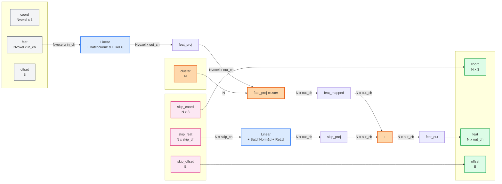

```mermaid

graph LR
    subgraph InputCurrent[" "]
        p["coord<br>Nvoxel x 3"]
        x["feat<br>Nvoxel x in_ch"]
        o["offset<br>B"]
    end
    
    subgraph InputSkip[" "]
        pskip["skip_coord<br>N x 3"]
        xskip["skip_feat<br>N x skip_ch"]
        oskip["skip_offset<br>B"]
    end
    
    subgraph InputCluster[" "]
        cluster["cluster<br>N"]
    end
    
    x -->|Nvoxel x in_ch| Proj["Linear<br>+ BatchNorm1d + ReLU"]
    Proj -->|Nvoxel x out_ch| FeatProj["feat_proj"]
    
    FeatProj -->|Nvoxel x out_ch| Map["feat_proj cluster"]
    cluster -->|N| Map
    Map -->|N x out_ch| FeatMapped["feat_mapped"]
    
    xskip -->|N x skip_ch| ProjSkip["Linear<br>+ BatchNorm1d + ReLU"]
    ProjSkip -->|N x out_ch| SkipProj["skip_proj"]
    
    FeatMapped -->|N x out_ch| Add["+"]
    SkipProj -->|N x out_ch| Add
    Add -->|N x out_ch| FeatOut["feat_out"]
    
    subgraph Output[" "]
        pout["coord<br>N x 3"]
        xout["feat<br>N x out_ch"]
        oout["offset<br>B"]
    end
    
    pskip --> pout
    FeatOut --> xout
    oskip --> oout
    
    style p fill:#f3f4f6,stroke:#6b7280,stroke-width:2px
    style x fill:#f3f4f6,stroke:#6b7280,stroke-width:2px
    style o fill:#f3f4f6,stroke:#6b7280,stroke-width:2px
    style pskip fill:#fce7f3,stroke:#db2777,stroke-width:2px
    style xskip fill:#fce7f3,stroke:#db2777,stroke-width:2px
    style oskip fill:#fce7f3,stroke:#db2777,stroke-width:2px
    style cluster fill:#fed7aa,stroke:#ea580c,stroke-width:2px
    
    style Proj fill:#dbeafe,stroke:#3b82f6,stroke-width:2px
    style Map fill:#fed7aa,stroke:#ea580c,stroke-width:3px
    style ProjSkip fill:#dbeafe,stroke:#3b82f6,stroke-width:2px
    style Add fill:#fed7aa,stroke:#ea580c,stroke-width:2px
    
    style pout fill:#dcfce7,stroke:#16a34a,stroke-width:2px
    style xout fill:#dcfce7,stroke:#16a34a,stroke-width:2px
    style oout fill:#dcfce7,stroke:#16a34a,stroke-width:2px
```
