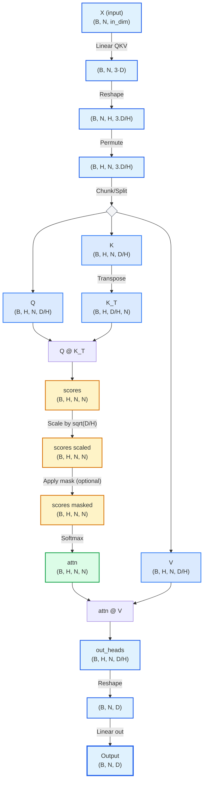

```mermaid
---
config:
  layout: dagre
---
flowchart TD
    X["X (input)<br>(B, N, in_dim)"] -- Linear QKV --> XProj["(B, N, 3·D)"]
    XProj -- Reshape --> XR["(B, N, H, 3.D/H)"]
    XR -- Permute --> XP["(B, H, N, 3.D/H)"]
    XP -- Chunk/Split --> QKV{" "}
    QKV --> Q["Q<br>(B, H, N, D/H)"] & K["K<br>(B, H, N, D/H)"] & V["V<br>(B, H, N, D/H)"]
    K -- Transpose --> KT["K_T<br>(B, H, D/H, N)"]
    Q --> MatMul["Q @ K_T"]
    KT --> MatMul
    MatMul --> Scores["scores<br>(B, H, N, N)"]
    Scores -- Scale by sqrt(D/H) --> Scaled["scores scaled<br>(B, H, N, N)"]
    Scaled -- Apply mask (optional) --> Masked["scores masked<br>(B, H, N, N)"]
    Masked -- Softmax --> Attn["attn<br>(B, H, N, N)"]
    Attn --> MatMul2["attn @ V"]
    V --> MatMul2
    MatMul2 --> OutPerm["out_heads<br>(B, H, N, D/H)"]
    OutPerm -- Reshape --> OutConcat["(B, N, D)"]
    OutConcat -- Linear out --> Output["Output<br>(B, N, D)"]
    style X fill:#e0f2fe,stroke:#2563eb,stroke-width:2px
    style XProj fill:#e0f2fe,stroke:#2563eb,stroke-width:2px
    style XR fill:#e0f2fe,stroke:#2563eb,stroke-width:2px
    style XP fill:#e0f2fe,stroke:#2563eb,stroke-width:2px
    style QKV fill:#f3f4f6,stroke:#6b7280,stroke-width:1px
    style Q fill:#dbeafe,stroke:#3b82f6,stroke-width:2px
    style K fill:#dbeafe,stroke:#3b82f6,stroke-width:2px
    style V fill:#dbeafe,stroke:#3b82f6,stroke-width:2px
    style KT fill:#dbeafe,stroke:#3b82f6,stroke-width:2px
    style Scores fill:#fef3c7,stroke:#d97706,stroke-width:2px
    style Scaled fill:#fef3c7,stroke:#d97706,stroke-width:2px
    style Masked fill:#fef3c7,stroke:#d97706,stroke-width:2px
    style Attn fill:#dcfce7,stroke:#16a34a,stroke-width:2px
    style OutPerm fill:#e0f2fe,stroke:#2563eb,stroke-width:2px
    style OutConcat fill:#e0f2fe,stroke:#2563eb,stroke-width:2px
    style Output fill:#e0f2fe,stroke:#2563eb,stroke-width:3px
```