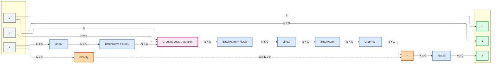

```mermaid
---
config:
  layout: elk
---
graph LR
    subgraph InputPXO[" "]
        p["p"]
        x["x"]
        o["o"]
    end
    
    x -->|N x C| Identity["identity"]
    x -->|N x C| FC1["Linear"]
    
    FC1 -->|N x C| Norm1["BatchNorm + ReLU"]
    Norm1 -->|N x C| GVA["GroupedVectorAttention"]
    
    p -->|N x 3| GVA
    o -->|B| GVA
    
    GVA -->|N x C| Norm2["BatchNorm + ReLU"]
    Norm2 -->|N x C| FC3["Linear"]
    FC3 -->|N x C| Norm3["BatchNorm"]
    
    Norm3 -->|N x C| DropPath["DropPath"]
    DropPath -->|N x C| Add["+"]
    Identity -.skip N x C.-> Add
    
    Add -->|N x C| ReLU["ReLU"]
    
    subgraph OutputPXO[" "]
        pout["p"]
        xout["x"]
        oout["o"]
    end
    
    p -->|N x 3| pout
    ReLU -->|N x C| xout
    o -->|B| oout
    
    style p fill:#f3f4f6,stroke:#6b7280,stroke-width:2px
    style x fill:#f3f4f6,stroke:#6b7280,stroke-width:2px
    style o fill:#f3f4f6,stroke:#6b7280,stroke-width:2px
    
    style Identity fill:#fed7aa,stroke:#ea580c,stroke-width:2px
    style FC1 fill:#dbeafe,stroke:#3b82f6,stroke-width:2px
    style Norm1 fill:#dbeafe,stroke:#3b82f6,stroke-width:2px
    
    style GVA fill:#fce7f3,stroke:#db2777,stroke-width:3px
    
    style Norm2 fill:#dbeafe,stroke:#3b82f6,stroke-width:2px
    style FC3 fill:#dbeafe,stroke:#3b82f6,stroke-width:2px
    style Norm3 fill:#dbeafe,stroke:#3b82f6,stroke-width:2px
    style DropPath fill:#dbeafe,stroke:#3b82f6,stroke-width:2px
    
    style Add fill:#fed7aa,stroke:#ea580c,stroke-width:3px
    style ReLU fill:#dbeafe,stroke:#3b82f6,stroke-width:2px
    
    style pout fill:#dcfce7,stroke:#16a34a,stroke-width:2px
    style xout fill:#dcfce7,stroke:#16a34a,stroke-width:2px
    style oout fill:#dcfce7,stroke:#16a34a,stroke-width:2px
```
