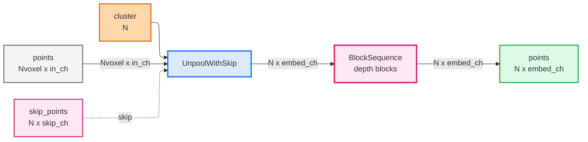

```mermaid
---
config:
  layout: elk
---
graph LR
    InputCurrent["points<br>Nvoxel x in_ch"] -->|Nvoxel x in_ch| Unpool["UnpoolWithSkip"]
    InputSkip["skip_points<br>N x skip_ch"] -.skip.-> Unpool
    InputCluster["cluster<br>N"] --> Unpool
    
    Unpool -->|N x embed_ch| BlockSeq["BlockSequence<br>depth blocks"]
    BlockSeq -->|N x embed_ch| Output["points<br>N x embed_ch"]
    
    style InputCurrent fill:#f3f4f6,stroke:#6b7280,stroke-width:2px
    style InputSkip fill:#fce7f3,stroke:#db2777,stroke-width:2px
    style InputCluster fill:#fed7aa,stroke:#ea580c,stroke-width:2px
    style Unpool fill:#dbeafe,stroke:#3b82f6,stroke-width:3px
    style BlockSeq fill:#fce7f3,stroke:#db2777,stroke-width:3px
    style Output fill:#dcfce7,stroke:#16a34a,stroke-width:2px
```
