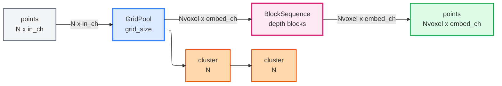

```mermaid
---
config:
  layout: elk
---
graph LR
    Input["points<br>N x in_ch"] -->|N x in_ch| GridPool["GridPool<br>grid_size"]
    
    GridPool -->|Nvoxel x embed_ch| BlockSeq["BlockSequence<br>depth blocks"]
    GridPool --> Cluster["cluster<br>N"]
    
    BlockSeq -->|Nvoxel x embed_ch| Output["points<br>Nvoxel x embed_ch"]
    Cluster --> ClusterOut["cluster<br>N"]
    
    style Input fill:#f3f4f6,stroke:#6b7280,stroke-width:2px
    style GridPool fill:#dbeafe,stroke:#3b82f6,stroke-width:3px
    style BlockSeq fill:#fce7f3,stroke:#db2777,stroke-width:3px
    style Output fill:#dcfce7,stroke:#16a34a,stroke-width:2px
    style Cluster fill:#fed7aa,stroke:#ea580c,stroke-width:2px
    style ClusterOut fill:#fed7aa,stroke:#ea580c,stroke-width:2px
```
