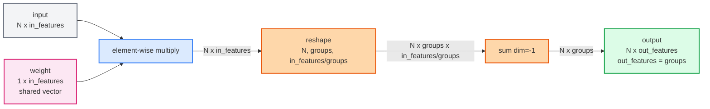

```mermaid
graph LR
    Input["input<br>N x in_features"] --> Mul["element-wise multiply"]
    Weight["weight<br>1 x in_features<br>shared vector"] --> Mul
    
    Mul -->|N x in_features| Reshape["reshape<br>N, groups, in_features/groups"]
    
    Reshape -->|N x groups x in_features/groups| Sum["sum dim=-1"]
    
    Sum -->|N x groups| Output["output<br>N x out_features<br>out_features = groups"]
    
    style Input fill:#f3f4f6,stroke:#6b7280,stroke-width:2px
    style Weight fill:#fce7f3,stroke:#db2777,stroke-width:2px
    style Mul fill:#dbeafe,stroke:#3b82f6,stroke-width:2px
    style Reshape fill:#fed7aa,stroke:#ea580c,stroke-width:2px
    style Sum fill:#fed7aa,stroke:#ea580c,stroke-width:2px
    style Output fill:#dcfce7,stroke:#16a34a,stroke-width:2px
```

