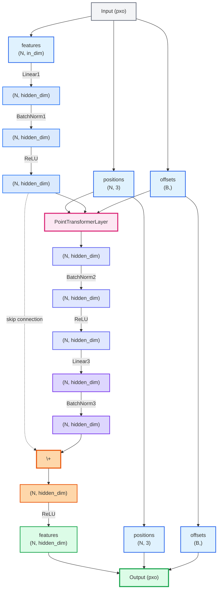

```mermaid
---
config:
  layout: dagre
---
flowchart TD
    Input["Input (pxo)"] --> P["positions<br>(N, 3)"] & X["features<br>(N, in_dim)"] & O["offsets<br>(B,)"]
    
    X -- Linear1 --> X1["(N, hidden_dim)"]
    X1 -- BatchNorm1 --> X1BN["(N, hidden_dim)"]
    X1BN -- ReLU --> X1Act["(N, hidden_dim)"]
    
    P --> PTL["PointTransformerLayer"] & POut["positions<br>(N, 3)"]
    X1Act --> PTL
    O --> PTL & OOut["offsets<br>(B,)"]
    
    PTL --> X2["(N, hidden_dim)"]
    X2 -- BatchNorm2 --> X2BN["(N, hidden_dim)"]
    X2BN -- ReLU --> X2Act["(N, hidden_dim)"]
    
    X2Act -- Linear3 --> X3["(N, hidden_dim)"]
    X3 -- BatchNorm3 --> X3BN["(N, hidden_dim)"]
    
    X1Act -.skip connection.-> Add["\+"]
    X3BN --> Add
    
    Add --> XSum["(N, hidden_dim)"]
    XSum -- ReLU --> XOut["features<br>(N, hidden_dim)"]
    
    XOut --> Output["Output (pxo)"]
    POut --> Output
    OOut --> Output
    
    style Input fill:#f3f4f6,stroke:#6b7280,stroke-width:2px
    style P fill:#e0f2fe,stroke:#2563eb,stroke-width:2px
    style X fill:#e0f2fe,stroke:#2563eb,stroke-width:2px
    style O fill:#e0f2fe,stroke:#2563eb,stroke-width:2px
    
    style X1 fill:#dbeafe,stroke:#3b82f6,stroke-width:2px
    style X1BN fill:#dbeafe,stroke:#3b82f6,stroke-width:2px
    style X1Act fill:#dbeafe,stroke:#3b82f6,stroke-width:2px
    
    style PTL fill:#fce7f3,stroke:#db2777,stroke-width:3px
    
    style X2 fill:#e0e7ff,stroke:#6366f1,stroke-width:2px
    style X2BN fill:#e0e7ff,stroke:#6366f1,stroke-width:2px
    style X2Act fill:#e0e7ff,stroke:#6366f1,stroke-width:2px
    
    style X3 fill:#ddd6fe,stroke:#7c3aed,stroke-width:2px
    style X3BN fill:#ddd6fe,stroke:#7c3aed,stroke-width:2px
    
    style Add fill:#fed7aa,stroke:#ea580c,stroke-width:3px
    style XSum fill:#fed7aa,stroke:#ea580c,stroke-width:2px
    style XOut fill:#dcfce7,stroke:#16a34a,stroke-width:2px
    
    style POut fill:#e0f2fe,stroke:#2563eb,stroke-width:2px
    style OOut fill:#e0f2fe,stroke:#2563eb,stroke-width:2px
    style Output fill:#dcfce7,stroke:#16a34a,stroke-width:3px
```