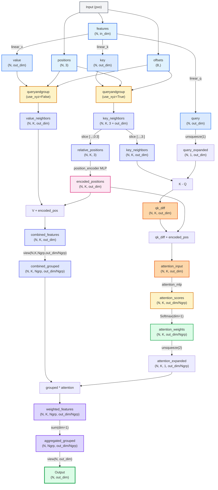

```mermaid
---
config:
  layout: dagre
---
flowchart TD
    Input["Input (pxo)"] --> P["positions<br>(N, 3)"]
    Input --> X["features<br>(N, in_dim)"]
    Input --> O["offsets<br>(B,)"]
    
    X -- linear_q --> Q["query<br>(N, out_dim)"]
    X -- linear_k --> K["key<br>(N, out_dim)"]
    X -- linear_v --> V["value<br>(N, out_dim)"]
    
    K --> KNN1["queryandgroup<br>(use_xyz=True)"]
    P --> KNN1
    O --> KNN1
    KNN1 --> KNeighbors["key_neighbors<br>(N, K, 3 + out_dim)"]
    
    V --> KNN2["queryandgroup<br>(use_xyz=False)"]
    P --> KNN2
    O --> KNN2
    KNN2 --> VNeighbors["value_neighbors<br>(N, K, out_dim)"]
    
    KNeighbors -- "slice [:,:,0:3]" --> RelPos["relative_positions<br>(N, K, 3)"]
    KNeighbors -- "slice [:,:,3:]" --> KNeighborsClean["key_neighbors<br>(N, K, out_dim)"]
    
    RelPos -- position_encoder MLP --> EncPos["encoded_positions<br>(N, K, out_dim)"]
    
    Q -- unsqueeze(1) --> QExp["query_expanded<br>(N, 1, out_dim)"]
    KNeighborsClean --> Diff["K - Q"]
    QExp --> Diff
    Diff --> QKDiff["qk_diff<br>(N, K, out_dim)"]
    
    QKDiff --> Combine["qk_diff + encoded_pos"]
    EncPos --> Combine
    Combine --> AttnInput["attention_input<br>(N, K, out_dim)"]
    
    AttnInput -- attention_mlp --> AttnScores["attention_scores<br>(N, K, out_dim/Ngrp)"]
    AttnScores -- Softmax(dim=1) --> AttnWeights["attention_weights<br>(N, K, out_dim/Ngrp)"]
    
    VNeighbors --> CombFeats["V + encoded_pos"]
    EncPos --> CombFeats
    CombFeats --> Combined["combined_features<br>(N, K, out_dim)"]
    
    Combined -- "view(N,K,Ngrp,out_dim/Ngrp)" --> Grouped["combined_grouped<br>(N, K, Ngrp, out_dim/Ngrp)"]
    AttnWeights -- unsqueeze(2) --> AttnExp["attention_expanded<br>(N, K, 1, out_dim/Ngrp)"]
    
    Grouped --> Multiply["grouped * attention"]
    AttnExp --> Multiply
    Multiply --> Weighted["weighted_features<br>(N, K, Ngrp, out_dim/Ngrp)"]
    
    Weighted -- "sum(dim=1)" --> Aggregated["aggregated_grouped<br>(N, Ngrp, out_dim/Ngrp)"]
    Aggregated -- "view(N, out_dim)" --> OutputFinal["Output<br>(N, out_dim)"]
    
    style Input fill:#f3f4f6,stroke:#6b7280,stroke-width:2px
    style P fill:#e0f2fe,stroke:#2563eb,stroke-width:2px
    style X fill:#e0f2fe,stroke:#2563eb,stroke-width:2px
    style O fill:#e0f2fe,stroke:#2563eb,stroke-width:2px
    
    style Q fill:#dbeafe,stroke:#3b82f6,stroke-width:2px
    style K fill:#dbeafe,stroke:#3b82f6,stroke-width:2px
    style V fill:#dbeafe,stroke:#3b82f6,stroke-width:2px
    
    style KNN1 fill:#fef3c7,stroke:#d97706,stroke-width:2px
    style KNN2 fill:#fef3c7,stroke:#d97706,stroke-width:2px
    
    style KNeighbors fill:#e0e7ff,stroke:#6366f1,stroke-width:2px
    style VNeighbors fill:#e0e7ff,stroke:#6366f1,stroke-width:2px
    style RelPos fill:#e0e7ff,stroke:#6366f1,stroke-width:2px
    style KNeighborsClean fill:#e0e7ff,stroke:#6366f1,stroke-width:2px
    
    style EncPos fill:#fce7f3,stroke:#db2777,stroke-width:2px
    
    style QKDiff fill:#fed7aa,stroke:#ea580c,stroke-width:2px
    style AttnInput fill:#fed7aa,stroke:#ea580c,stroke-width:2px
    style AttnScores fill:#fef3c7,stroke:#d97706,stroke-width:2px
    style AttnWeights fill:#dcfce7,stroke:#16a34a,stroke-width:2px
    
    style Combined fill:#e0e7ff,stroke:#6366f1,stroke-width:2px
    style Grouped fill:#e0e7ff,stroke:#6366f1,stroke-width:2px
    style Weighted fill:#ddd6fe,stroke:#7c3aed,stroke-width:2px
    style Aggregated fill:#ddd6fe,stroke:#7c3aed,stroke-width:2px
    
    style OutputFinal fill:#dcfce7,stroke:#16a34a,stroke-width:3px
```