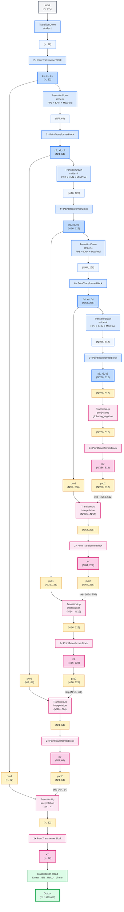

```mermaid
---
config:
  layout: dagre
---
flowchart TD
    Input["Input<br>(N, 3+C)"] --> Enc1Start["TransitionDown<br>stride=1"]
    
    Enc1Start --> Enc1Mid["(N, 32)"]
    Enc1Mid --> Enc1Blocks["2× PointTransformerBlock"]
    Enc1Blocks --> P1["p1, x1, o1<br>(N, 32)"]
    
    P1 --> Enc2Start["TransitionDown<br>stride=4<br>FPS + KNN + MaxPool"]
    Enc2Start --> Enc2Mid["(N/4, 64)"]
    Enc2Mid --> Enc2Blocks["3× PointTransformerBlock"]
    Enc2Blocks --> P2["p2, x2, o2<br>(N/4, 64)"]
    
    P2 --> Enc3Start["TransitionDown<br>stride=4<br>FPS + KNN + MaxPool"]
    Enc3Start --> Enc3Mid["(N/16, 128)"]
    Enc3Mid --> Enc3Blocks["4× PointTransformerBlock"]
    Enc3Blocks --> P3["p3, x3, o3<br>(N/16, 128)"]
    
    P3 --> Enc4Start["TransitionDown<br>stride=4<br>FPS + KNN + MaxPool"]
    Enc4Start --> Enc4Mid["(N/64, 256)"]
    Enc4Mid --> Enc4Blocks["6× PointTransformerBlock"]
    Enc4Blocks --> P4["p4, x4, o4<br>(N/64, 256)"]
    
    P4 --> Enc5Start["TransitionDown<br>stride=4<br>FPS + KNN + MaxPool"]
    Enc5Start --> Enc5Mid["(N/256, 512)"]
    Enc5Mid --> Enc5Blocks["3× PointTransformerBlock"]
    Enc5Blocks --> P5["p5, x5, o5<br>(N/256, 512)"]
    
    P5 --> Dec5In["(N/256, 512)"]
    Dec5In --> Dec5Up["TransitionUp<br>pxo2=None<br>global aggregation"]
    Dec5Up --> Dec5Mid["(N/256, 512)"]
    Dec5Mid --> Dec5Blocks["2× PointTransformerBlock"]
    Dec5Blocks --> P5Dec["x5'<br>(N/256, 512)"]
    
    P4 --> Dec4In1["pxo1<br>(N/64, 256)"]
    P5Dec --> Dec4In2["pxo2<br>(N/256, 512)"]
    Dec4In1 --> Dec4Up["TransitionUp<br>interpolation<br>(N/256→N/64)"]
    Dec4In2 -.skip (N/256, 512).-> Dec4Up
    Dec4Up --> Dec4Mid["(N/64, 256)"]
    Dec4Mid --> Dec4Blocks["2× PointTransformerBlock"]
    Dec4Blocks --> P4Dec["x4'<br>(N/64, 256)"]
    
    P3 --> Dec3In1["pxo1<br>(N/16, 128)"]
    P4Dec --> Dec3In2["pxo2<br>(N/64, 256)"]
    Dec3In1 --> Dec3Up["TransitionUp<br>interpolation<br>(N/64→N/16)"]
    Dec3In2 -.skip (N/64, 256).-> Dec3Up
    Dec3Up --> Dec3Mid["(N/16, 128)"]
    Dec3Mid --> Dec3Blocks["2× PointTransformerBlock"]
    Dec3Blocks --> P3Dec["x3'<br>(N/16, 128)"]
    
    P2 --> Dec2In1["pxo1<br>(N/4, 64)"]
    P3Dec --> Dec2In2["pxo2<br>(N/16, 128)"]
    Dec2In1 --> Dec2Up["TransitionUp<br>interpolation<br>(N/16→N/4)"]
    Dec2In2 -.skip (N/16, 128).-> Dec2Up
    Dec2Up --> Dec2Mid["(N/4, 64)"]
    Dec2Mid --> Dec2Blocks["2× PointTransformerBlock"]
    Dec2Blocks --> P2Dec["x2'<br>(N/4, 64)"]
    
    P1 --> Dec1In1["pxo1<br>(N, 32)"]
    P2Dec --> Dec1In2["pxo2<br>(N/4, 64)"]
    Dec1In1 --> Dec1Up["TransitionUp<br>interpolation<br>(N/4→N)"]
    Dec1In2 -.skip (N/4, 64).-> Dec1Up
    Dec1Up --> Dec1Mid["(N, 32)"]
    Dec1Mid --> Dec1Blocks["2× PointTransformerBlock"]
    Dec1Blocks --> P1Dec["x1'<br>(N, 32)"]
    
    P1Dec --> Cls["Classification Head<br>Linear→BN→ReLU→Linear"]
    Cls --> Output["Output<br>(N, K classes)"]
    
    style Input fill:#f3f4f6,stroke:#6b7280,stroke-width:3px
    
    style Enc1Start fill:#dbeafe,stroke:#3b82f6,stroke-width:2px
    style Enc1Mid fill:#eff6ff,stroke:#3b82f6,stroke-width:1px
    style Enc1Blocks fill:#dbeafe,stroke:#3b82f6,stroke-width:2px
    style P1 fill:#bfdbfe,stroke:#3b82f6,stroke-width:3px
    
    style Enc2Start fill:#dbeafe,stroke:#3b82f6,stroke-width:2px
    style Enc2Mid fill:#eff6ff,stroke:#3b82f6,stroke-width:1px
    style Enc2Blocks fill:#dbeafe,stroke:#3b82f6,stroke-width:2px
    style P2 fill:#bfdbfe,stroke:#3b82f6,stroke-width:3px
    
    style Enc3Start fill:#dbeafe,stroke:#3b82f6,stroke-width:2px
    style Enc3Mid fill:#eff6ff,stroke:#3b82f6,stroke-width:1px
    style Enc3Blocks fill:#dbeafe,stroke:#3b82f6,stroke-width:2px
    style P3 fill:#bfdbfe,stroke:#3b82f6,stroke-width:3px
    
    style Enc4Start fill:#dbeafe,stroke:#3b82f6,stroke-width:2px
    style Enc4Mid fill:#eff6ff,stroke:#3b82f6,stroke-width:1px
    style Enc4Blocks fill:#dbeafe,stroke:#3b82f6,stroke-width:2px
    style P4 fill:#bfdbfe,stroke:#3b82f6,stroke-width:3px
    
    style Enc5Start fill:#dbeafe,stroke:#3b82f6,stroke-width:2px
    style Enc5Mid fill:#eff6ff,stroke:#3b82f6,stroke-width:1px
    style Enc5Blocks fill:#dbeafe,stroke:#3b82f6,stroke-width:2px
    style P5 fill:#bfdbfe,stroke:#3b82f6,stroke-width:3px
    
    style Dec5In fill:#fef3c7,stroke:#d97706,stroke-width:1px
    style Dec5Up fill:#fce7f3,stroke:#db2777,stroke-width:2px
    style Dec5Mid fill:#fef3c7,stroke:#d97706,stroke-width:1px
    style Dec5Blocks fill:#fce7f3,stroke:#db2777,stroke-width:2px
    style P5Dec fill:#fbcfe8,stroke:#db2777,stroke-width:3px
    
    style Dec4In1 fill:#fef3c7,stroke:#d97706,stroke-width:1px
    style Dec4In2 fill:#fef3c7,stroke:#d97706,stroke-width:1px
    style Dec4Up fill:#fce7f3,stroke:#db2777,stroke-width:2px
    style Dec4Mid fill:#fef3c7,stroke:#d97706,stroke-width:1px
    style Dec4Blocks fill:#fce7f3,stroke:#db2777,stroke-width:2px
    style P4Dec fill:#fbcfe8,stroke:#db2777,stroke-width:3px
    
    style Dec3In1 fill:#fef3c7,stroke:#d97706,stroke-width:1px
    style Dec3In2 fill:#fef3c7,stroke:#d97706,stroke-width:1px
    style Dec3Up fill:#fce7f3,stroke:#db2777,stroke-width:2px
    style Dec3Mid fill:#fef3c7,stroke:#d97706,stroke-width:1px
    style Dec3Blocks fill:#fce7f3,stroke:#db2777,stroke-width:2px
    style P3Dec fill:#fbcfe8,stroke:#db2777,stroke-width:3px
    
    style Dec2In1 fill:#fef3c7,stroke:#d97706,stroke-width:1px
    style Dec2In2 fill:#fef3c7,stroke:#d97706,stroke-width:1px
    style Dec2Up fill:#fce7f3,stroke:#db2777,stroke-width:2px
    style Dec2Mid fill:#fef3c7,stroke:#d97706,stroke-width:1px
    style Dec2Blocks fill:#fce7f3,stroke:#db2777,stroke-width:2px
    style P2Dec fill:#fbcfe8,stroke:#db2777,stroke-width:3px
    
    style Dec1In1 fill:#fef3c7,stroke:#d97706,stroke-width:1px
    style Dec1In2 fill:#fef3c7,stroke:#d97706,stroke-width:1px
    style Dec1Up fill:#fce7f3,stroke:#db2777,stroke-width:2px
    style Dec1Mid fill:#fef3c7,stroke:#d97706,stroke-width:1px
    style Dec1Blocks fill:#fce7f3,stroke:#db2777,stroke-width:2px
    style P1Dec fill:#fbcfe8,stroke:#db2777,stroke-width:3px
    
    style Cls fill:#dcfce7,stroke:#16a34a,stroke-width:2px
    style Output fill:#dcfce7,stroke:#16a34a,stroke-width:3px
```