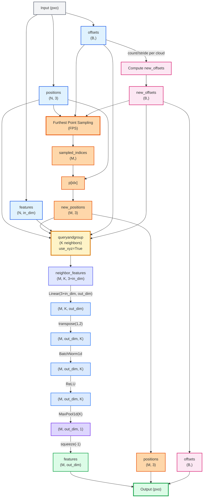

```mermaid
---
config:
  layout: dagre
---
flowchart TD
    Input["Input (pxo)"] --> P["positions<br>(N, 3)"] & X["features<br>(N, in_dim)"] & O["offsets<br>(B,)"]
    
    O -- "count//stride per cloud" --> ComputeOffsets["Compute new_offsets"]
    ComputeOffsets --> NewO["new_offsets<br>(B,)"]
    
    P --> FPS["Furthest Point Sampling<br>(FPS)"]
    O --> FPS
    NewO --> FPS
    FPS --> Idx["sampled_indices<br>(M,)"]
    
    Idx --> ExtractPos["p[idx]"]
    P --> ExtractPos
    ExtractPos --> NewP["new_positions<br>(M, 3)"]
    
    P --> KNN["queryandgroup<br>(K neighbors)<br>use_xyz=True"]
    NewP --> KNN
    X --> KNN
    O --> KNN
    NewO --> KNN
    KNN --> XNeighbors["neighbor_features<br>(M, K, 3+in_dim)"]
    
    XNeighbors -- "Linear(3+in_dim, out_dim)" --> XProj["(M, K, out_dim)"]
    XProj -- "transpose(1,2)" --> XProjT["(M, out_dim, K)"]
    XProjT -- BatchNorm1d --> XProjBN["(M, out_dim, K)"]
    XProjBN -- ReLU --> XProjAct["(M, out_dim, K)"]
    XProjAct -- "MaxPool1d(K)" --> XPooled["(M, out_dim, 1)"]
    XPooled -- "squeeze(-1)" --> XOut["features<br>(M, out_dim)"]
    
    NewP --> POut["positions<br>(M, 3)"]
    NewO --> OOut["offsets<br>(B,)"]
    
    XOut --> Output["Output (pxo)"]
    POut --> Output
    OOut --> Output
    
    style Input fill:#f3f4f6,stroke:#6b7280,stroke-width:2px
    style P fill:#e0f2fe,stroke:#2563eb,stroke-width:2px
    style X fill:#e0f2fe,stroke:#2563eb,stroke-width:2px
    style O fill:#e0f2fe,stroke:#2563eb,stroke-width:2px
    
    style ComputeOffsets fill:#fce7f3,stroke:#db2777,stroke-width:2px
    style NewO fill:#fce7f3,stroke:#db2777,stroke-width:2px
    
    style FPS fill:#fed7aa,stroke:#ea580c,stroke-width:3px
    style Idx fill:#fed7aa,stroke:#ea580c,stroke-width:2px
    style ExtractPos fill:#fed7aa,stroke:#ea580c,stroke-width:2px
    style NewP fill:#fed7aa,stroke:#ea580c,stroke-width:2px
    
    style KNN fill:#fef3c7,stroke:#d97706,stroke-width:3px
    style XNeighbors fill:#e0e7ff,stroke:#6366f1,stroke-width:2px
    
    style XProj fill:#dbeafe,stroke:#3b82f6,stroke-width:2px
    style XProjT fill:#dbeafe,stroke:#3b82f6,stroke-width:2px
    style XProjBN fill:#dbeafe,stroke:#3b82f6,stroke-width:2px
    style XProjAct fill:#dbeafe,stroke:#3b82f6,stroke-width:2px
    
    style XPooled fill:#ddd6fe,stroke:#7c3aed,stroke-width:2px
    style XOut fill:#dcfce7,stroke:#16a34a,stroke-width:2px
    
    style POut fill:#fed7aa,stroke:#ea580c,stroke-width:2px
    style OOut fill:#fce7f3,stroke:#db2777,stroke-width:2px
    style Output fill:#dcfce7,stroke:#16a34a,stroke-width:3px
    
```