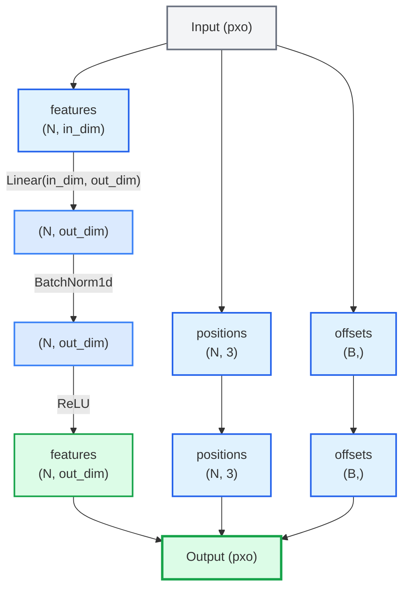

```mermaid
---
config:
  layout: dagre
---
flowchart TD
    Input["Input (pxo)"] --> P["positions<br>(N, 3)"] & X["features<br>(N, in_dim)"] & O["offsets<br>(B,)"]
    
    X -- "Linear(in_dim, out_dim)" --> X1["(N, out_dim)"]
    X1 -- BatchNorm1d --> X1BN["(N, out_dim)"]
    X1BN -- ReLU --> XOut["features<br>(N, out_dim)"]
    
    P --> POut["positions<br>(N, 3)"]
    O --> OOut["offsets<br>(B,)"]
    
    XOut --> Output["Output (pxo)"]
    POut --> Output
    OOut --> Output
    
    style Input fill:#f3f4f6,stroke:#6b7280,stroke-width:2px
    style P fill:#e0f2fe,stroke:#2563eb,stroke-width:2px
    style X fill:#e0f2fe,stroke:#2563eb,stroke-width:2px
    style O fill:#e0f2fe,stroke:#2563eb,stroke-width:2px
    
    style X1 fill:#dbeafe,stroke:#3b82f6,stroke-width:2px
    style X1BN fill:#dbeafe,stroke:#3b82f6,stroke-width:2px
    style XOut fill:#dcfce7,stroke:#16a34a,stroke-width:2px
    
    style POut fill:#e0f2fe,stroke:#2563eb,stroke-width:2px
    style OOut fill:#e0f2fe,stroke:#2563eb,stroke-width:2px
    style Output fill:#dcfce7,stroke:#16a34a,stroke-width:3px
    
```