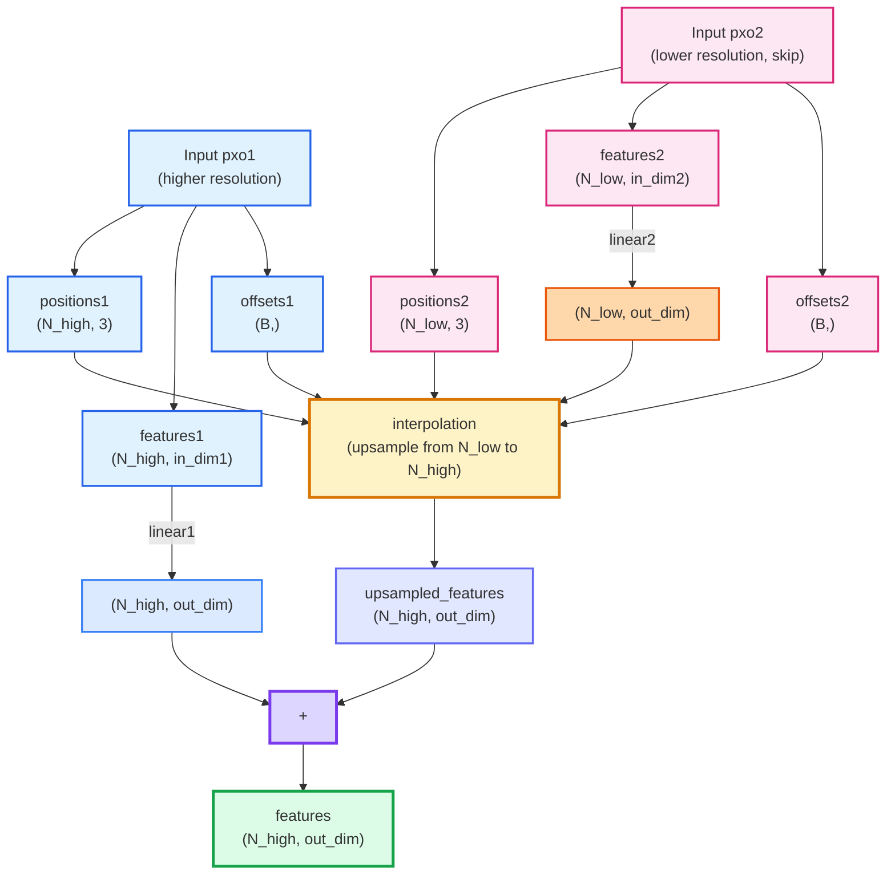

```mermaid
---
config:
  layout: dagre
---
flowchart TD
    Input1["Input pxo1<br>(higher resolution)"] --> P1["positions1<br>(N_high, 3)"] & X1["features1<br>(N_high, in_dim1)"] & O1["offsets1<br>(B,)"]
    Input2["Input pxo2<br>(lower resolution, skip)"] --> P2["positions2<br>(N_low, 3)"] & X2["features2<br>(N_low, in_dim2)"] & O2["offsets2<br>(B,)"]
    
    X1 -- "linear1" --> X1Proj["(N_high, out_dim)"]
    
    X2 -- "linear2" --> X2Proj["(N_low, out_dim)"]
    
    P2 --> Interp["interpolation<br>(upsample from N_low to N_high)"]
    P1 --> Interp
    X2Proj --> Interp
    O2 --> Interp
    O1 --> Interp
    
    Interp --> X2Up["upsampled_features<br>(N_high, out_dim)"]
    
    X1Proj --> Add["+"]
    X2Up --> Add
    
    Add --> XOut["features<br>(N_high, out_dim)"]
    
    style Input1 fill:#e0f2fe,stroke:#2563eb,stroke-width:2px
    style P1 fill:#e0f2fe,stroke:#2563eb,stroke-width:2px
    style X1 fill:#e0f2fe,stroke:#2563eb,stroke-width:2px
    style O1 fill:#e0f2fe,stroke:#2563eb,stroke-width:2px
    
    style Input2 fill:#fce7f3,stroke:#db2777,stroke-width:2px
    style P2 fill:#fce7f3,stroke:#db2777,stroke-width:2px
    style X2 fill:#fce7f3,stroke:#db2777,stroke-width:2px
    style O2 fill:#fce7f3,stroke:#db2777,stroke-width:2px
    
    style X1Proj fill:#dbeafe,stroke:#3b82f6,stroke-width:2px
    style X2Proj fill:#fed7aa,stroke:#ea580c,stroke-width:2px
    
    style Interp fill:#fef3c7,stroke:#d97706,stroke-width:3px
    style X2Up fill:#e0e7ff,stroke:#6366f1,stroke-width:2px
    
    style Add fill:#ddd6fe,stroke:#7c3aed,stroke-width:3px
    style XOut fill:#dcfce7,stroke:#16a34a,stroke-width:3px
```