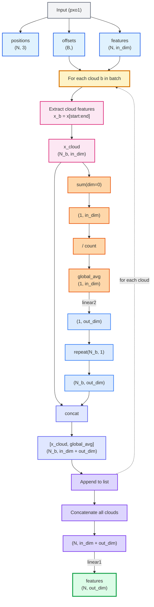

```mermaid
---
config:
  layout: dagre
---
flowchart TD
    Input["Input (pxo1)"] --> P["positions<br>(N, 3)"] & X["features<br>(N, in_dim)"] & O["offsets<br>(B,)"]
    
    O --> Loop["For each cloud b in batch"]
    X --> Loop
    
    Loop --> Extract["Extract cloud features<br>x_b = x[start:end]"]
    Extract --> XCloud["x_cloud<br>(N_b, in_dim)"]
    
    XCloud --> Sum["sum(dim=0)"]
    Sum --> XSum["(1, in_dim)"]
    XSum --> Avg["/ count"]
    Avg --> XAvg["global_avg<br>(1, in_dim)"]
    
    XAvg -- "linear2" --> XAvgProj["(1, out_dim)"]
    XAvgProj --> Repeat["repeat(N_b, 1)"]
    Repeat --> XAvgRep["(N_b, out_dim)"]
    
    XCloud --> Concat["concat"]
    XAvgRep --> Concat
    Concat --> XConcat["[x_cloud, global_avg]<br>(N_b, in_dim + out_dim)"]
    
    XConcat --> Append["Append to list"]
    Append -.for each cloud.-> Loop
    
    Append --> ConcatAll["Concatenate all clouds"]
    ConcatAll --> XAll["(N, in_dim + out_dim)"]
    
    XAll -- "linear1" --> XOut["features<br>(N, out_dim)"]
    
    style Input fill:#f3f4f6,stroke:#6b7280,stroke-width:2px
    style P fill:#e0f2fe,stroke:#2563eb,stroke-width:2px
    style X fill:#e0f2fe,stroke:#2563eb,stroke-width:2px
    style O fill:#e0f2fe,stroke:#2563eb,stroke-width:2px
    
    style Loop fill:#fef3c7,stroke:#d97706,stroke-width:3px
    style Extract fill:#fce7f3,stroke:#db2777,stroke-width:2px
    style XCloud fill:#fce7f3,stroke:#db2777,stroke-width:2px
    
    style Sum fill:#fed7aa,stroke:#ea580c,stroke-width:2px
    style XSum fill:#fed7aa,stroke:#ea580c,stroke-width:2px
    style Avg fill:#fed7aa,stroke:#ea580c,stroke-width:2px
    style XAvg fill:#fed7aa,stroke:#ea580c,stroke-width:2px
    
    style XAvgProj fill:#dbeafe,stroke:#3b82f6,stroke-width:2px
    style Repeat fill:#dbeafe,stroke:#3b82f6,stroke-width:2px
    style XAvgRep fill:#dbeafe,stroke:#3b82f6,stroke-width:2px
    
    style Concat fill:#e0e7ff,stroke:#6366f1,stroke-width:2px
    style XConcat fill:#e0e7ff,stroke:#6366f1,stroke-width:2px
    
    style Append fill:#ddd6fe,stroke:#7c3aed,stroke-width:2px
    style ConcatAll fill:#ddd6fe,stroke:#7c3aed,stroke-width:2px
    style XAll fill:#ddd6fe,stroke:#7c3aed,stroke-width:2px
    
    style XOut fill:#dcfce7,stroke:#16a34a,stroke-width:3px
```