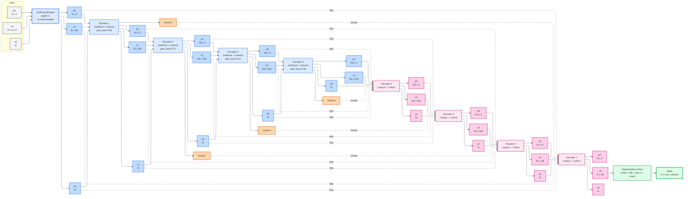

```mermaid
---
config:
  layout: elk
---
graph LR
    subgraph Input
        p0["p0<br>N x 3"]
        x0["x0<br>N x in_ch"]
        o0["o0<br>B"]
    end
    
    p0 --> PatchEmbed
    x0 --> PatchEmbed
    o0 --> PatchEmbed
    
    PatchEmbed["GVAPatchEmbed<br>depth=1<br>no downsample"] --> p0out["p0<br>N x 3"]
    PatchEmbed --> x0out["x0<br>N x 48"]
    PatchEmbed --> o0out["o0<br>B"]
    
    p0out --> Enc1
    x0out --> Enc1
    o0out --> Enc1
    
    Enc1["Encoder 1<br>GridPool + 2 blocks<br>grid_size=0.06"] --> p1["p1<br>N1 x 3"]
    Enc1 --> x1["x1<br>N1 x 96"]
    Enc1 --> o1["o1<br>B"]
    Enc1 --> c1["cluster1"]
    
    p1 --> Enc2
    x1 --> Enc2
    o1 --> Enc2
    
    Enc2["Encoder 2<br>GridPool + 2 blocks<br>grid_size=0.12"] --> p2["p2<br>N2 x 3"]
    Enc2 --> x2["x2<br>N2 x 192"]
    Enc2 --> o2["o2<br>B"]
    Enc2 --> c2["cluster2"]
    
    p2 --> Enc3
    x2 --> Enc3
    o2 --> Enc3
    
    Enc3["Encoder 3<br>GridPool + 6 blocks<br>grid_size=0.24"] --> p3["p3<br>N3 x 3"]
    Enc3 --> x3["x3<br>N3 x 384"]
    Enc3 --> o3["o3<br>B"]
    Enc3 --> c3["cluster3"]
    
    p3 --> Enc4
    x3 --> Enc4
    o3 --> Enc4
    
    Enc4["Encoder 4<br>GridPool + 2 blocks<br>grid_size=0.48"] --> p4["p4<br>N4 x 3"]
    Enc4 --> x4["x4<br>N4 x 512"]
    Enc4 --> o4["o4<br>B"]
    Enc4 --> c4["cluster4"]
    
    p4 --> Dec4
    x4 --> Dec4
    o4 --> Dec4
    c4 -.cluster.-> Dec4
    p3 -.skip.-> Dec4
    x3 -.skip.-> Dec4
    o3 -.skip.-> Dec4
    
    Dec4["Decoder 4<br>Unpool + 1 block"] --> p3d["p3<br>N3 x 3"]
    Dec4 --> x3d["x3<br>N3 x 384"]
    Dec4 --> o3d["o3<br>B"]
    
    p3d --> Dec3
    x3d --> Dec3
    o3d --> Dec3
    c3 -.cluster.-> Dec3
    p2 -.skip.-> Dec3
    x2 -.skip.-> Dec3
    o2 -.skip.-> Dec3
    
    Dec3["Decoder 3<br>Unpool + 1 block"] --> p2d["p2<br>N2 x 3"]
    Dec3 --> x2d["x2<br>N2 x 192"]
    Dec3 --> o2d["o2<br>B"]
    
    p2d --> Dec2
    x2d --> Dec2
    o2d --> Dec2
    c2 -.cluster.-> Dec2
    p1 -.skip.-> Dec2
    x1 -.skip.-> Dec2
    o1 -.skip.-> Dec2
    
    Dec2["Decoder 2<br>Unpool + 1 block"] --> p1d["p1<br>N1 x 3"]
    Dec2 --> x1d["x1<br>N1 x 96"]
    Dec2 --> o1d["o1<br>B"]
    
    p1d --> Dec1
    x1d --> Dec1
    o1d --> Dec1
    c1 -.cluster.-> Dec1
    p0out -.skip.-> Dec1
    x0out -.skip.-> Dec1
    o0out -.skip.-> Dec1
    
    Dec1["Decoder 1<br>Unpool + 1 block"] --> p0d["p0<br>N x 3"]
    Dec1 --> x0d["x0<br>N x 48"]
    Dec1 --> o0d["o0<br>B"]
    
    x0d --> SegHead["Segmentation Head<br>Linear + BN + ReLU + Linear"]
    SegHead --> Out["logits<br>N x num_classes"]
    
    style p0 fill:#f3f4f6,stroke:#6b7280,stroke-width:2px
    style x0 fill:#f3f4f6,stroke:#6b7280,stroke-width:2px
    style o0 fill:#f3f4f6,stroke:#6b7280,stroke-width:2px
    
    style PatchEmbed fill:#dbeafe,stroke:#3b82f6,stroke-width:3px
    style p0out fill:#bfdbfe,stroke:#3b82f6,stroke-width:2px
    style x0out fill:#bfdbfe,stroke:#3b82f6,stroke-width:2px
    style o0out fill:#bfdbfe,stroke:#3b82f6,stroke-width:2px
    
    style Enc1 fill:#dbeafe,stroke:#3b82f6,stroke-width:2px
    style Enc2 fill:#dbeafe,stroke:#3b82f6,stroke-width:2px
    style Enc3 fill:#dbeafe,stroke:#3b82f6,stroke-width:2px
    style Enc4 fill:#dbeafe,stroke:#3b82f6,stroke-width:2px
    
    style p1 fill:#bfdbfe,stroke:#3b82f6,stroke-width:2px
    style x1 fill:#bfdbfe,stroke:#3b82f6,stroke-width:2px
    style o1 fill:#bfdbfe,stroke:#3b82f6,stroke-width:2px
    style c1 fill:#fed7aa,stroke:#ea580c,stroke-width:2px
    
    style p2 fill:#bfdbfe,stroke:#3b82f6,stroke-width:2px
    style x2 fill:#bfdbfe,stroke:#3b82f6,stroke-width:2px
    style o2 fill:#bfdbfe,stroke:#3b82f6,stroke-width:2px
    style c2 fill:#fed7aa,stroke:#ea580c,stroke-width:2px
    
    style p3 fill:#bfdbfe,stroke:#3b82f6,stroke-width:2px
    style x3 fill:#bfdbfe,stroke:#3b82f6,stroke-width:2px
    style o3 fill:#bfdbfe,stroke:#3b82f6,stroke-width:2px
    style c3 fill:#fed7aa,stroke:#ea580c,stroke-width:2px
    
    style p4 fill:#bfdbfe,stroke:#3b82f6,stroke-width:2px
    style x4 fill:#bfdbfe,stroke:#3b82f6,stroke-width:2px
    style o4 fill:#bfdbfe,stroke:#3b82f6,stroke-width:2px
    style c4 fill:#fed7aa,stroke:#ea580c,stroke-width:2px
    
    style Dec4 fill:#fce7f3,stroke:#db2777,stroke-width:2px
    style Dec3 fill:#fce7f3,stroke:#db2777,stroke-width:2px
    style Dec2 fill:#fce7f3,stroke:#db2777,stroke-width:2px
    style Dec1 fill:#fce7f3,stroke:#db2777,stroke-width:2px
    
    style p3d fill:#fbcfe8,stroke:#db2777,stroke-width:2px
    style x3d fill:#fbcfe8,stroke:#db2777,stroke-width:2px
    style o3d fill:#fbcfe8,stroke:#db2777,stroke-width:2px
    
    style p2d fill:#fbcfe8,stroke:#db2777,stroke-width:2px
    style x2d fill:#fbcfe8,stroke:#db2777,stroke-width:2px
    style o2d fill:#fbcfe8,stroke:#db2777,stroke-width:2px
    
    style p1d fill:#fbcfe8,stroke:#db2777,stroke-width:2px
    style x1d fill:#fbcfe8,stroke:#db2777,stroke-width:2px
    style o1d fill:#fbcfe8,stroke:#db2777,stroke-width:2px
    
    style p0d fill:#fbcfe8,stroke:#db2777,stroke-width:2px
    style x0d fill:#fbcfe8,stroke:#db2777,stroke-width:2px
    style o0d fill:#fbcfe8,stroke:#db2777,stroke-width:2px
    
    style SegHead fill:#dcfce7,stroke:#16a34a,stroke-width:2px
    style Out fill:#dcfce7,stroke:#16a34a,stroke-width:3px
```
