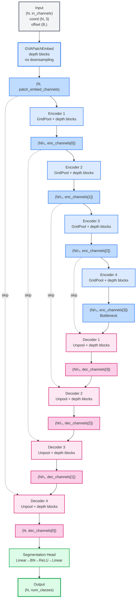

```mermaid
---
config:
  layout: dagre
---
flowchart TD
    Input["Input<br>(N, in_channels)<br>coord (N, 3)<br>offset (B,)"] --> PatchEmbed["GVAPatchEmbed<br>depth blocks<br>no downsampling"]
    
    PatchEmbed --> P0["(N, patch_embed_channels)"]
    
    P0 --> Enc1["Encoder 1<br>GridPool + depth blocks"]
    Enc1 --> P1["(N/r₁, enc_channels[0])"]
    
    P1 --> Enc2["Encoder 2<br>GridPool + depth blocks"]
    Enc2 --> P2["(N/r₂, enc_channels[1])"]
    
    P2 --> Enc3["Encoder 3<br>GridPool + depth blocks"]
    Enc3 --> P3["(N/r₃, enc_channels[2])"]
    
    P3 --> Enc4["Encoder 4<br>GridPool + depth blocks"]
    Enc4 --> P4["(N/r₄, enc_channels[3])<br>Bottleneck"]
    
    P0 -.skip.-> Dec4
    P1 -.skip.-> Dec3
    P2 -.skip.-> Dec2
    P3 -.skip.-> Dec1
    
    P4 --> Dec1["Decoder 1<br>Unpool + depth blocks"]
    Dec1 --> D3["(N/r₃, dec_channels[3])"]
    
    D3 --> Dec2["Decoder 2<br>Unpool + depth blocks"]
    Dec2 --> D2["(N/r₂, dec_channels[2])"]
    
    D2 --> Dec3["Decoder 3<br>Unpool + depth blocks"]
    Dec3 --> D1["(N/r₁, dec_channels[1])"]
    
    D1 --> Dec4["Decoder 4<br>Unpool + depth blocks"]
    Dec4 --> D0["(N, dec_channels[0])"]
    
    D0 --> Head["Segmentation Head<br>Linear→BN→ReLU→Linear"]
    Head --> Output["Output<br>(N, num_classes)"]
    
    style Input fill:#f3f4f6,stroke:#6b7280,stroke-width:3px
    style PatchEmbed fill:#dbeafe,stroke:#3b82f6,stroke-width:3px
    style P0 fill:#bfdbfe,stroke:#3b82f6,stroke-width:2px
    
    style Enc1 fill:#dbeafe,stroke:#3b82f6,stroke-width:2px
    style Enc2 fill:#dbeafe,stroke:#3b82f6,stroke-width:2px
    style Enc3 fill:#dbeafe,stroke:#3b82f6,stroke-width:2px
    style Enc4 fill:#dbeafe,stroke:#3b82f6,stroke-width:2px
    
    style P1 fill:#bfdbfe,stroke:#3b82f6,stroke-width:2px
    style P2 fill:#bfdbfe,stroke:#3b82f6,stroke-width:2px
    style P3 fill:#bfdbfe,stroke:#3b82f6,stroke-width:2px
    style P4 fill:#bfdbfe,stroke:#3b82f6,stroke-width:2px
    
    style Dec1 fill:#fce7f3,stroke:#db2777,stroke-width:2px
    style Dec2 fill:#fce7f3,stroke:#db2777,stroke-width:2px
    style Dec3 fill:#fce7f3,stroke:#db2777,stroke-width:2px
    style Dec4 fill:#fce7f3,stroke:#db2777,stroke-width:2px
    
    style D3 fill:#fbcfe8,stroke:#db2777,stroke-width:2px
    style D2 fill:#fbcfe8,stroke:#db2777,stroke-width:2px
    style D1 fill:#fbcfe8,stroke:#db2777,stroke-width:2px
    style D0 fill:#fbcfe8,stroke:#db2777,stroke-width:2px
    
    style Head fill:#dcfce7,stroke:#16a34a,stroke-width:2px
    style Output fill:#dcfce7,stroke:#16a34a,stroke-width:3px
```
