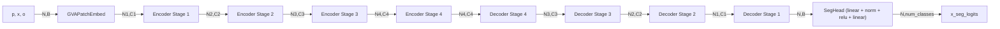

```mermaid
graph LR
    A["p, x, o"] -->|N,B| B["GVAPatchEmbed"]
    B -->|N1,C1| C1["Encoder Stage 1"]
    C1 -->|N2,C2| C2["Encoder Stage 2"]
    C2 -->|N3,C3| C3["Encoder Stage 3"]
    C3 -->|N4,C4| C4["Encoder Stage 4"]
    C4 -->|N4,C4| D1["Decoder Stage 4"]
    D1 -->|N3,C3| D2["Decoder Stage 3"]
    D2 -->|N2,C2| D3["Decoder Stage 2"]
    D3 -->|N1,C1| D4["Decoder Stage 1"]
    D4 -->|N,B| E["SegHead (linear + norm + relu + linear)"]
    E -->|N,num_classes| F["x_seg_logits"]

```
