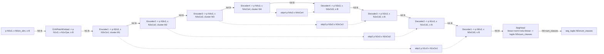

```mermaid
graph LR
    IN["p N0x3, x N0xin_dim, o B"] -->|N0 B| PE["GVAPatchEmbed -> p N1x3, x N1xCpe, o B"]

    PE -->|N1 B| ENC1["Encoder1 -> p N2x3, x N2xCe1, cluster M1"]
    ENC1 -->|N2 B| ENC2["Encoder2 -> p N3x3, x N3xCe2, cluster M2"]
    ENC2 -->|N3 B| ENC3["Encoder3 -> p N4x3, x N4xCe3, cluster M3"]
    ENC3 -->|N4 B| ENC4["Encoder4 -> p N4x3, x N4xCe4, cluster M4"]

    %% skip connections
    ENC1 -.-> SK1["skip1 p N1x3 x N1xCe1"]
    ENC2 -.-> SK2["skip2 p N2x3 x N2xCe2"]
    ENC3 -.-> SK3["skip3 p N3x3 x N3xCe3"]
    ENC4 -.-> SK4["skip4 p N4x3 x N4xCe4"]

    %% decoders
    ENC4 -->|N4 B| DEC4["Decoder4 -> p N3x3, x N3xCd3, o B"]
    DEC4 -->|N3 B| DEC3["Decoder3 -> p N2x3, x N2xCd2, o B"]
    DEC3 -->|N2 B| DEC2["Decoder2 -> p N1x3, x N1xCd1, o B"]
    DEC2 -->|N1 B| DEC1["Decoder1 -> p N0x3, x N0xCd0, o B"]

    SK4 -.-> DEC4
    SK3 -.-> DEC3
    SK2 -.-> DEC2
    SK1 -.-> DEC1

    %% seg head
    DEC1 -->|N0 B| SH["SegHead linear+norm+relu+linear -> logits N0xnum_classes"]
    SH -->|N0 num_classes| OUT["seg_logits N0xnum_classes"]
```
