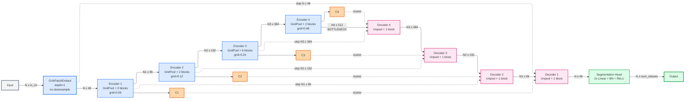

```mermaid
---
config:
  layout: elk
---
graph LR
    Input["Input"] -->|N x in_ch| PatchEmbed["GVAPatchEmbed<br>depth=1<br>no downsample"]
    
    PatchEmbed -->|N x 48| Enc1["Encoder 1<br>GridPool + 2 blocks<br>grid=0.06"]
    Enc1 -->|N1 x 96| Enc2["Encoder 2<br>GridPool + 2 blocks<br>grid=0.12"]
    Enc1 --> C1
    
    Enc2 -->|N2 x 192| Enc3["Encoder 3<br>GridPool + 6 blocks<br>grid=0.24"]
    Enc2 --> C2
    
    Enc3 -->|N3 x 384| Enc4["Encoder 4<br>GridPool + 2 blocks<br>grid=0.48"]
    Enc3 --> C3
    
    Enc4 -->|N4 x 512<br>BOTTLENECK| Dec4["Decoder 4<br>Unpool + 1 block"]
    Enc4 --> C4
    
    C4 -.cluster.-> Dec4
    Enc3 -.skip N3 x 384.-> Dec4
    
    Dec4 -->|N3 x 384| Dec3["Decoder 3<br>Unpool + 1 block"]
    C3 -.cluster.-> Dec3
    Enc2 -.skip N2 x 192.-> Dec3
    
    Dec3 -->|N2 x 192| Dec2["Decoder 2<br>Unpool + 1 block"]
    C2 -.cluster.-> Dec2
    Enc1 -.skip N1 x 96.-> Dec2
    
    Dec2 -->|N1 x 96| Dec1["Decoder 1<br>Unpool + 1 block"]
    C1 -.cluster.-> Dec1
    PatchEmbed -.skip N x 48.-> Dec1
    
    Dec1 -->|N x 48| SegHead["Segmentation Head<br>2x Linear + BN + ReLU"]
    SegHead -->|N x num_classes| Output["Output"]
    
    style Input fill:#f3f4f6,stroke:#6b7280,stroke-width:3px
    style PatchEmbed fill:#dbeafe,stroke:#3b82f6,stroke-width:3px
    
    style Enc1 fill:#dbeafe,stroke:#3b82f6,stroke-width:2px
    style Enc2 fill:#dbeafe,stroke:#3b82f6,stroke-width:2px
    style Enc3 fill:#dbeafe,stroke:#3b82f6,stroke-width:2px
    style Enc4 fill:#dbeafe,stroke:#3b82f6,stroke-width:2px
    
    style C1 fill:#fed7aa,stroke:#ea580c,stroke-width:2px
    style C2 fill:#fed7aa,stroke:#ea580c,stroke-width:2px
    style C3 fill:#fed7aa,stroke:#ea580c,stroke-width:2px
    style C4 fill:#fed7aa,stroke:#ea580c,stroke-width:2px
    
    style Dec4 fill:#fce7f3,stroke:#db2777,stroke-width:2px
    style Dec3 fill:#fce7f3,stroke:#db2777,stroke-width:2px
    style Dec2 fill:#fce7f3,stroke:#db2777,stroke-width:2px
    style Dec1 fill:#fce7f3,stroke:#db2777,stroke-width:2px
    
    style SegHead fill:#dcfce7,stroke:#16a34a,stroke-width:2px
    style Output fill:#dcfce7,stroke:#16a34a,stroke-width:3px
```
