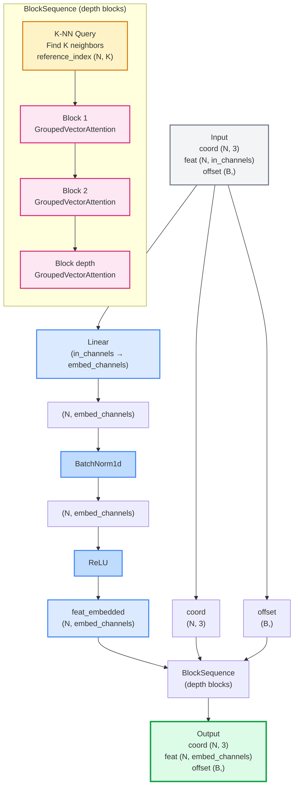

```mermaid
---
config:
  layout: dagre
---
flowchart TD
    Input["Input<br>coord (N, 3)<br>feat (N, in_channels)<br>offset (B,)"] --> Proj["Linear<br>(in_channels → embed_channels)"]
    
    Proj --> ProjOut["(N, embed_channels)"]
    ProjOut --> BN1["BatchNorm1d"]
    BN1 --> BN1Out["(N, embed_channels)"]
    BN1Out --> ReLU1["ReLU"]
    ReLU1 --> FeatEmbed["feat_embedded<br>(N, embed_channels)"]
    
    Input --> Coord["coord<br>(N, 3)"]
    Input --> Offset["offset<br>(B,)"]
    
    FeatEmbed --> BlockSeq["BlockSequence<br>(depth blocks)"]
    Coord --> BlockSeq
    Offset --> BlockSeq
    
    subgraph BlockSequence["BlockSequence (depth blocks)"]
        direction TB
        KNN["K-NN Query<br>Find K neighbors<br>reference_index (N, K)"]
        
        Block1["Block 1<br>GroupedVectorAttention"]
        Block2["Block 2<br>GroupedVectorAttention"]
        BlockN["Block depth<br>GroupedVectorAttention"]
        
        KNN --> Block1
        Block1 --> Block2
        Block2 --> BlockN
    end
    
    BlockSeq --> Output["Output<br>coord (N, 3)<br>feat (N, embed_channels)<br>offset (B,)"]
    
    style Input fill:#f3f4f6,stroke:#6b7280,stroke-width:2px
    style Proj fill:#dbeafe,stroke:#3b82f6,stroke-width:2px
    style BN1 fill:#bfdbfe,stroke:#3b82f6,stroke-width:2px
    style ReLU1 fill:#bfdbfe,stroke:#3b82f6,stroke-width:2px
    style FeatEmbed fill:#dbeafe,stroke:#3b82f6,stroke-width:2px
    
    style KNN fill:#fef3c7,stroke:#d97706,stroke-width:2px
    style Block1 fill:#fce7f3,stroke:#db2777,stroke-width:2px
    style Block2 fill:#fce7f3,stroke:#db2777,stroke-width:2px
    style BlockN fill:#fce7f3,stroke:#db2777,stroke-width:2px
    
    style Output fill:#dcfce7,stroke:#16a34a,stroke-width:3px
```
