```mermaid
---
config:
  layout: elk
---
graph LR
    Input["Input<br>N points<br>in_channels"] --> PatchEmbed["GVAPatchEmbed<br>depth=1<br>no downsample"]
    
    PatchEmbed --> PC0["Point Cloud<br>N points<br>48 channels"]
    
    PC0 --> Enc1["Encoder 1<br>GridPool + 2 blocks<br>grid=0.06"]
    Enc1 --> PC1["N1 points<br>96 channels"]
    Enc1 --> C1["cluster1"]
    
    PC1 --> Enc2["Encoder 2<br>GridPool + 2 blocks<br>grid=0.12"]
    Enc2 --> PC2["N2 points<br>192 channels"]
    Enc2 --> C2["cluster2"]
    
    PC2 --> Enc3["Encoder 3<br>GridPool + 6 blocks<br>grid=0.24"]
    Enc3 --> PC3["N3 points<br>384 channels"]
    Enc3 --> C3["cluster3"]
    
    PC3 --> Enc4["Encoder 4<br>GridPool + 2 blocks<br>grid=0.48"]
    Enc4 --> PC4["N4 points<br>512 channels<br>BOTTLENECK"]
    Enc4 --> C4["cluster4"]
    
    PC4 --> Dec4["Decoder 4<br>Unpool + 1 block"]
    C4 -.cluster.-> Dec4
    PC3 -.skip.-> Dec4
    Dec4 --> PD3["N3 points<br>384 channels"]
    
    PD3 --> Dec3["Decoder 3<br>Unpool + 1 block"]
    C3 -.cluster.-> Dec3
    PC2 -.skip.-> Dec3
    Dec3 --> PD2["N2 points<br>192 channels"]
    
    PD2 --> Dec2["Decoder 2<br>Unpool + 1 block"]
    C2 -.cluster.-> Dec2
    PC1 -.skip.-> Dec2
    Dec2 --> PD1["N1 points<br>96 channels"]
    
    PD1 --> Dec1["Decoder 1<br>Unpool + 1 block"]
    C1 -.cluster.-> Dec1
    PC0 -.skip.-> Dec1
    Dec1 --> PD0["N points<br>48 channels"]
    
    PD0 --> SegHead["Segmentation Head<br>2x Linear + BN + ReLU"]
    SegHead --> Output["Output<br>N points<br>num_classes"]
    
    style Input fill:#f3f4f6,stroke:#6b7280,stroke-width:3px
    style PatchEmbed fill:#dbeafe,stroke:#3b82f6,stroke-width:3px
    style PC0 fill:#bfdbfe,stroke:#3b82f6,stroke-width:2px
    
    style Enc1 fill:#dbeafe,stroke:#3b82f6,stroke-width:2px
    style Enc2 fill:#dbeafe,stroke:#3b82f6,stroke-width:2px
    style Enc3 fill:#dbeafe,stroke:#3b82f6,stroke-width:2px
    style Enc4 fill:#dbeafe,stroke:#3b82f6,stroke-width:2px
    
    style PC1 fill:#bfdbfe,stroke:#3b82f6,stroke-width:2px
    style PC2 fill:#bfdbfe,stroke:#3b82f6,stroke-width:2px
    style PC3 fill:#bfdbfe,stroke:#3b82f6,stroke-width:2px
    style PC4 fill:#bfdbfe,stroke:#3b82f6,stroke-width:2px
    
    style C1 fill:#fed7aa,stroke:#ea580c,stroke-width:2px
    style C2 fill:#fed7aa,stroke:#ea580c,stroke-width:2px
    style C3 fill:#fed7aa,stroke:#ea580c,stroke-width:2px
    style C4 fill:#fed7aa,stroke:#ea580c,stroke-width:2px
    
    style Dec4 fill:#fce7f3,stroke:#db2777,stroke-width:2px
    style Dec3 fill:#fce7f3,stroke:#db2777,stroke-width:2px
    style Dec2 fill:#fce7f3,stroke:#db2777,stroke-width:2px
    style Dec1 fill:#fce7f3,stroke:#db2777,stroke-width:2px
    
    style PD3 fill:#fbcfe8,stroke:#db2777,stroke-width:2px
    style PD2 fill:#fbcfe8,stroke:#db2777,stroke-width:2px
    style PD1 fill:#fbcfe8,stroke:#db2777,stroke-width:2px
    style PD0 fill:#fbcfe8,stroke:#db2777,stroke-width:2px
    
    style SegHead fill:#dcfce7,stroke:#16a34a,stroke-width:2px
    style Output fill:#dcfce7,stroke:#16a34a,stroke-width:3px
```

**Beaucoup plus clair !**

**Flow résumé:**
```
N points, in_ch
    ↓ Patch Embed
N points, 48ch
    ↓ Enc1 (grid pool)
N1 points (~N/4), 96ch
    ↓ Enc2 (grid pool)
N2 points (~N1/4), 192ch
    ↓ Enc3 (grid pool)
N3 points (~N2/4), 384ch
    ↓ Enc4 (grid pool)
N4 points (~N3/4), 512ch [BOTTLENECK]
    ↓ Dec4 (unpool + skip)
N3 points, 384ch
    ↓ Dec3 (unpool + skip)
N2 points, 192ch
    ↓ Dec2 (unpool + skip)
N1 points, 96ch
    ↓ Dec1 (unpool + skip)
N points, 48ch
    ↓ Seg Head
N points, num_classes
```
