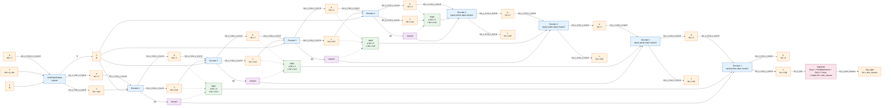

```mermaid
graph LR
    %% Input data nodes
    IN_P["p<br>N0 x 3"]
    IN_X["x<br>N0 x in_dim"]
    IN_O["o<br>B"]

    classDef data fill:#FFF3E0,stroke:#E65100,color:#000;
    classDef block fill:#E3F2FD,stroke:#0D47A1,color:#000;
    classDef skip fill:#E8F5E9,stroke:#1B5E20,color:#000;
    classDef cluster fill:#F3E5F5,stroke:#6A1B9A,color:#000;
    classDef head fill:#FCE4EC,stroke:#880E4F,color:#000;

    class IN_P,IN_X,IN_O data

    %% Patch embed
    IN_P -->|N0_x_3 N0_x_in_dim B| PE["GVAPatchEmbed<br>outputs"]
    IN_X --> PE
    IN_O --> PE
    class PE block

    PE -->|N1_x_3 N1_x_Cpe B| P1["p<br>N1 x 3"]
    PE -->|N1_x_3 N1_x_Cpe B| X1["x<br>N1 x Cpe"]
    PE -->|B| O1["o<br>B"]
    class P1,X1,O1 data

    %% Encoder stages (stacked)
    P1 -->|N1_x_3 N1_x_Ce1 B| ENC1["Encoder 1"]
    X1 --> ENC1
    O1 --> ENC1
    class ENC1 block

    ENC1 -->|N2_x_3 N2_x_Ce1 B| P2["p<br>N2 x 3"]
    ENC1 -->|N2_x_3 N2_x_Ce1 B| X2["x<br>N2 x Ce1"]
    ENC1 -->|M1| CL1["cluster1"]
    class P2,X2 data
    class CL1 cluster

    P2 -->|N2_x_3 N2_x_Ce2 B| ENC2["Encoder 2"]
    X2 --> ENC2
    O1 --> ENC2
    class ENC2 block

    ENC2 -->|N3_x_3 N3_x_Ce2 B| P3["p<br>N3 x 3"]
    ENC2 -->|N3_x_3 N3_x_Ce2 B| X3["x<br>N3 x Ce2"]
    ENC2 -->|M2| CL2["cluster2"]
    class P3,X3 data
    class CL2 cluster

    P3 -->|N3_x_3 N3_x_Ce3 B| ENC3["Encoder 3"]
    X3 --> ENC3
    O1 --> ENC3
    class ENC3 block

    ENC3 -->|N4_x_3 N4_x_Ce3 B| P4["p<br>N4 x 3"]
    ENC3 -->|N4_x_3 N4_x_Ce3 B| X4["x<br>N4 x Ce3"]
    ENC3 -->|M3| CL3["cluster3"]
    class P4,X4 data
    class CL3 cluster

    P4 -->|N4_x_3 N4_x_Ce4 B| ENC4["Encoder 4"]
    X4 --> ENC4
    O1 --> ENC4
    class ENC4 block

    ENC4 -->|N5_x_3 N5_x_Ce4 B| P5["p<br>N5 x 3"]
    ENC4 -->|N5_x_3 N5_x_Ce4 B| X5["x<br>N5 x Ce4"]
    ENC4 -->|M4| CL4["cluster4"]
    class P5,X5 data
    class CL4 cluster

    %% Create explicit skip nodes (separate boxes for clarity)
    SK1["skip1<br>p N1 x 3<br>x N1 x Ce1"]:::skip
    SK2["skip2<br>p N2 x 3<br>x N2 x Ce2"]:::skip
    SK3["skip3<br>p N3 x 3<br>x N3 x Ce3"]:::skip
    SK4["skip4<br>p N4 x 3<br>x N4 x Ce4"]:::skip

    P2 -.-> SK1
    P3 -.-> SK2
    P4 -.-> SK3
    P5 -.-> SK4

    X2 -.-> SK1
    X3 -.-> SK2
    X4 -.-> SK3
    X5 -.-> SK4

    CL1 -.-> SK1
    CL2 -.-> SK2
    CL3 -.-> SK3
    CL4 -.-> SK4

    %% Decoder stages (reverse order). Each decoder consumes (points, skip, cluster)
    P5 -->|N5_x_3 N5_x_Cd4 B| DEC4["Decoder 4<br>inputs points skip4 cluster4"]
    SK4 --> DEC4
    CL4 --> DEC4
    class DEC4 block

    DEC4 -->|N4_x_3 N4_x_Cd3 B| PD4["p<br>N4 x 3"]
    DEC4 -->|N4_x_3 N4_x_Cd3 B| XD4["x<br>N4 x Cd3"]
    class PD4,XD4 data

    PD4 -->|N4_x_3 N4_x_Cd3 B| DEC3["Decoder 3<br>inputs points skip3 cluster3"]
    SK3 --> DEC3
    CL3 --> DEC3
    class DEC3 block

    DEC3 -->|N3_x_3 N3_x_Cd2 B| PD3["p<br>N3 x 3"]
    DEC3 -->|N3_x_3 N3_x_Cd2 B| XD3["x<br>N3 x Cd2"]
    class PD3,XD3 data

    PD3 -->|N3_x_3 N3_x_Cd2 B| DEC2["Decoder 2<br>inputs points skip2 cluster2"]
    SK2 --> DEC2
    CL2 --> DEC2
    class DEC2 block

    DEC2 -->|N2_x_3 N2_x_Cd1 B| PD2["p<br>N2 x 3"]
    DEC2 -->|N2_x_3 N2_x_Cd1 B| XD2["x<br>N2 x Cd1"]
    class PD2,XD2 data

    PD2 -->|N2_x_3 N2_x_Cd1 B| DEC1["Decoder 1<br>inputs points skip1 cluster1"]
    SK1 --> DEC1
    CL1 --> DEC1
    class DEC1 block

    DEC1 -->|N1_x_3 N1_x_Cd0 B| PD1["p<br>N1 x 3"]
    DEC1 -->|N1_x_3 N1_x_Cd0 B| XD1["x<br>N1 x Cd0"]
    class PD1,XD1 data

    %% Segmentation head consumes final x and outputs logits
    XD1 -->|N1_x_Cd0| SH["SegHead<br>linear + PointBatchNorm + ReLU + linear<br>-> logits N1 x num_classes"]
    class SH head

    SH -->|N1_x_num_classes| OUT["seg_logits<br>N1 x num_classes"]
    class OUT data

```
