# Mermaid Export Pro - Comprehensive Debug Report

**Timestamp**: 2025-10-14T10:07:00.570Z

**Test Coverage**: 10 diagram types × 2 complexity levels × 3 formats × 2 strategies

**Strategies Tested**: 
- CLI Export (using @mermaid-js/mermaid-cli)
- Web Export (VS Code webview + mermaid.js)

## Flowchart Test Diagrams

### Simple Version
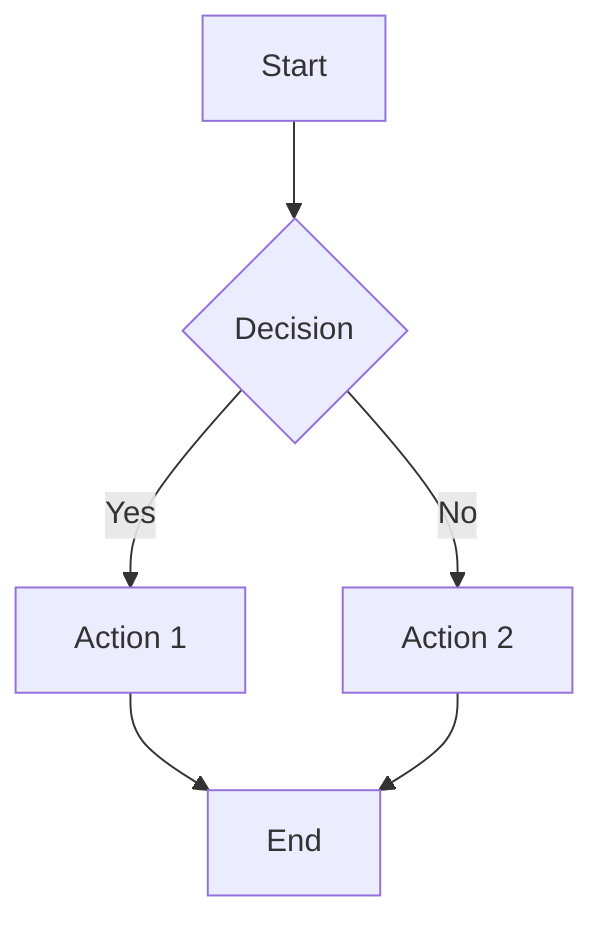

### Complex Version  
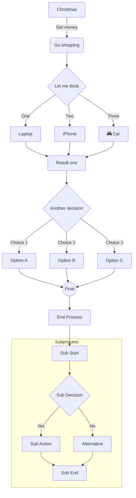

## Sequence Test Diagrams

### Simple Version
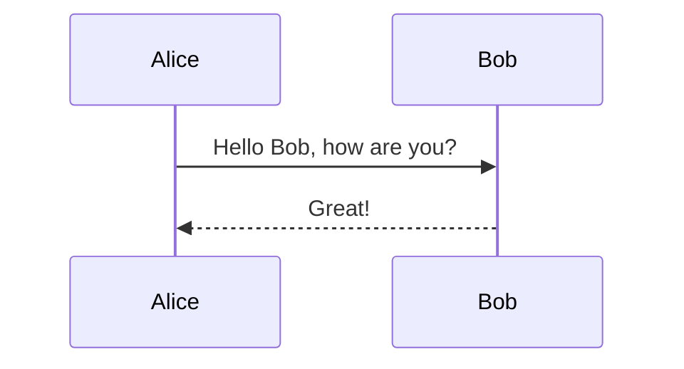

### Complex Version  
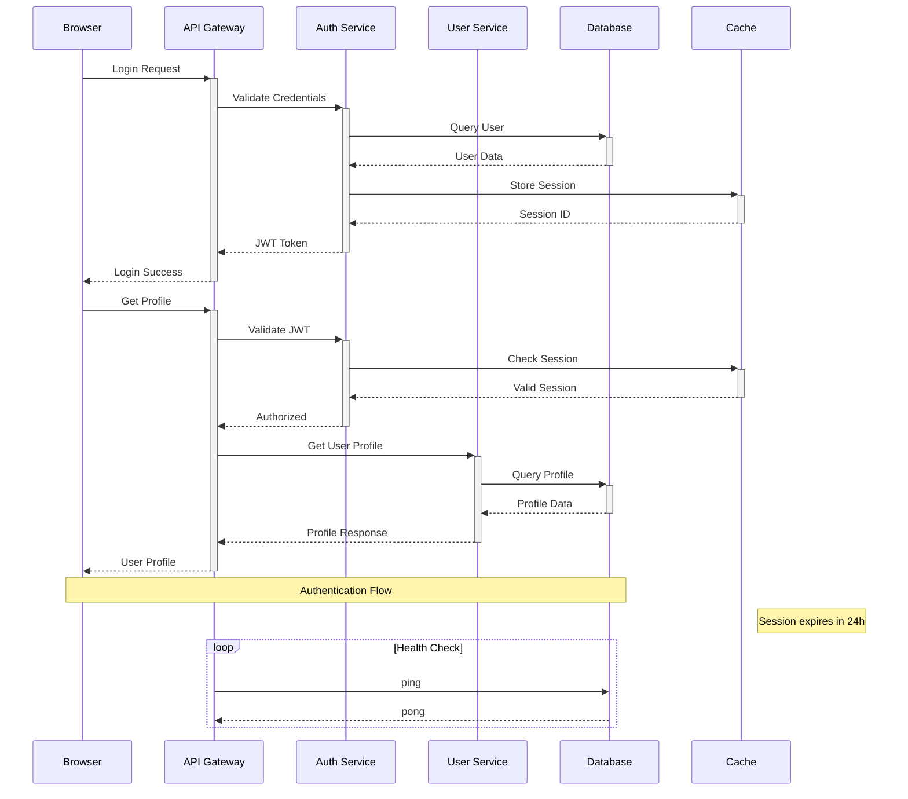

## ClassDiagram Test Diagrams

### Simple Version
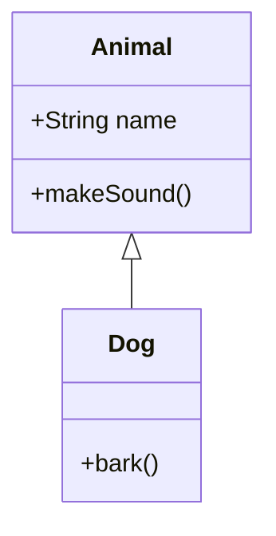

### Complex Version  
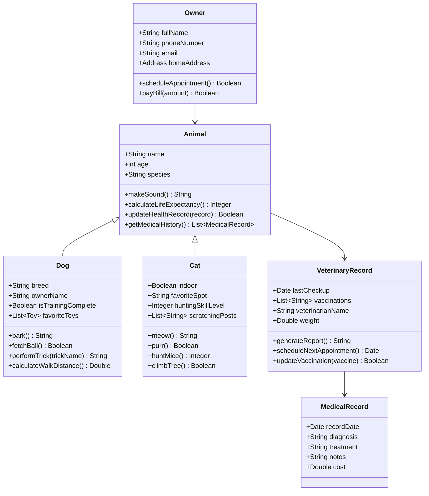

## StateDiagram Test Diagrams

### Simple Version
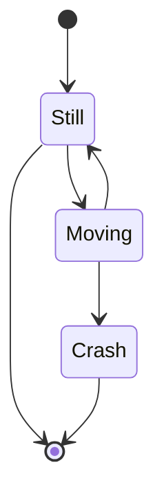

### Complex Version  
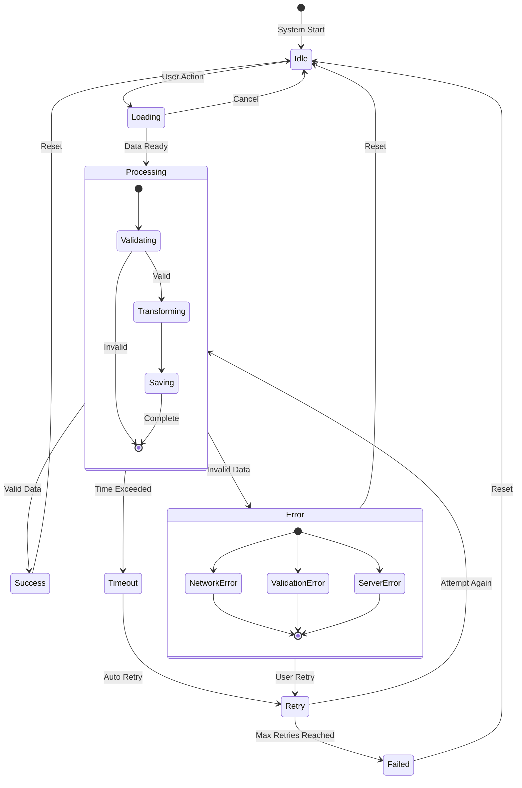

## ErDiagram Test Diagrams

### Simple Version
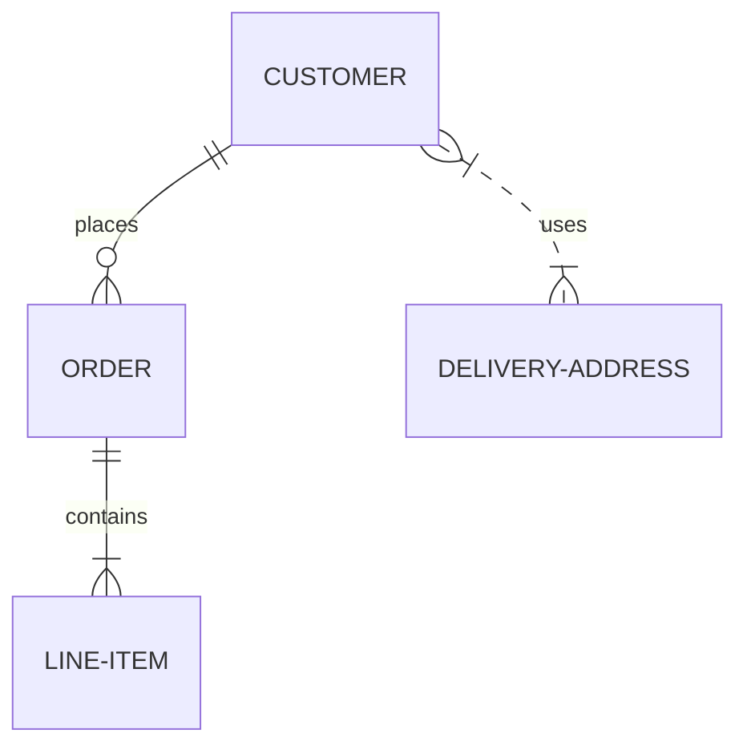

### Complex Version  
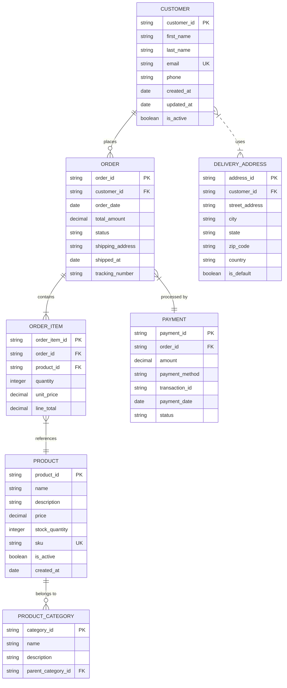

## Gantt Test Diagrams

### Simple Version
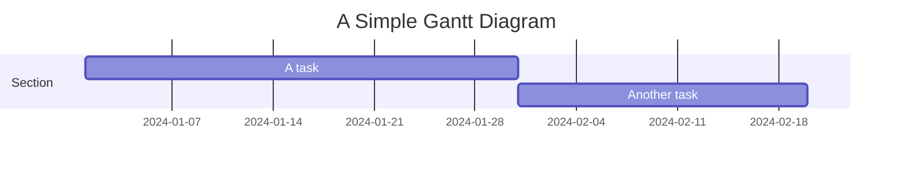

### Complex Version  
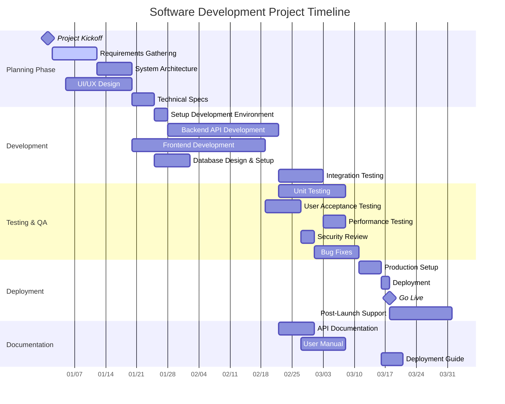

## Pie Test Diagrams

### Simple Version
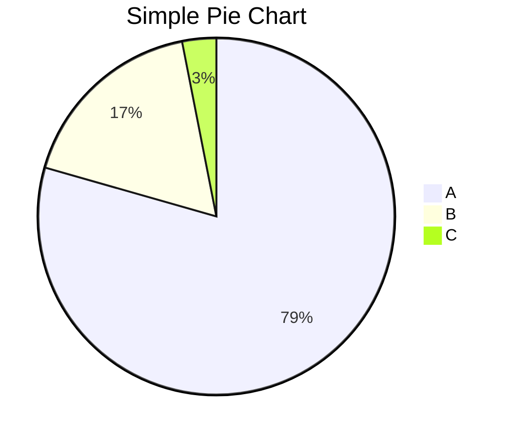

### Complex Version  
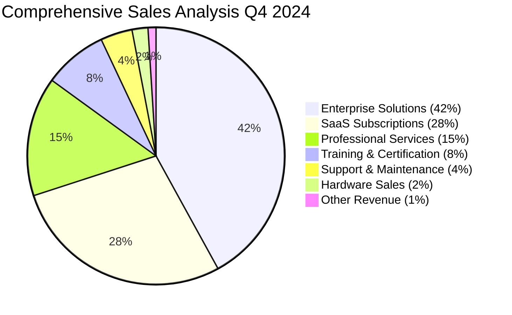

## Journey Test Diagrams

### Simple Version
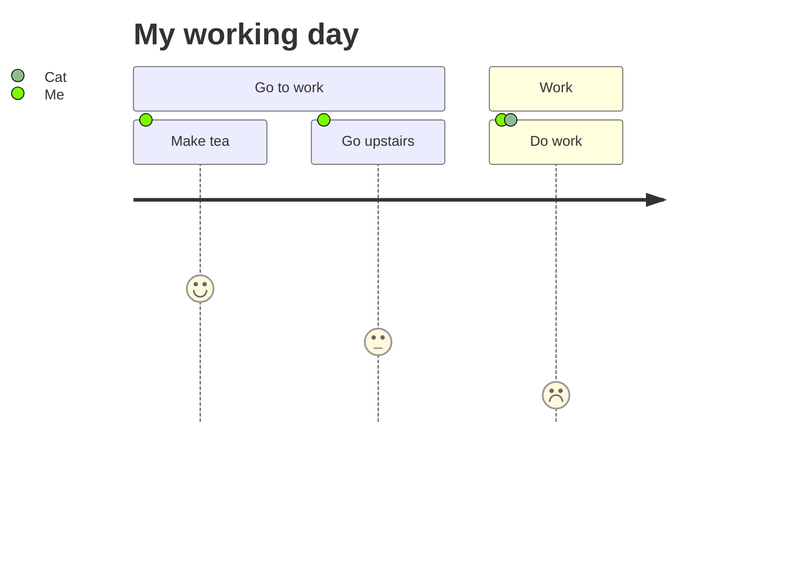

### Complex Version  
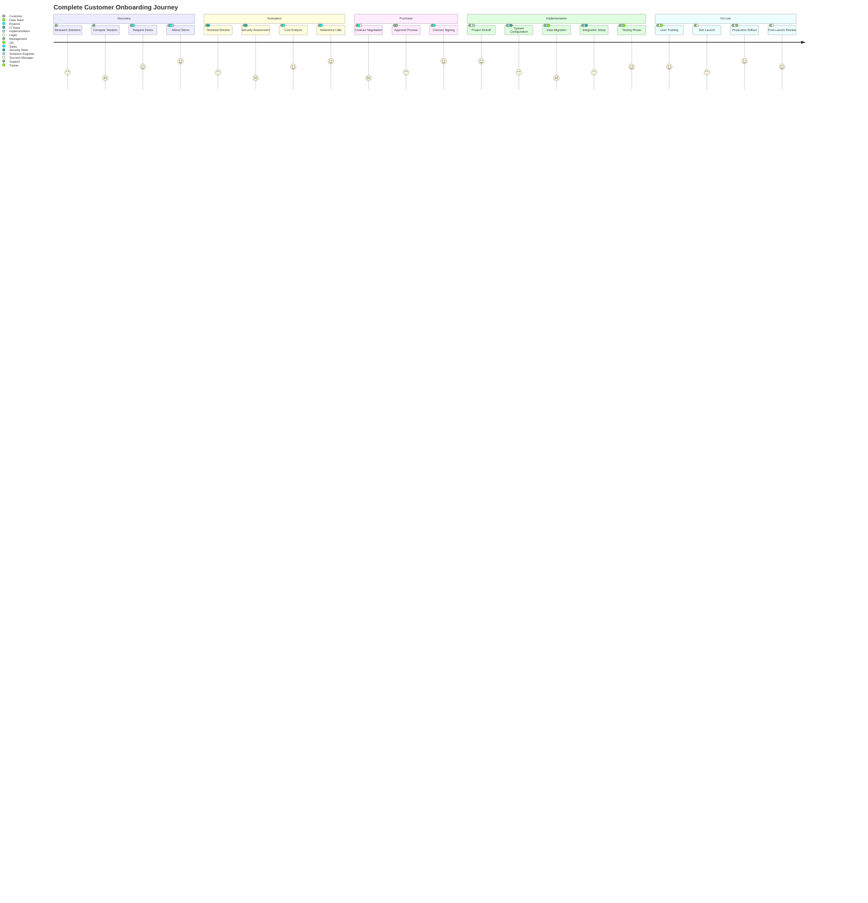

## Gitgraph Test Diagrams

### Simple Version
```mermaid
gitgraph
    commit
    commit
    branch develop
    commit
    commit
    checkout main
    commit
    merge develop
```

### Complex Version  
```mermaid
gitgraph
    commit id: "Initial commit"
    commit id: "Add basic structure"
    
    branch feature/authentication
    checkout feature/authentication
    commit id: "Add login form"
    commit id: "Implement JWT auth"
    commit id: "Add password validation"
    
    checkout main
    commit id: "Update documentation"
    
    branch feature/user-management
    checkout feature/user-management  
    commit id: "Add user model"
    commit id: "Create user CRUD"
    
    checkout main
    merge feature/authentication
    commit id: "Version 1.1.0" tag: "v1.1.0"
    
    checkout feature/user-management
    commit id: "Add user permissions"
    commit id: "Implement user roles"
    
    checkout main
    branch hotfix/security-patch
    commit id: "Fix SQL injection"
    commit id: "Update dependencies"
    
    checkout main  
    merge hotfix/security-patch
    commit id: "Security patch 1.1.1" tag: "v1.1.1"
    
    merge feature/user-management
    commit id: "Version 1.2.0" tag: "v1.2.0"
    
    branch feature/dashboard
    checkout feature/dashboard
    commit id: "Add dashboard layout"
    commit id: "Implement analytics"
```

## Mindmap Test Diagrams

### Simple Version
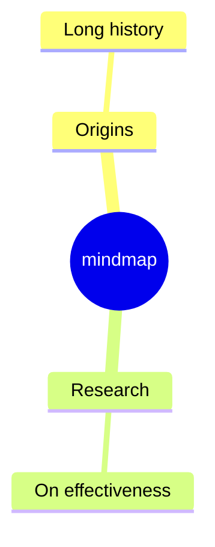

### Complex Version  
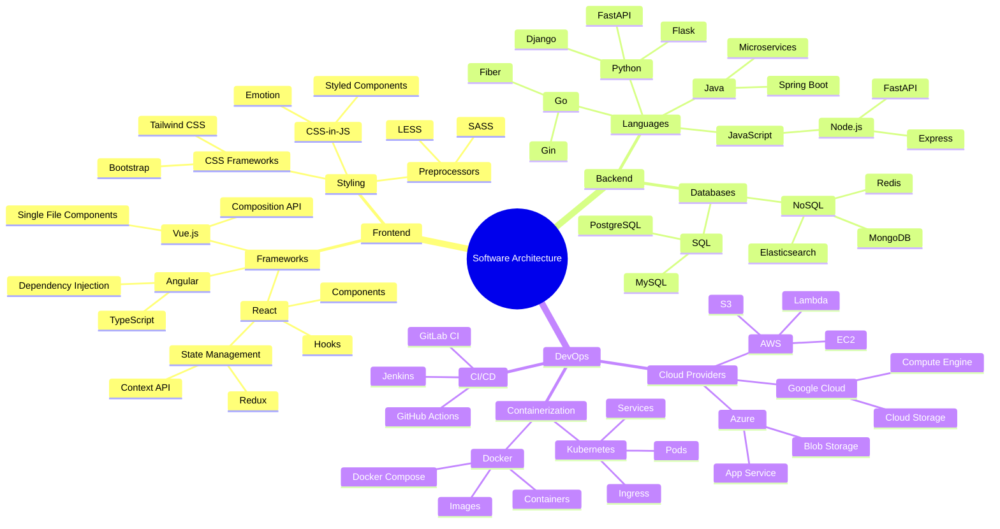

**Export Options**:
- Formats: SVG, PNG, JPG
- Theme: default
- Dimensions: 800x600
- Background: transparent

## Results Summary

## Flowchart Results

### CLI (SVG) (simple) Strategy

- **Status**: ❌ FAILED
- **Duration**: 37ms
- **Version**: N/A
- **Error**: CLI not available - mmdc command not found. Install with: npm install -g @mermaid-js/mermaid-cli

### Web (SVG) (simple) Strategy

- **Status**: ✅ SUCCESS
- **Duration**: 747ms
- **Version**: N/A
- **Output Files**:
  - diagram.svg (14428 bytes)

### CLI (PNG) (simple) Strategy

- **Status**: ❌ FAILED
- **Duration**: 42ms
- **Version**: N/A
- **Error**: CLI not available - mmdc command not found. Install with: npm install -g @mermaid-js/mermaid-cli

### Web (PNG) (simple) Strategy

- **Status**: ✅ SUCCESS
- **Duration**: 554ms
- **Version**: N/A
- **Output Files**:
  - diagram.png (26814 bytes)

### CLI (JPG) (simple) Strategy

- **Status**: ❌ FAILED
- **Duration**: 42ms
- **Version**: N/A
- **Error**: CLI not available - mmdc command not found. Install with: npm install -g @mermaid-js/mermaid-cli

### Web (JPG) (simple) Strategy

- **Status**: ✅ SUCCESS
- **Duration**: 330ms
- **Version**: N/A
- **Output Files**:
  - diagram.jpg (20893 bytes)

### CLI (SVG) (complex) Strategy

- **Status**: ❌ FAILED
- **Duration**: 40ms
- **Version**: N/A
- **Error**: CLI not available - mmdc command not found. Install with: npm install -g @mermaid-js/mermaid-cli

### Web (SVG) (complex) Strategy

- **Status**: ✅ SUCCESS
- **Duration**: 370ms
- **Version**: N/A
- **Output Files**:
  - diagram.svg (70895 bytes)

### CLI (PNG) (complex) Strategy

- **Status**: ❌ FAILED
- **Duration**: 47ms
- **Version**: N/A
- **Error**: CLI not available - mmdc command not found. Install with: npm install -g @mermaid-js/mermaid-cli

### Web (PNG) (complex) Strategy

- **Status**: ✅ SUCCESS
- **Duration**: 469ms
- **Version**: N/A
- **Output Files**:
  - diagram.png (34736 bytes)

### CLI (JPG) (complex) Strategy

- **Status**: ❌ FAILED
- **Duration**: 49ms
- **Version**: N/A
- **Error**: CLI not available - mmdc command not found. Install with: npm install -g @mermaid-js/mermaid-cli

### Web (JPG) (complex) Strategy

- **Status**: ✅ SUCCESS
- **Duration**: 626ms
- **Version**: N/A
- **Output Files**:
  - diagram.jpg (18908 bytes)

## Sequence Results

### CLI (SVG) (simple) Strategy

- **Status**: ❌ FAILED
- **Duration**: 76ms
- **Version**: N/A
- **Error**: CLI not available - mmdc command not found. Install with: npm install -g @mermaid-js/mermaid-cli

### Web (SVG) (simple) Strategy

- **Status**: ✅ SUCCESS
- **Duration**: 272ms
- **Version**: N/A
- **Output Files**:
  - diagram.svg (21507 bytes)

### CLI (PNG) (simple) Strategy

- **Status**: ❌ FAILED
- **Duration**: 47ms
- **Version**: N/A
- **Error**: CLI not available - mmdc command not found. Install with: npm install -g @mermaid-js/mermaid-cli

### Web (PNG) (simple) Strategy

- **Status**: ✅ SUCCESS
- **Duration**: 302ms
- **Version**: N/A
- **Output Files**:
  - diagram.png (31578 bytes)

### CLI (JPG) (simple) Strategy

- **Status**: ❌ FAILED
- **Duration**: 46ms
- **Version**: N/A
- **Error**: CLI not available - mmdc command not found. Install with: npm install -g @mermaid-js/mermaid-cli

### Web (JPG) (simple) Strategy

- **Status**: ✅ SUCCESS
- **Duration**: 304ms
- **Version**: N/A
- **Output Files**:
  - diagram.jpg (21105 bytes)

### CLI (SVG) (complex) Strategy

- **Status**: ❌ FAILED
- **Duration**: 54ms
- **Version**: N/A
- **Error**: CLI not available - mmdc command not found. Install with: npm install -g @mermaid-js/mermaid-cli

### Web (SVG) (complex) Strategy

- **Status**: ✅ SUCCESS
- **Duration**: 462ms
- **Version**: N/A
- **Output Files**:
  - diagram.svg (33709 bytes)

### CLI (PNG) (complex) Strategy

- **Status**: ❌ FAILED
- **Duration**: 72ms
- **Version**: N/A
- **Error**: CLI not available - mmdc command not found. Install with: npm install -g @mermaid-js/mermaid-cli

### Web (PNG) (complex) Strategy

- **Status**: ✅ SUCCESS
- **Duration**: 344ms
- **Version**: N/A
- **Output Files**:
  - diagram.png (59280 bytes)

### CLI (JPG) (complex) Strategy

- **Status**: ❌ FAILED
- **Duration**: 51ms
- **Version**: N/A
- **Error**: CLI not available - mmdc command not found. Install with: npm install -g @mermaid-js/mermaid-cli

### Web (JPG) (complex) Strategy

- **Status**: ✅ SUCCESS
- **Duration**: 297ms
- **Version**: N/A
- **Output Files**:
  - diagram.jpg (35270 bytes)

## ClassDiagram Results

### CLI (SVG) (simple) Strategy

- **Status**: ❌ FAILED
- **Duration**: 38ms
- **Version**: N/A
- **Error**: CLI not available - mmdc command not found. Install with: npm install -g @mermaid-js/mermaid-cli

### Web (SVG) (simple) Strategy

- **Status**: ✅ SUCCESS
- **Duration**: 485ms
- **Version**: N/A
- **Output Files**:
  - diagram.svg (14924 bytes)

### CLI (PNG) (simple) Strategy

- **Status**: ❌ FAILED
- **Duration**: 39ms
- **Version**: N/A
- **Error**: CLI not available - mmdc command not found. Install with: npm install -g @mermaid-js/mermaid-cli

### Web (PNG) (simple) Strategy

- **Status**: ✅ SUCCESS
- **Duration**: 317ms
- **Version**: N/A
- **Output Files**:
  - diagram.png (28979 bytes)

### CLI (JPG) (simple) Strategy

- **Status**: ❌ FAILED
- **Duration**: 41ms
- **Version**: N/A
- **Error**: CLI not available - mmdc command not found. Install with: npm install -g @mermaid-js/mermaid-cli

### Web (JPG) (simple) Strategy

- **Status**: ✅ SUCCESS
- **Duration**: 313ms
- **Version**: N/A
- **Output Files**:
  - diagram.jpg (21712 bytes)

### CLI (SVG) (complex) Strategy

- **Status**: ❌ FAILED
- **Duration**: 39ms
- **Version**: N/A
- **Error**: CLI not available - mmdc command not found. Install with: npm install -g @mermaid-js/mermaid-cli

### Web (SVG) (complex) Strategy

- **Status**: ✅ SUCCESS
- **Duration**: 546ms
- **Version**: N/A
- **Output Files**:
  - diagram.svg (42065 bytes)

### CLI (PNG) (complex) Strategy

- **Status**: ❌ FAILED
- **Duration**: 59ms
- **Version**: N/A
- **Error**: CLI not available - mmdc command not found. Install with: npm install -g @mermaid-js/mermaid-cli

### Web (PNG) (complex) Strategy

- **Status**: ✅ SUCCESS
- **Duration**: 516ms
- **Version**: N/A
- **Output Files**:
  - diagram.png (71186 bytes)

### CLI (JPG) (complex) Strategy

- **Status**: ❌ FAILED
- **Duration**: 43ms
- **Version**: N/A
- **Error**: CLI not available - mmdc command not found. Install with: npm install -g @mermaid-js/mermaid-cli

### Web (JPG) (complex) Strategy

- **Status**: ✅ SUCCESS
- **Duration**: 370ms
- **Version**: N/A
- **Output Files**:
  - diagram.jpg (47057 bytes)

## StateDiagram Results

### CLI (SVG) (simple) Strategy

- **Status**: ❌ FAILED
- **Duration**: 38ms
- **Version**: N/A
- **Error**: CLI not available - mmdc command not found. Install with: npm install -g @mermaid-js/mermaid-cli

### Web (SVG) (simple) Strategy

- **Status**: ✅ SUCCESS
- **Duration**: 517ms
- **Version**: N/A
- **Output Files**:
  - diagram.svg (137535 bytes)

### CLI (PNG) (simple) Strategy

- **Status**: ❌ FAILED
- **Duration**: 44ms
- **Version**: N/A
- **Error**: CLI not available - mmdc command not found. Install with: npm install -g @mermaid-js/mermaid-cli

### Web (PNG) (simple) Strategy

- **Status**: ✅ SUCCESS
- **Duration**: 345ms
- **Version**: N/A
- **Output Files**:
  - diagram.png (26510 bytes)

### CLI (JPG) (simple) Strategy

- **Status**: ❌ FAILED
- **Duration**: 41ms
- **Version**: N/A
- **Error**: CLI not available - mmdc command not found. Install with: npm install -g @mermaid-js/mermaid-cli

### Web (JPG) (simple) Strategy

- **Status**: ✅ SUCCESS
- **Duration**: 388ms
- **Version**: N/A
- **Output Files**:
  - diagram.jpg (16952 bytes)

### CLI (SVG) (complex) Strategy

- **Status**: ❌ FAILED
- **Duration**: 46ms
- **Version**: N/A
- **Error**: CLI not available - mmdc command not found. Install with: npm install -g @mermaid-js/mermaid-cli

### Web (SVG) (complex) Strategy

- **Status**: ✅ SUCCESS
- **Duration**: 499ms
- **Version**: N/A
- **Output Files**:
  - diagram.svg (493643 bytes)

### CLI (PNG) (complex) Strategy

- **Status**: ❌ FAILED
- **Duration**: 53ms
- **Version**: N/A
- **Error**: CLI not available - mmdc command not found. Install with: npm install -g @mermaid-js/mermaid-cli

### Web (PNG) (complex) Strategy

- **Status**: ✅ SUCCESS
- **Duration**: 631ms
- **Version**: N/A
- **Output Files**:
  - diagram.png (65642 bytes)

### CLI (JPG) (complex) Strategy

- **Status**: ❌ FAILED
- **Duration**: 42ms
- **Version**: N/A
- **Error**: CLI not available - mmdc command not found. Install with: npm install -g @mermaid-js/mermaid-cli

### Web (JPG) (complex) Strategy

- **Status**: ✅ SUCCESS
- **Duration**: 468ms
- **Version**: N/A
- **Output Files**:
  - diagram.jpg (28626 bytes)

## ErDiagram Results

### CLI (SVG) (simple) Strategy

- **Status**: ❌ FAILED
- **Duration**: 97ms
- **Version**: N/A
- **Error**: CLI not available - mmdc command not found. Install with: npm install -g @mermaid-js/mermaid-cli

### Web (SVG) (simple) Strategy

- **Status**: ✅ SUCCESS
- **Duration**: 342ms
- **Version**: N/A
- **Output Files**:
  - diagram.svg (9929 bytes)

### CLI (PNG) (simple) Strategy

- **Status**: ❌ FAILED
- **Duration**: 47ms
- **Version**: N/A
- **Error**: CLI not available - mmdc command not found. Install with: npm install -g @mermaid-js/mermaid-cli

### Web (PNG) (simple) Strategy

- **Status**: ✅ SUCCESS
- **Duration**: 378ms
- **Version**: N/A
- **Output Files**:
  - diagram.png (31094 bytes)

### CLI (JPG) (simple) Strategy

- **Status**: ❌ FAILED
- **Duration**: 49ms
- **Version**: N/A
- **Error**: CLI not available - mmdc command not found. Install with: npm install -g @mermaid-js/mermaid-cli

### Web (JPG) (simple) Strategy

- **Status**: ✅ SUCCESS
- **Duration**: 328ms
- **Version**: N/A
- **Output Files**:
  - diagram.jpg (21381 bytes)

### CLI (SVG) (complex) Strategy

- **Status**: ❌ FAILED
- **Duration**: 48ms
- **Version**: N/A
- **Error**: CLI not available - mmdc command not found. Install with: npm install -g @mermaid-js/mermaid-cli

### Web (SVG) (complex) Strategy

- **Status**: ✅ SUCCESS
- **Duration**: 566ms
- **Version**: N/A
- **Output Files**:
  - diagram.svg (158636 bytes)

### CLI (PNG) (complex) Strategy

- **Status**: ❌ FAILED
- **Duration**: 53ms
- **Version**: N/A
- **Error**: CLI not available - mmdc command not found. Install with: npm install -g @mermaid-js/mermaid-cli

### Web (PNG) (complex) Strategy

- **Status**: ✅ SUCCESS
- **Duration**: 859ms
- **Version**: N/A
- **Output Files**:
  - diagram.png (63981 bytes)

### CLI (JPG) (complex) Strategy

- **Status**: ❌ FAILED
- **Duration**: 41ms
- **Version**: N/A
- **Error**: CLI not available - mmdc command not found. Install with: npm install -g @mermaid-js/mermaid-cli

### Web (JPG) (complex) Strategy

- **Status**: ✅ SUCCESS
- **Duration**: 659ms
- **Version**: N/A
- **Output Files**:
  - diagram.jpg (32174 bytes)

## Gantt Results

### CLI (SVG) (simple) Strategy

- **Status**: ❌ FAILED
- **Duration**: 47ms
- **Version**: N/A
- **Error**: CLI not available - mmdc command not found. Install with: npm install -g @mermaid-js/mermaid-cli

### Web (SVG) (simple) Strategy

- **Status**: ✅ SUCCESS
- **Duration**: 244ms
- **Version**: N/A
- **Output Files**:
  - diagram.svg (10160 bytes)

### CLI (PNG) (simple) Strategy

- **Status**: ❌ FAILED
- **Duration**: 44ms
- **Version**: N/A
- **Error**: CLI not available - mmdc command not found. Install with: npm install -g @mermaid-js/mermaid-cli

### Web (PNG) (simple) Strategy

- **Status**: ✅ SUCCESS
- **Duration**: 303ms
- **Version**: N/A
- **Output Files**:
  - diagram.png (20661 bytes)

### CLI (JPG) (simple) Strategy

- **Status**: ❌ FAILED
- **Duration**: 47ms
- **Version**: N/A
- **Error**: CLI not available - mmdc command not found. Install with: npm install -g @mermaid-js/mermaid-cli

### Web (JPG) (simple) Strategy

- **Status**: ✅ SUCCESS
- **Duration**: 304ms
- **Version**: N/A
- **Output Files**:
  - diagram.jpg (17852 bytes)

### CLI (SVG) (complex) Strategy

- **Status**: ❌ FAILED
- **Duration**: 48ms
- **Version**: N/A
- **Error**: CLI not available - mmdc command not found. Install with: npm install -g @mermaid-js/mermaid-cli

### Web (SVG) (complex) Strategy

- **Status**: ✅ SUCCESS
- **Duration**: 264ms
- **Version**: N/A
- **Output Files**:
  - diagram.svg (19773 bytes)

### CLI (PNG) (complex) Strategy

- **Status**: ❌ FAILED
- **Duration**: 49ms
- **Version**: N/A
- **Error**: CLI not available - mmdc command not found. Install with: npm install -g @mermaid-js/mermaid-cli

### Web (PNG) (complex) Strategy

- **Status**: ✅ SUCCESS
- **Duration**: 331ms
- **Version**: N/A
- **Output Files**:
  - diagram.png (70026 bytes)

### CLI (JPG) (complex) Strategy

- **Status**: ❌ FAILED
- **Duration**: 45ms
- **Version**: N/A
- **Error**: CLI not available - mmdc command not found. Install with: npm install -g @mermaid-js/mermaid-cli

### Web (JPG) (complex) Strategy

- **Status**: ✅ SUCCESS
- **Duration**: 294ms
- **Version**: N/A
- **Output Files**:
  - diagram.jpg (59670 bytes)

## Pie Results

### CLI (SVG) (simple) Strategy

- **Status**: ❌ FAILED
- **Duration**: 43ms
- **Version**: N/A
- **Error**: CLI not available - mmdc command not found. Install with: npm install -g @mermaid-js/mermaid-cli

### Web (SVG) (simple) Strategy

- **Status**: ✅ SUCCESS
- **Duration**: 260ms
- **Version**: N/A
- **Output Files**:
  - diagram.svg (3882 bytes)

### CLI (PNG) (simple) Strategy

- **Status**: ❌ FAILED
- **Duration**: 46ms
- **Version**: N/A
- **Error**: CLI not available - mmdc command not found. Install with: npm install -g @mermaid-js/mermaid-cli

### Web (PNG) (simple) Strategy

- **Status**: ✅ SUCCESS
- **Duration**: 293ms
- **Version**: N/A
- **Output Files**:
  - diagram.png (49320 bytes)

### CLI (JPG) (simple) Strategy

- **Status**: ❌ FAILED
- **Duration**: 96ms
- **Version**: N/A
- **Error**: CLI not available - mmdc command not found. Install with: npm install -g @mermaid-js/mermaid-cli

### Web (JPG) (simple) Strategy

- **Status**: ✅ SUCCESS
- **Duration**: 359ms
- **Version**: N/A
- **Output Files**:
  - diagram.jpg (27470 bytes)

### CLI (SVG) (complex) Strategy

- **Status**: ❌ FAILED
- **Duration**: 54ms
- **Version**: N/A
- **Error**: CLI not available - mmdc command not found. Install with: npm install -g @mermaid-js/mermaid-cli

### Web (SVG) (complex) Strategy

- **Status**: ✅ SUCCESS
- **Duration**: 313ms
- **Version**: N/A
- **Output Files**:
  - diagram.svg (5766 bytes)

### CLI (PNG) (complex) Strategy

- **Status**: ❌ FAILED
- **Duration**: 40ms
- **Version**: N/A
- **Error**: CLI not available - mmdc command not found. Install with: npm install -g @mermaid-js/mermaid-cli

### Web (PNG) (complex) Strategy

- **Status**: ✅ SUCCESS
- **Duration**: 324ms
- **Version**: N/A
- **Output Files**:
  - diagram.png (75266 bytes)

### CLI (JPG) (complex) Strategy

- **Status**: ❌ FAILED
- **Duration**: 41ms
- **Version**: N/A
- **Error**: CLI not available - mmdc command not found. Install with: npm install -g @mermaid-js/mermaid-cli

### Web (JPG) (complex) Strategy

- **Status**: ✅ SUCCESS
- **Duration**: 320ms
- **Version**: N/A
- **Output Files**:
  - diagram.jpg (52506 bytes)

## Journey Results

### CLI (SVG) (simple) Strategy

- **Status**: ❌ FAILED
- **Duration**: 45ms
- **Version**: N/A
- **Error**: CLI not available - mmdc command not found. Install with: npm install -g @mermaid-js/mermaid-cli

### Web (SVG) (simple) Strategy

- **Status**: ✅ SUCCESS
- **Duration**: 448ms
- **Version**: N/A
- **Output Files**:
  - diagram.svg (11263 bytes)

### CLI (PNG) (simple) Strategy

- **Status**: ❌ FAILED
- **Duration**: 42ms
- **Version**: N/A
- **Error**: CLI not available - mmdc command not found. Install with: npm install -g @mermaid-js/mermaid-cli

### Web (PNG) (simple) Strategy

- **Status**: ✅ SUCCESS
- **Duration**: 353ms
- **Version**: N/A
- **Output Files**:
  - diagram.png (34950 bytes)

### CLI (JPG) (simple) Strategy

- **Status**: ❌ FAILED
- **Duration**: 66ms
- **Version**: N/A
- **Error**: CLI not available - mmdc command not found. Install with: npm install -g @mermaid-js/mermaid-cli

### Web (JPG) (simple) Strategy

- **Status**: ✅ SUCCESS
- **Duration**: 267ms
- **Version**: N/A
- **Output Files**:
  - diagram.jpg (22947 bytes)

### CLI (SVG) (complex) Strategy

- **Status**: ❌ FAILED
- **Duration**: 44ms
- **Version**: N/A
- **Error**: CLI not available - mmdc command not found. Install with: npm install -g @mermaid-js/mermaid-cli

### Web (SVG) (complex) Strategy

- **Status**: ✅ SUCCESS
- **Duration**: 237ms
- **Version**: N/A
- **Output Files**:
  - diagram.svg (45179 bytes)

### CLI (PNG) (complex) Strategy

- **Status**: ❌ FAILED
- **Duration**: 45ms
- **Version**: N/A
- **Error**: CLI not available - mmdc command not found. Install with: npm install -g @mermaid-js/mermaid-cli

### Web (PNG) (complex) Strategy

- **Status**: ✅ SUCCESS
- **Duration**: 351ms
- **Version**: N/A
- **Output Files**:
  - diagram.png (28277 bytes)

### CLI (JPG) (complex) Strategy

- **Status**: ❌ FAILED
- **Duration**: 71ms
- **Version**: N/A
- **Error**: CLI not available - mmdc command not found. Install with: npm install -g @mermaid-js/mermaid-cli

### Web (JPG) (complex) Strategy

- **Status**: ✅ SUCCESS
- **Duration**: 303ms
- **Version**: N/A
- **Output Files**:
  - diagram.jpg (15573 bytes)

## Gitgraph Results

### CLI (SVG) (simple) Strategy

- **Status**: ❌ FAILED
- **Duration**: 40ms
- **Version**: N/A
- **Error**: CLI not available - mmdc command not found. Install with: npm install -g @mermaid-js/mermaid-cli

### Web (SVG) (simple) Strategy

- **Status**: ❌ FAILED
- **Duration**: 260ms
- **Version**: N/A
- **Error**: Web export strategy failed: Webview rendering error: No diagram type detected matching given configuration for text: gitgraph
    commit
    commit
    branch develop
    commit
    commit
    checkout main
    commit
    merge develop\nUnknownDiagramError: No diagram type detected matching given configuration for text: gitgraph
    commit
    commit
    branch develop
    commit
    commit
    checkout main
    commit
    merge develop
    at detectType (https://file+.vscode-resource.vscode-cdn.net/c%3A/Users/bibol/.vscode/extensions/gsejas.mermaid-export-pro-1.0.9/dist/webview.js:263:74)
    at Diagram.fromText (https://file+.vscode-resource.vscode-cdn.net/c%3A/Users/bibol/.vscode/extensions/gsejas.mermaid-export-pro-1.0.9/dist/webview.js:2728:6242)
    at Object.render (https://file+.vscode-resource.vscode-cdn.net/c%3A/Users/bibol/.vscode/extensions/gsejas.mermaid-export-pro-1.0.9/dist/webview.js:2736:1192)
    at https://file+.vscode-resource.vscode-cdn.net/c%3A/Users/bibol/.vscode/extensions/gsejas.mermaid-export-pro-1.0.9/dist/webview.js:2736:5557
    at new Promise (<anonymous>)
    at performCall (https://file+.vscode-resource.vscode-cdn.net/c%3A/Users/bibol/.vscode/extensions/gsejas.mermaid-export-pro-1.0.9/dist/webview.js:2736:5534)
    at executeQueue (https://file+.vscode-resource.vscode-cdn.net/c%3A/Users/bibol/.vscode/extensions/gsejas.mermaid-export-pro-1.0.9/dist/webview.js:2736:5192)
    at https://file+.vscode-resource.vscode-cdn.net/c%3A/Users/bibol/.vscode/extensions/gsejas.mermaid-export-pro-1.0.9/dist/webview.js:2736:5682
    at new Promise (<anonymous>)
    at Object.render (https://file+.vscode-resource.vscode-cdn.net/c%3A/Users/bibol/.vscode/extensions/gsejas.mermaid-export-pro-1.0.9/dist/webview.js:2736:5502)

### CLI (PNG) (simple) Strategy

- **Status**: ❌ FAILED
- **Duration**: 46ms
- **Version**: N/A
- **Error**: CLI not available - mmdc command not found. Install with: npm install -g @mermaid-js/mermaid-cli

### Web (PNG) (simple) Strategy

- **Status**: ❌ FAILED
- **Duration**: 237ms
- **Version**: N/A
- **Error**: Web export strategy failed: Webview rendering error: No diagram type detected matching given configuration for text: gitgraph
    commit
    commit
    branch develop
    commit
    commit
    checkout main
    commit
    merge develop\nUnknownDiagramError: No diagram type detected matching given configuration for text: gitgraph
    commit
    commit
    branch develop
    commit
    commit
    checkout main
    commit
    merge develop
    at detectType (https://file+.vscode-resource.vscode-cdn.net/c%3A/Users/bibol/.vscode/extensions/gsejas.mermaid-export-pro-1.0.9/dist/webview.js:263:74)
    at Diagram.fromText (https://file+.vscode-resource.vscode-cdn.net/c%3A/Users/bibol/.vscode/extensions/gsejas.mermaid-export-pro-1.0.9/dist/webview.js:2728:6242)
    at Object.render (https://file+.vscode-resource.vscode-cdn.net/c%3A/Users/bibol/.vscode/extensions/gsejas.mermaid-export-pro-1.0.9/dist/webview.js:2736:1192)
    at https://file+.vscode-resource.vscode-cdn.net/c%3A/Users/bibol/.vscode/extensions/gsejas.mermaid-export-pro-1.0.9/dist/webview.js:2736:5557
    at new Promise (<anonymous>)
    at performCall (https://file+.vscode-resource.vscode-cdn.net/c%3A/Users/bibol/.vscode/extensions/gsejas.mermaid-export-pro-1.0.9/dist/webview.js:2736:5534)
    at executeQueue (https://file+.vscode-resource.vscode-cdn.net/c%3A/Users/bibol/.vscode/extensions/gsejas.mermaid-export-pro-1.0.9/dist/webview.js:2736:5192)
    at https://file+.vscode-resource.vscode-cdn.net/c%3A/Users/bibol/.vscode/extensions/gsejas.mermaid-export-pro-1.0.9/dist/webview.js:2736:5682
    at new Promise (<anonymous>)
    at Object.render (https://file+.vscode-resource.vscode-cdn.net/c%3A/Users/bibol/.vscode/extensions/gsejas.mermaid-export-pro-1.0.9/dist/webview.js:2736:5502)

### CLI (JPG) (simple) Strategy

- **Status**: ❌ FAILED
- **Duration**: 41ms
- **Version**: N/A
- **Error**: CLI not available - mmdc command not found. Install with: npm install -g @mermaid-js/mermaid-cli

### Web (JPG) (simple) Strategy

- **Status**: ❌ FAILED
- **Duration**: 490ms
- **Version**: N/A
- **Error**: Web export strategy failed: Webview rendering error: No diagram type detected matching given configuration for text: gitgraph
    commit
    commit
    branch develop
    commit
    commit
    checkout main
    commit
    merge develop\nUnknownDiagramError: No diagram type detected matching given configuration for text: gitgraph
    commit
    commit
    branch develop
    commit
    commit
    checkout main
    commit
    merge develop
    at detectType (https://file+.vscode-resource.vscode-cdn.net/c%3A/Users/bibol/.vscode/extensions/gsejas.mermaid-export-pro-1.0.9/dist/webview.js:263:74)
    at Diagram.fromText (https://file+.vscode-resource.vscode-cdn.net/c%3A/Users/bibol/.vscode/extensions/gsejas.mermaid-export-pro-1.0.9/dist/webview.js:2728:6242)
    at Object.render (https://file+.vscode-resource.vscode-cdn.net/c%3A/Users/bibol/.vscode/extensions/gsejas.mermaid-export-pro-1.0.9/dist/webview.js:2736:1192)
    at https://file+.vscode-resource.vscode-cdn.net/c%3A/Users/bibol/.vscode/extensions/gsejas.mermaid-export-pro-1.0.9/dist/webview.js:2736:5557
    at new Promise (<anonymous>)
    at performCall (https://file+.vscode-resource.vscode-cdn.net/c%3A/Users/bibol/.vscode/extensions/gsejas.mermaid-export-pro-1.0.9/dist/webview.js:2736:5534)
    at executeQueue (https://file+.vscode-resource.vscode-cdn.net/c%3A/Users/bibol/.vscode/extensions/gsejas.mermaid-export-pro-1.0.9/dist/webview.js:2736:5192)
    at https://file+.vscode-resource.vscode-cdn.net/c%3A/Users/bibol/.vscode/extensions/gsejas.mermaid-export-pro-1.0.9/dist/webview.js:2736:5682
    at new Promise (<anonymous>)
    at Object.render (https://file+.vscode-resource.vscode-cdn.net/c%3A/Users/bibol/.vscode/extensions/gsejas.mermaid-export-pro-1.0.9/dist/webview.js:2736:5502)

### CLI (SVG) (complex) Strategy

- **Status**: ❌ FAILED
- **Duration**: 58ms
- **Version**: N/A
- **Error**: CLI not available - mmdc command not found. Install with: npm install -g @mermaid-js/mermaid-cli

### Web (SVG) (complex) Strategy

- **Status**: ❌ FAILED
- **Duration**: 290ms
- **Version**: N/A
- **Error**: Web export strategy failed: Webview rendering error: No diagram type detected matching given configuration for text: gitgraph
    commit id: "Initial commit"
    commit id: "Add basic structure"
    
    branch feature/authentication
    checkout feature/authentication
    commit id: "Add login form"
    commit id: "Implement JWT auth"
    commit id: "Add password validation"
    
    checkout main
    commit id: "Update documentation"
    
    branch feature/user-management
    checkout feature/user-management  
    commit id: "Add user model"
    commit id: "Create user CRUD"
    
    checkout main
    merge feature/authentication
    commit id: "Version 1.1.0" tag: "v1.1.0"
    
    checkout feature/user-management
    commit id: "Add user permissions"
    commit id: "Implement user roles"
    
    checkout main
    branch hotfix/security-patch
    commit id: "Fix SQL injection"
    commit id: "Update dependencies"
    
    checkout main  
    merge hotfix/security-patch
    commit id: "Security patch 1.1.1" tag: "v1.1.1"
    
    merge feature/user-management
    commit id: "Version 1.2.0" tag: "v1.2.0"
    
    branch feature/dashboard
    checkout feature/dashboard
    commit id: "Add dashboard layout"
    commit id: "Implement analytics"\nUnknownDiagramError: No diagram type detected matching given configuration for text: gitgraph
    commit id: "Initial commit"
    commit id: "Add basic structure"
    
    branch feature/authentication
    checkout feature/authentication
    commit id: "Add login form"
    commit id: "Implement JWT auth"
    commit id: "Add password validation"
    
    checkout main
    commit id: "Update documentation"
    
    branch feature/user-management
    checkout feature/user-management  
    commit id: "Add user model"
    commit id: "Create user CRUD"
    
    checkout main
    merge feature/authentication
    commit id: "Version 1.1.0" tag: "v1.1.0"
    
    checkout feature/user-management
    commit id: "Add user permissions"
    commit id: "Implement user roles"
    
    checkout main
    branch hotfix/security-patch
    commit id: "Fix SQL injection"
    commit id: "Update dependencies"
    
    checkout main  
    merge hotfix/security-patch
    commit id: "Security patch 1.1.1" tag: "v1.1.1"
    
    merge feature/user-management
    commit id: "Version 1.2.0" tag: "v1.2.0"
    
    branch feature/dashboard
    checkout feature/dashboard
    commit id: "Add dashboard layout"
    commit id: "Implement analytics"
    at detectType (https://file+.vscode-resource.vscode-cdn.net/c%3A/Users/bibol/.vscode/extensions/gsejas.mermaid-export-pro-1.0.9/dist/webview.js:263:74)
    at Diagram.fromText (https://file+.vscode-resource.vscode-cdn.net/c%3A/Users/bibol/.vscode/extensions/gsejas.mermaid-export-pro-1.0.9/dist/webview.js:2728:6242)
    at Object.render (https://file+.vscode-resource.vscode-cdn.net/c%3A/Users/bibol/.vscode/extensions/gsejas.mermaid-export-pro-1.0.9/dist/webview.js:2736:1192)
    at https://file+.vscode-resource.vscode-cdn.net/c%3A/Users/bibol/.vscode/extensions/gsejas.mermaid-export-pro-1.0.9/dist/webview.js:2736:5557
    at new Promise (<anonymous>)
    at performCall (https://file+.vscode-resource.vscode-cdn.net/c%3A/Users/bibol/.vscode/extensions/gsejas.mermaid-export-pro-1.0.9/dist/webview.js:2736:5534)
    at executeQueue (https://file+.vscode-resource.vscode-cdn.net/c%3A/Users/bibol/.vscode/extensions/gsejas.mermaid-export-pro-1.0.9/dist/webview.js:2736:5192)
    at https://file+.vscode-resource.vscode-cdn.net/c%3A/Users/bibol/.vscode/extensions/gsejas.mermaid-export-pro-1.0.9/dist/webview.js:2736:5682
    at new Promise (<anonymous>)
    at Object.render (https://file+.vscode-resource.vscode-cdn.net/c%3A/Users/bibol/.vscode/extensions/gsejas.mermaid-export-pro-1.0.9/dist/webview.js:2736:5502)

### CLI (PNG) (complex) Strategy

- **Status**: ❌ FAILED
- **Duration**: 48ms
- **Version**: N/A
- **Error**: CLI not available - mmdc command not found. Install with: npm install -g @mermaid-js/mermaid-cli

### Web (PNG) (complex) Strategy

- **Status**: ❌ FAILED
- **Duration**: 258ms
- **Version**: N/A
- **Error**: Web export strategy failed: Webview rendering error: No diagram type detected matching given configuration for text: gitgraph
    commit id: "Initial commit"
    commit id: "Add basic structure"
    
    branch feature/authentication
    checkout feature/authentication
    commit id: "Add login form"
    commit id: "Implement JWT auth"
    commit id: "Add password validation"
    
    checkout main
    commit id: "Update documentation"
    
    branch feature/user-management
    checkout feature/user-management  
    commit id: "Add user model"
    commit id: "Create user CRUD"
    
    checkout main
    merge feature/authentication
    commit id: "Version 1.1.0" tag: "v1.1.0"
    
    checkout feature/user-management
    commit id: "Add user permissions"
    commit id: "Implement user roles"
    
    checkout main
    branch hotfix/security-patch
    commit id: "Fix SQL injection"
    commit id: "Update dependencies"
    
    checkout main  
    merge hotfix/security-patch
    commit id: "Security patch 1.1.1" tag: "v1.1.1"
    
    merge feature/user-management
    commit id: "Version 1.2.0" tag: "v1.2.0"
    
    branch feature/dashboard
    checkout feature/dashboard
    commit id: "Add dashboard layout"
    commit id: "Implement analytics"\nUnknownDiagramError: No diagram type detected matching given configuration for text: gitgraph
    commit id: "Initial commit"
    commit id: "Add basic structure"
    
    branch feature/authentication
    checkout feature/authentication
    commit id: "Add login form"
    commit id: "Implement JWT auth"
    commit id: "Add password validation"
    
    checkout main
    commit id: "Update documentation"
    
    branch feature/user-management
    checkout feature/user-management  
    commit id: "Add user model"
    commit id: "Create user CRUD"
    
    checkout main
    merge feature/authentication
    commit id: "Version 1.1.0" tag: "v1.1.0"
    
    checkout feature/user-management
    commit id: "Add user permissions"
    commit id: "Implement user roles"
    
    checkout main
    branch hotfix/security-patch
    commit id: "Fix SQL injection"
    commit id: "Update dependencies"
    
    checkout main  
    merge hotfix/security-patch
    commit id: "Security patch 1.1.1" tag: "v1.1.1"
    
    merge feature/user-management
    commit id: "Version 1.2.0" tag: "v1.2.0"
    
    branch feature/dashboard
    checkout feature/dashboard
    commit id: "Add dashboard layout"
    commit id: "Implement analytics"
    at detectType (https://file+.vscode-resource.vscode-cdn.net/c%3A/Users/bibol/.vscode/extensions/gsejas.mermaid-export-pro-1.0.9/dist/webview.js:263:74)
    at Diagram.fromText (https://file+.vscode-resource.vscode-cdn.net/c%3A/Users/bibol/.vscode/extensions/gsejas.mermaid-export-pro-1.0.9/dist/webview.js:2728:6242)
    at Object.render (https://file+.vscode-resource.vscode-cdn.net/c%3A/Users/bibol/.vscode/extensions/gsejas.mermaid-export-pro-1.0.9/dist/webview.js:2736:1192)
    at https://file+.vscode-resource.vscode-cdn.net/c%3A/Users/bibol/.vscode/extensions/gsejas.mermaid-export-pro-1.0.9/dist/webview.js:2736:5557
    at new Promise (<anonymous>)
    at performCall (https://file+.vscode-resource.vscode-cdn.net/c%3A/Users/bibol/.vscode/extensions/gsejas.mermaid-export-pro-1.0.9/dist/webview.js:2736:5534)
    at executeQueue (https://file+.vscode-resource.vscode-cdn.net/c%3A/Users/bibol/.vscode/extensions/gsejas.mermaid-export-pro-1.0.9/dist/webview.js:2736:5192)
    at https://file+.vscode-resource.vscode-cdn.net/c%3A/Users/bibol/.vscode/extensions/gsejas.mermaid-export-pro-1.0.9/dist/webview.js:2736:5682
    at new Promise (<anonymous>)
    at Object.render (https://file+.vscode-resource.vscode-cdn.net/c%3A/Users/bibol/.vscode/extensions/gsejas.mermaid-export-pro-1.0.9/dist/webview.js:2736:5502)

### CLI (JPG) (complex) Strategy

- **Status**: ❌ FAILED
- **Duration**: 46ms
- **Version**: N/A
- **Error**: CLI not available - mmdc command not found. Install with: npm install -g @mermaid-js/mermaid-cli

### Web (JPG) (complex) Strategy

- **Status**: ❌ FAILED
- **Duration**: 256ms
- **Version**: N/A
- **Error**: Web export strategy failed: Webview rendering error: No diagram type detected matching given configuration for text: gitgraph
    commit id: "Initial commit"
    commit id: "Add basic structure"
    
    branch feature/authentication
    checkout feature/authentication
    commit id: "Add login form"
    commit id: "Implement JWT auth"
    commit id: "Add password validation"
    
    checkout main
    commit id: "Update documentation"
    
    branch feature/user-management
    checkout feature/user-management  
    commit id: "Add user model"
    commit id: "Create user CRUD"
    
    checkout main
    merge feature/authentication
    commit id: "Version 1.1.0" tag: "v1.1.0"
    
    checkout feature/user-management
    commit id: "Add user permissions"
    commit id: "Implement user roles"
    
    checkout main
    branch hotfix/security-patch
    commit id: "Fix SQL injection"
    commit id: "Update dependencies"
    
    checkout main  
    merge hotfix/security-patch
    commit id: "Security patch 1.1.1" tag: "v1.1.1"
    
    merge feature/user-management
    commit id: "Version 1.2.0" tag: "v1.2.0"
    
    branch feature/dashboard
    checkout feature/dashboard
    commit id: "Add dashboard layout"
    commit id: "Implement analytics"\nUnknownDiagramError: No diagram type detected matching given configuration for text: gitgraph
    commit id: "Initial commit"
    commit id: "Add basic structure"
    
    branch feature/authentication
    checkout feature/authentication
    commit id: "Add login form"
    commit id: "Implement JWT auth"
    commit id: "Add password validation"
    
    checkout main
    commit id: "Update documentation"
    
    branch feature/user-management
    checkout feature/user-management  
    commit id: "Add user model"
    commit id: "Create user CRUD"
    
    checkout main
    merge feature/authentication
    commit id: "Version 1.1.0" tag: "v1.1.0"
    
    checkout feature/user-management
    commit id: "Add user permissions"
    commit id: "Implement user roles"
    
    checkout main
    branch hotfix/security-patch
    commit id: "Fix SQL injection"
    commit id: "Update dependencies"
    
    checkout main  
    merge hotfix/security-patch
    commit id: "Security patch 1.1.1" tag: "v1.1.1"
    
    merge feature/user-management
    commit id: "Version 1.2.0" tag: "v1.2.0"
    
    branch feature/dashboard
    checkout feature/dashboard
    commit id: "Add dashboard layout"
    commit id: "Implement analytics"
    at detectType (https://file+.vscode-resource.vscode-cdn.net/c%3A/Users/bibol/.vscode/extensions/gsejas.mermaid-export-pro-1.0.9/dist/webview.js:263:74)
    at Diagram.fromText (https://file+.vscode-resource.vscode-cdn.net/c%3A/Users/bibol/.vscode/extensions/gsejas.mermaid-export-pro-1.0.9/dist/webview.js:2728:6242)
    at Object.render (https://file+.vscode-resource.vscode-cdn.net/c%3A/Users/bibol/.vscode/extensions/gsejas.mermaid-export-pro-1.0.9/dist/webview.js:2736:1192)
    at https://file+.vscode-resource.vscode-cdn.net/c%3A/Users/bibol/.vscode/extensions/gsejas.mermaid-export-pro-1.0.9/dist/webview.js:2736:5557
    at new Promise (<anonymous>)
    at performCall (https://file+.vscode-resource.vscode-cdn.net/c%3A/Users/bibol/.vscode/extensions/gsejas.mermaid-export-pro-1.0.9/dist/webview.js:2736:5534)
    at executeQueue (https://file+.vscode-resource.vscode-cdn.net/c%3A/Users/bibol/.vscode/extensions/gsejas.mermaid-export-pro-1.0.9/dist/webview.js:2736:5192)
    at https://file+.vscode-resource.vscode-cdn.net/c%3A/Users/bibol/.vscode/extensions/gsejas.mermaid-export-pro-1.0.9/dist/webview.js:2736:5682
    at new Promise (<anonymous>)
    at Object.render (https://file+.vscode-resource.vscode-cdn.net/c%3A/Users/bibol/.vscode/extensions/gsejas.mermaid-export-pro-1.0.9/dist/webview.js:2736:5502)

## Mindmap Results

### CLI (SVG) (simple) Strategy

- **Status**: ❌ FAILED
- **Duration**: 45ms
- **Version**: N/A
- **Error**: CLI not available - mmdc command not found. Install with: npm install -g @mermaid-js/mermaid-cli

### Web (SVG) (simple) Strategy

- **Status**: ✅ SUCCESS
- **Duration**: 338ms
- **Version**: N/A
- **Output Files**:
  - diagram.svg (19289 bytes)

### CLI (PNG) (simple) Strategy

- **Status**: ❌ FAILED
- **Duration**: 43ms
- **Version**: N/A
- **Error**: CLI not available - mmdc command not found. Install with: npm install -g @mermaid-js/mermaid-cli

### Web (PNG) (simple) Strategy

- **Status**: ✅ SUCCESS
- **Duration**: 329ms
- **Version**: N/A
- **Output Files**:
  - diagram.png (31658 bytes)

### CLI (JPG) (simple) Strategy

- **Status**: ❌ FAILED
- **Duration**: 89ms
- **Version**: N/A
- **Error**: CLI not available - mmdc command not found. Install with: npm install -g @mermaid-js/mermaid-cli

### Web (JPG) (simple) Strategy

- **Status**: ✅ SUCCESS
- **Duration**: 391ms
- **Version**: N/A
- **Output Files**:
  - diagram.jpg (18598 bytes)

### CLI (SVG) (complex) Strategy

- **Status**: ❌ FAILED
- **Duration**: 40ms
- **Version**: N/A
- **Error**: CLI not available - mmdc command not found. Install with: npm install -g @mermaid-js/mermaid-cli

### Web (SVG) (complex) Strategy

- **Status**: ✅ SUCCESS
- **Duration**: 565ms
- **Version**: N/A
- **Output Files**:
  - diagram.svg (86182 bytes)

### CLI (PNG) (complex) Strategy

- **Status**: ❌ FAILED
- **Duration**: 47ms
- **Version**: N/A
- **Error**: CLI not available - mmdc command not found. Install with: npm install -g @mermaid-js/mermaid-cli

### Web (PNG) (complex) Strategy

- **Status**: ✅ SUCCESS
- **Duration**: 642ms
- **Version**: N/A
- **Output Files**:
  - diagram.png (83067 bytes)

### CLI (JPG) (complex) Strategy

- **Status**: ❌ FAILED
- **Duration**: 52ms
- **Version**: N/A
- **Error**: CLI not available - mmdc command not found. Install with: npm install -g @mermaid-js/mermaid-cli

### Web (JPG) (complex) Strategy

- **Status**: ✅ SUCCESS
- **Duration**: 604ms
- **Version**: N/A
- **Output Files**:
  - diagram.jpg (54291 bytes)

## Performance Comparison

| Diagram Type | CLI SVG | Web SVG | CLI PNG | Web PNG | CLI JPG | Web JPG |
|-------------|---------|---------|---------|---------|---------|---------|
| flowchart | ❌ | 747ms | ❌ | 554ms | ❌ | 330ms |
| sequence | ❌ | 272ms | ❌ | 302ms | ❌ | 304ms |
| classDiagram | ❌ | 485ms | ❌ | 317ms | ❌ | 313ms |
| stateDiagram | ❌ | 517ms | ❌ | 345ms | ❌ | 388ms |
| erDiagram | ❌ | 342ms | ❌ | 378ms | ❌ | 328ms |
| gantt | ❌ | 244ms | ❌ | 303ms | ❌ | 304ms |
| pie | ❌ | 260ms | ❌ | 293ms | ❌ | 359ms |
| journey | ❌ | 448ms | ❌ | 353ms | ❌ | 267ms |
| gitgraph | ❌ | ❌ | ❌ | ❌ | ❌ | ❌ |
| mindmap | ❌ | 338ms | ❌ | 329ms | ❌ | 391ms |


## Quick Commands

To inspect files manually:
```bash
# Windows PowerShell
Get-ChildItem -Recurse "c:\Users\bibol\Documents\GitHub\antoineach.github.io\debug-exports\2025-10-14_10-06-33-693ZZ" -Include "*.svg","*.png","*.jpg"

# Mac/Linux  
find "c:\Users\bibol\Documents\GitHub\antoineach.github.io\debug-exports\2025-10-14_10-06-33-693ZZ" -name "*.svg" -o -name "*.png" -o -name "*.jpg"
```

## Next Steps

1. **If CLI failed**: Install @mermaid-js/mermaid-cli globally or locally
2. **If Web failed**: Check VS Code webview support and browser security  
3. **If both succeeded**: Compare output quality and file sizes
4. **Format Issues**: PNG/JPG require proper canvas support in webview

